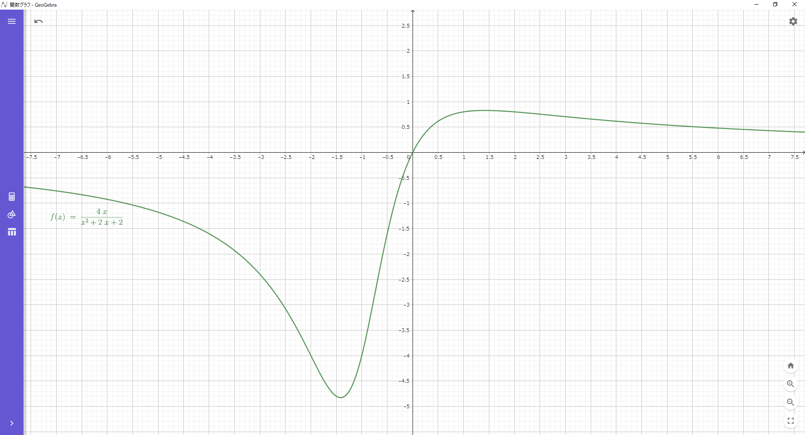
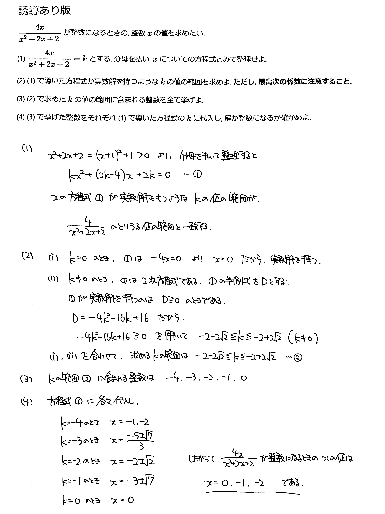

# 2021/03/19

満点:20点 / 目標:10点

> この問題は誘導をつけるかどうか自分で選べます。必要があれば【誘導あり版】を使ってください。

## 誘導なし版

$\dfrac{4x}{x^2+2x+2}$ が整数になるとき, 整数 $x$ の値を求めよ.

## 誘導あり版

$\dfrac{4x}{x^2+2x+2}$ が整数になるときの, 整数 $x$ の値を求めたい.

(1) $\dfrac{4x}{x^2+2x+2}=k$ とする. 分母を払い, $x$ についての方程式とみて整理せよ.

(2) (1) で導いた方程式が実数解を持つような $k$ の値の範囲を求めよ. **ただし, 最高次の係数に注意すること.**

(3) (2) で求めた $k$ の値の範囲に含まれる整数を全て挙げよ.

(4) (3) で挙げた整数をそれぞれ (1) で導いた方程式の $k$ に代入し, 解が整数になるか確かめよ.

## 解答・解説 (2021/03/25)

整数問題と思いきや, 分数関数の値域の問題です.
全然見たことのない形の式が出てきて困ったと思います.

さて, 高校生が分数関数の値域を求めるには, 大きく分けて2つの方法があります.

1. **逆像法**を使う
2. 微分してグラフを描く(数学III)

**逆像法**という言葉自体, 聞いたことがないと思います. 学校では体系的に学習する機会はほとんどありません. ただ, 難関校を受験するならば習得しておくべき考え方です. 詳しくはこちら:
- [【高校数学Ⅱ】順像法と逆像法の基本 | 受験の月](https://examist.jp/mathematics/inverse-image/gyakuzouhou/)
- [【高校数学Ⅱ】分数関数の値域（逆像法） | 受験の月](https://examist.jp/mathematics/inverse-image/tiiki-gyakuzouhou/)

でもこういう文章を読むのにも数学の力が必要です.
もしこのサイトの文章でよくわからないところがあれば解説するので, 聞いてください.

正直よくわかんないなって人は, 

> $($与式$)=k$ とおいて, 方程式を整理して, $D \geqq 0$ になる $k$ を求める

くらいに覚えておけばいいです.

ちなみにグラフを描くとこうなります(数学III).

