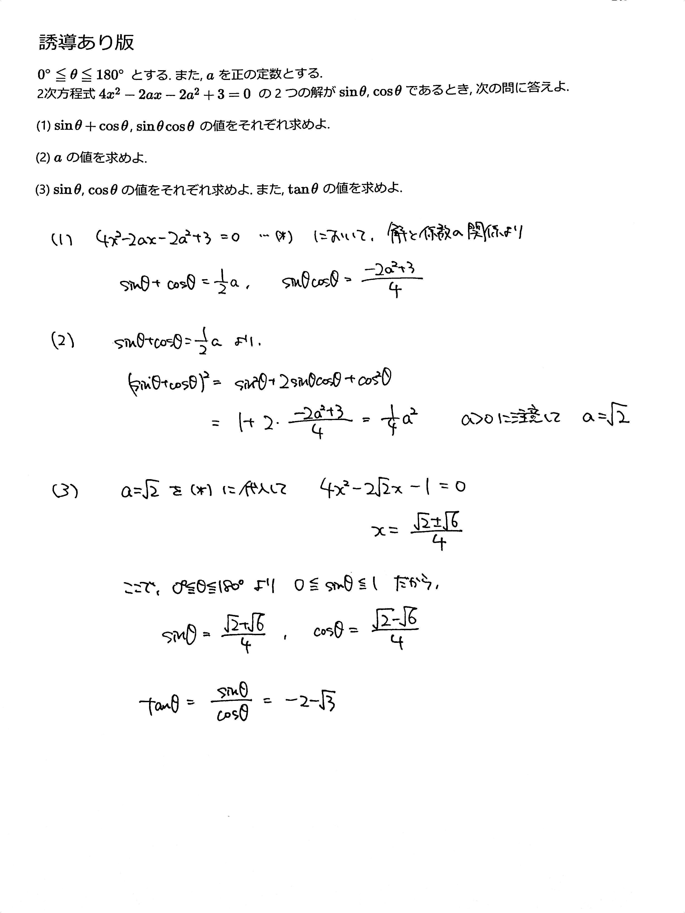

# 2021/03/26

満点:20点 / 目標:12点

> この問題は誘導をつけるかどうか自分で選べます。必要があれば【誘導あり版】を使ってください。

## 誘導なし版

$0^{\circ} \leqq \theta \leqq 180^{\circ}$とする. また, $a$ を正の定数とする.  
2次方程式 $4x^2-2ax-2a^2+3=0$ の2つの解が $\sin \theta$, $\cos \theta$ であるとき, $\tan \theta$ の値を求めよ.

## 誘導あり版

誘導あり版

$0^{\circ} \leqq \theta \leqq 180^{\circ}$ とする. また, $a$ を正の定数とする.  
2次方程式 $4x^2-2ax-2a^2+3=0$ の 2 つの解が $\sin \theta$, $\cos \theta$ であるとき, 次の問に答えよ.

(1) $\sin\theta+\cos\theta$, $\sin\theta\cos\theta$ の値をそれぞれ求めよ.

(2) $a$ の値を求めよ.

(3) $\sin\theta$, $\cos\theta$ の値をそれぞれ求めよ. また, $\tan\theta$ の値を求めよ.

## 解答・解説

解答・解説

「2つの解が」と書いてある時点で**解と係数の関係**の活用を疑うのが大事です.

