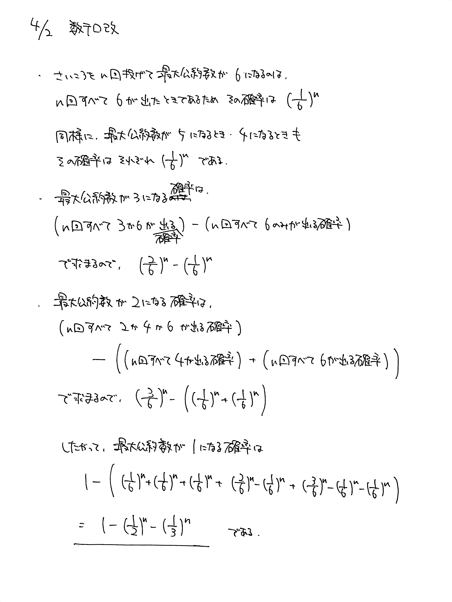

# 2021/04/02

出典:2020北海道大(文系)大問3(一部改題)

満点:20点 / 目標:12点

> この問題は誘導をつけるかどうか自分で選べます。必要があれば【誘導あり版】を使ってください。

## 誘導なし版

$n$ を $2$ 以上の自然数とする.  $1$ 個のさいころを続けて $n$ 回投げるとき, 出た目の最大公約数が $1$ になる確率を $n$ を用いて表せ.

## 誘導あり版

誘導あり版

$n$ を $2$ 以上の自然数とする.  $1$ 個のさいころを続けて $n$ 回投げるとき, 次の問に答えよ.

(1) 出た目の最大公約数が $6$ になる確率を $n$ を用いて表せ.

(2) 出た目の最大公約数が $3$ になる確率を $n$ を用いて表せ.

(3) 出た目の最大公約数が $1$ になる確率を $n$ を用いて表せ.

## 解答・解説

解答・解説

確率の問題です. 頑張って調べるだけです. 今回かなり出来がよくてすごいなって思いました.

確率の問題だとよく累乗を使った表現が最終解答になりますが, 表現の仕方には制限はなく
$$1-\left(\frac{1}{2}\right)^n-\left(\frac{1}{3}\right)^n$$
でも
$$\frac{6^n-3^n-2^n}{6^n}$$
でも問題ありません. 自分の好みで選んでください.

