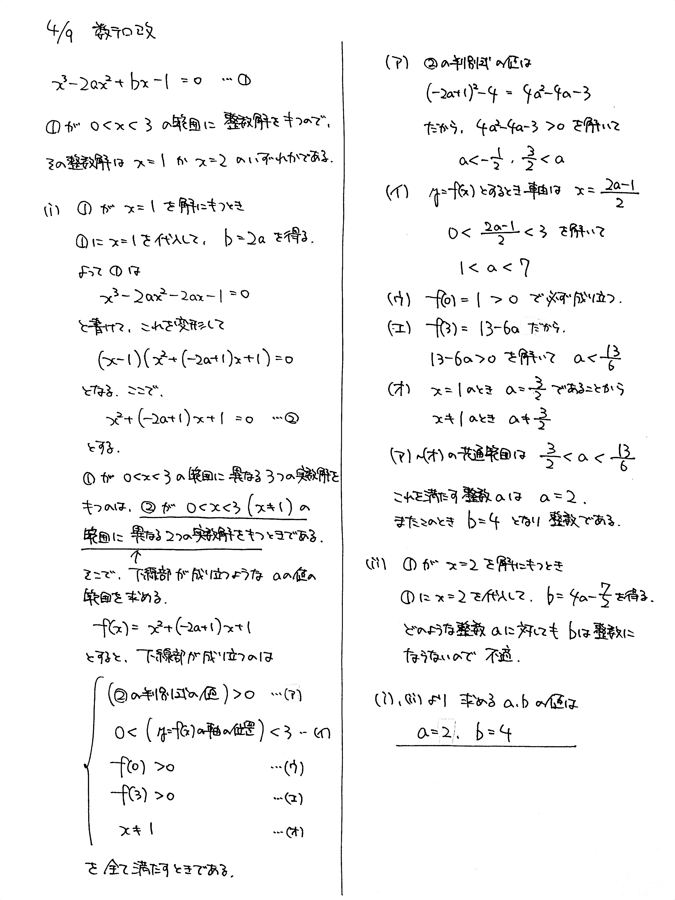
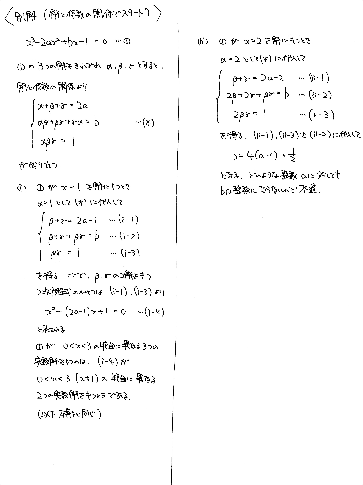

# 2021/04/09

出典:一橋大2001

満点:20点 / 目標:12点

> ヒントがあります。必要なら参考にしてください。

$a$, $b$ を整数とする. $3$ 次方程式 $x^3-2ax^2+bx-1=0$ は $0<x<3$ の範囲に $3$ つの異なる実数解をもち, その解のいずれかは整数である. $a$, $b$ の値を求めよ.

## ヒント・方針

- $0<x<3$ の範囲に整数解を持つことから, とりうる整数解の値は限られる. それぞれの場合で $a$ を用いて $b$ を表すと, 「 $b$ は整数である」という条件を用いてさらに整数解を絞り込むことができる.
- 3次方程式とはいうものの, 先に求めた整数解を使って因数分解できるはずなので, 結局2次方程式の問題に帰着する.

## 解答・解説 (2021/04/15)
3次方程式の**解の存在範囲**の問題です. うまいことやると2次方程式の解の存在範囲の問題になるのですが, そこまで到達していないようでした. 前半の流れは今後の模試でよく見ることになると思うので, 解き直しておきましょう.

- 解と係数の関係に持ち込もうとした答案がありました. 解と係数の関係を用いて, 2次方程式に帰着させることもできます. 別解に載せました.
- 答案中で記号が重複しないようにする必要があります.

