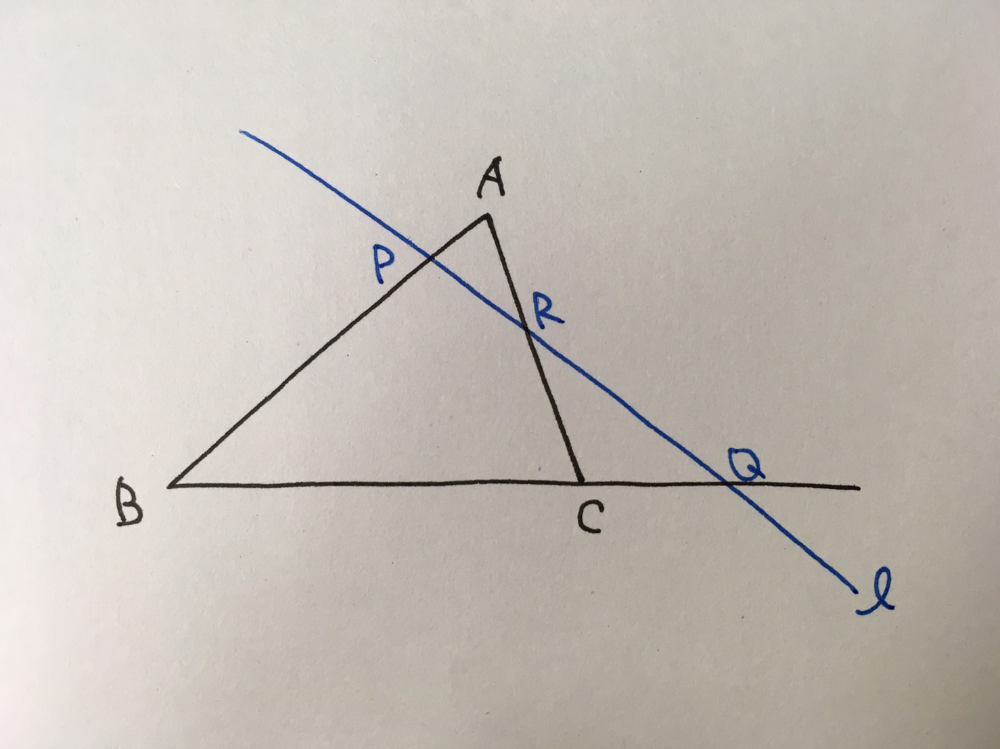
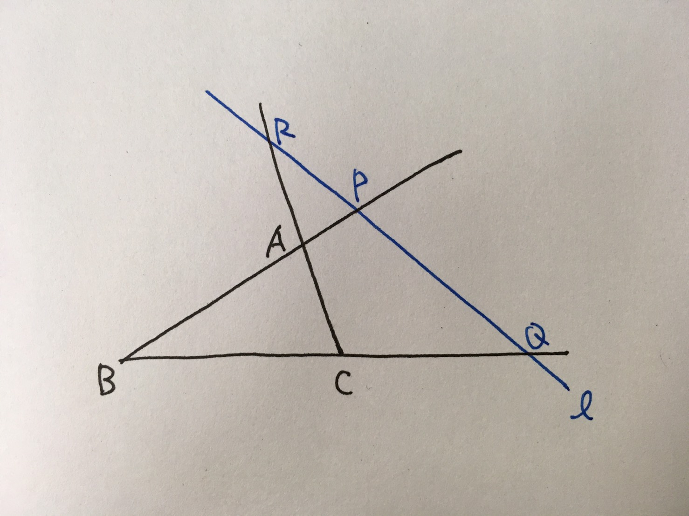
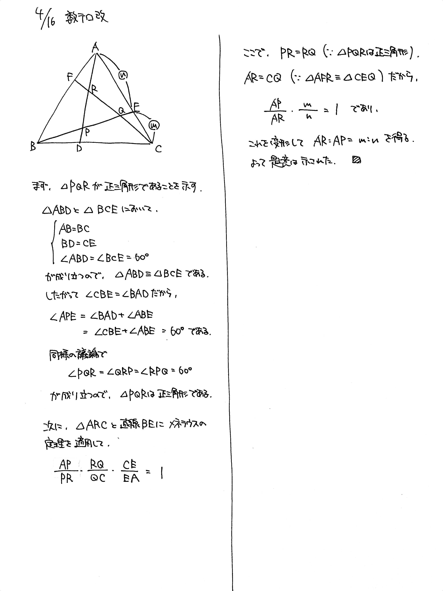

# 2021/04/16

満点:20点 / 目標:16点

> この問題は誘導をつけるかどうか自分で選べます。必要があれば【誘導あり版】を使ってください。

## 誘導なし版

正三角形 $\mathrm{ABC}$ において, $\mathrm{BC}$, $\mathrm{CA}$, $\mathrm{AB}$ を $m:n$ $(0 < m < n)$ に内分する点をそれぞれ $\mathrm{D}$, $\mathrm{E}$, $\mathrm{F}$ とする.
また, $\mathrm{AD}$ と $\mathrm{BE}$ の交点を $\mathrm{P}$, $\mathrm{BE}$ と $\mathrm{CF}$ の交点を $\mathrm{Q}$, $\mathrm{CF}$ と $\mathrm{AD}$ の交点を $\mathrm{R}$ とする. 
このとき, $\mathrm{AR} : \mathrm{AP} = m : n$ が成り立つことを示せ.

## 誘導あり版

誘導あり版

正三角形 $\mathrm{ABC}$ において, $\mathrm{BC}$, $\mathrm{CA}$, $\mathrm{AB}$ を $m:n$ $(0 < m < n)$ に内分する点をそれぞれ $\mathrm{D}$, $\mathrm{E}$, $\mathrm{F}$ とする.
また, $\mathrm{AD}$ と $\mathrm{BE}$ の交点を $\mathrm{P}$, $\mathrm{BE}$ と $\mathrm{CF}$ の交点を $\mathrm{Q}$, $\mathrm{CF}$ と $\mathrm{AD}$ の交点を $\mathrm{R}$ とする. 次の問に答えよ.

(1) 三角形 $\mathrm{PQR}$ は正三角形であることを示せ.

(2) $\mathrm{AR} : \mathrm{AP} = m : n$ が成り立つことを示せ.

## ヒント・方針

ヒント

(1) **まずは図を描く.** 正三角形の性質を考え, 何を示すべきか考える.

(2) 図の必要な部分だけ抽出し, メネラウスの定理を適用する.

## 解答・解説

解答・解説

久しぶりに図形の問題です. この問題は幾何的解法かベクトルで解くのがよいと思います. 

### 図形問題の解法選択

高校生が図形を扱うときにはいくつか選択肢があり, それぞれ利点と欠点があります. まとめてみました.

|選択肢|旧課程(-2021)|新課程(2022-)|長所|短所|
|--|--|--|--|--|
|幾何的解法|中1~数学A|中1~数学A|記述が簡潔|ひらめき勝負|
|座標平面|数学II|数学II|計算で解決できる|設定ミスると解けない 計算量が多い|
|ベクトル|数学B|**数学C**|計算で解決できる|特になし|
|複素数平面|数学III|**数学C**|回転移動に強い|難しい|

図形を扱うなら, ざっくり考察して解き進めれば解けてしまうベクトルが一番楽だと思います. ベクトルが封印されると本格的に文系は図形で困ると思います.

### メネラウスの定理と使い方

メネラウスの定理は, なんとなくで使っている人が多そうですが, 定義がしっかり存在します.

|||
|:--:|:--:|
|図1 いつものメネラウス|図2 見慣れないメネラウス|

どちらも, $\triangle \mathrm{ABC}$ や各辺の延長線上に直線 $l$ が刺さった図形です. このとき,

$$\frac{\mathrm{AP}}{\mathrm{PB}} \cdot \frac{\mathrm{BQ}}{\mathrm{QC}} \cdot \frac{\mathrm{CR}}{\mathrm{RA}} = 1 $$

が成り立ちます. イメージとしては, **必ず $\mathrm{P}$, $\mathrm{Q}$, $\mathrm{R}$ を経由して $\mathrm{A}$, $\mathrm{B}$, $\mathrm{C}$ を巡回する**と考えればよいでしょう.

メネラウスの定理を使うときは, 答案に

> $\triangle \mathrm{ABC}$ と直線 $l$ にメネラウスの定理を適用して,

と書いておくと紛れのない答案になってわかりやすくなります.

### 答案にどこまで書けばいいのか問題

中学校でさんざんやらされた三角形の合同/相似の証明は, 高校では厳密に書かなくても許されることが多いです. **この問題の主題は何なのか**を考えて記述を調整する必要があります. これはほかの分野でも同じです.
今回の答案では, $\triangle \mathrm{AFR} \equiv \triangle \mathrm{CEQ}$ であることをほぼ説明なしに使っていますが, これはさすがにもう少し丁寧に書いたほうがいいです.

### 別解について

少なくとも以下のような解法が考えられます.

- $\triangle \mathrm{PQR}$ が正三角形であることを示すために, $\mathrm{PQ}=\mathrm{QR}=\mathrm{RP}$ を示す解法
- ベクトルを用いる解法

また, $\mathrm{AR}=\mathrm{CQ}$ であることを「対称性から」と書いて, 減点されるかどうかはわかりません. 受験本番では記述は相対評価であることを踏まえると, ギャンブルです. なにか一言付け加えておくのが安全でしょう.

