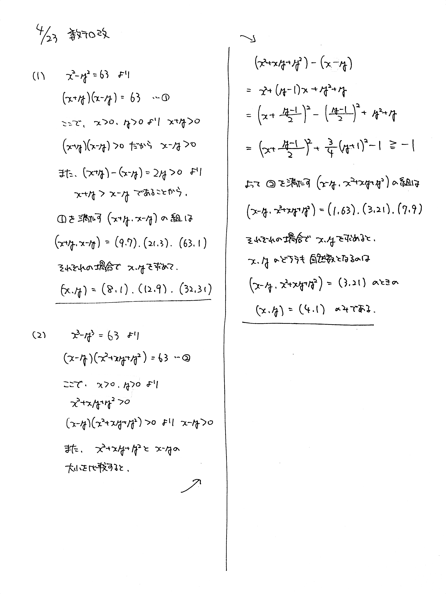

# 2021/04/23

満点:20点 / 目標:12点

(1) $x^2-y^2=63$ を満たす自然数 $x$, $y$ の組を全て求めよ.

(2) $x^3-y^3=63$ を満たす自然数 $x$, $y$ の組を全て求めよ.

## 解答・解説 (2021/04/30)

解答・解説

方程式の整数解の問題です. 整数の問題は本気を出せば限りなく難しくできるのですが, 実際の入試にはこのくらいが出てきやすそうですね.

### 整数問題の取り組み方

前提として, この手の整数問題は**しらみつぶしに調べれば解ける**という性質があります. たとえば (1) は, $$(x+y)(x-y)=63$$ と因数分解できますが, 絞り込まずに進めると $(x+y,\ x-y)$ の組は 12 組あることがわかります.

$$\begin{align}
(x+y,\ x-y) = &(1,\ 63),\ (3,\ 21),\ (7,\ 9),\ (9,\ 7),\ (21,\ 3),\ (63,\ 1), \\\\
&(-1,\ -63),\ (-3,\ -21),\ (-7,\ -9),\ (-9,\ -7),\ (-21,\ -3),\ (-63,\ -1)
\end{align}$$

12 回連立方程式を解いて, $x$ と $y$ がどちらも自然数になっている組を見つけられれば, それで問題ありません. 場合によっては, 絞り込みの方法を見つけるより早く解けるかもしれません.

### 絞り込みの手法

絞り込みの方法はたくさんあるのですが, この問題で最低限覚えておきたいのは以下の 3 つです.

- 文字の範囲に着目して, **正負**を調べる
  > $x>0$, $y>0$ だから, $x+y>0$ である.
  > $(x+y)(x-y)>0$ だから, $x-y>0$ である.

- 2つの数の差をとって, **大小関係**を調べる
  > $y$ は自然数で, $(x+y)-(x-y)=2y>0$ だから, $x+y>x-y$ である.
  
- 2つの数の和や差をとって, **偶奇**を調べる
  > $x$ は整数で, $(x+y)+(x-y)=2x$ だから, $x+y$ と $x-y$ を足すと偶数になる.

これらの手法を使って絞り込むと, (1) は 3 通り調べればよいことになります.

$$(x+y,\ x-y)=(9,\ 7),\ (21,\ 3),\ (63,\ 1)$$

解答例ではある程度絞り込んで処理しました.

