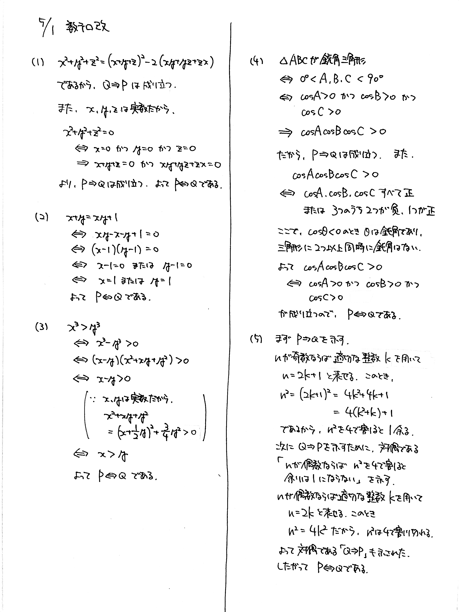

# 2021/05/01

満点:50点 / 目標:35点

$x$, $y$, $z$ を実数, $n$ を自然数とする. 下の表の (1) ~ (5) で, $\mathrm{P}$ と $\mathrm{Q}$ が**同値**であることを示せ.

||$\mathrm{P}$|$\mathrm{Q}$|
|:-:|:-:|:-:|
|(1)|$x^2+y^2+z^2=0$|$x+y+z=0$ かつ $xy+yz+zx=0$|
|(2)|$x=1$ または $y=1$|$x+y=xy+1$|
|(3)|$x>y$|$x^3>y^3$|
|(4)|$\triangle \mathrm{ABC}$ が鋭角三角形|$\cos A \cos B \cos C > 0$|
|(5)|$n$ は奇数|$n^2$ を $4$ で割ると $1$ 余る|

## 解答・解説 (2021/05/07)

ストレートな論証の問題です. 実際の問題では「同値であることを示せ」「～であるための必要十分条件を求めよ」「～となる条件を求めよ」などと聞かれますが, どれもやることは同じです.

### 同値変形について
同値であることを示すためには, $\mathrm{P} \Rightarrow \mathrm{Q}$ と $\mathrm{Q} \Rightarrow \mathrm{P}$ がどちらも成り立つことを述べなければなりません. ここで押さえておきたいのが, **同値変形**です. 

$$ 3x-1 = -2x+4 \ \Leftrightarrow \  x = 1 $$

これは中学 1 年生で学習した 1 次方程式ですが, 両矢印が成り立っています. したがってこれは同値変形です.

$$ x = \sqrt{7} \ \Rightarrow \ x^2 = 7 $$

これは中学 3 年生で学習した平方根の計算ですが, **左方向の矢印が成り立っていません**. どうすれば両方向の矢印が成り立つでしょうか？

$$ x = \pm \sqrt{7} \ \Leftrightarrow \ x^2 = 7 $$

これなら良さそうですね. 中学 3 年で必死に計算練習したでしょうから, 覚えていると思います.

$$ x = \sqrt{7} \ \Leftrightarrow \ x^2 = 7,\ x>0 $$

これもアリです. $x$ が正だと制限しておけば問題ないですね.

より詳しい内容があるので, ここで一読することを強くおすすめします. 
[【高校数学I】代表的な同値変形8パターンとその証明（高校数学最重要事項）](https://examist.jp/mathematics/class/doutihenkei/)

同値変形が正しくできることは, 自信を持って「高校数学を勉強したぞ！！」って言えるための必要条件だと思います.

### 同値記号を使っていいのか
同値記号 $\Leftrightarrow$ は特に同値性を明確にしたい場合に使用する記号のため, **同値でないのに同値記号を使ってしまうと, 大きく減点されるおそれがあります**. 式を並べて, 言葉でしっかり説明すれば大丈夫です. もちろん, とても自信があるなら使ってもかまいません.

解答例では, 流れが分かりやすいように同値記号を使っています(使ってしまいました).

