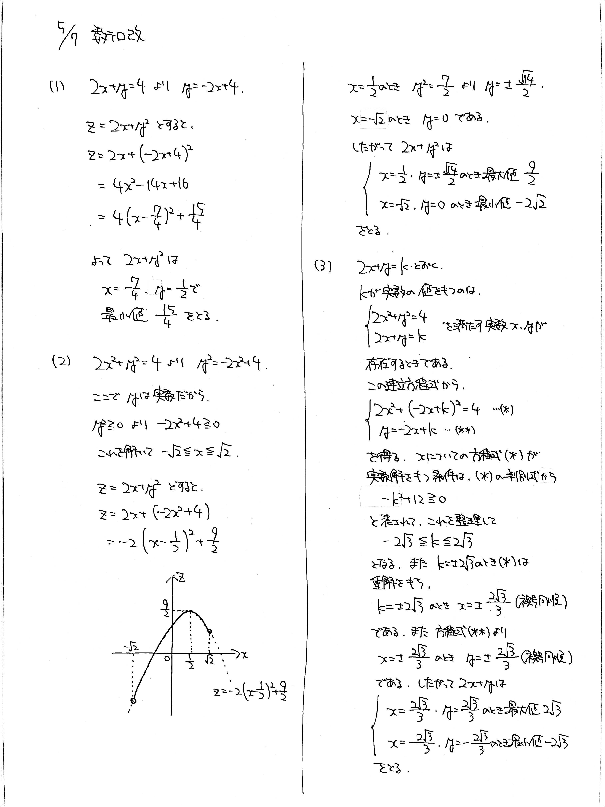

# 2021/05/07

満点:20点 / 目標:10点

> ヒントがあります。必要なら参考にしてください。

$x$, $y$ を実数とする. 次の問に答えよ.

(1) $2x+y=4$ のとき, $2x+y^2$ の最小値と, そのときの $x$, $y$ の値を求めよ.

(2) $2x^2+y^2=4$ のとき, $2x+y^2$ の最大値・最小値と, そのときの $x$, $y$ の値を求めよ.

(3) $2x^2+y^2=4$ のとき, $2x+y$ の最大値・最小値と, そのときの $x$, $y$ の値を求めよ.

## ヒント・方針

ヒント

- キーワード：**2変数関数の最大・最小**
    - 黄チャート 1-70, 1-101 を参照する
- (1), (2) は, 等式を変形して代入すれば, 1変数関数にできる. ただし (2) は文字の変域に注意すること.
- (3) は難しい. $2x+y=k$ とおいて, 実数条件を考える.

## 解答・解説

解答・解説

ベーシックな**2変数関数**の問題です. 大事な原則は

> 等式が1本あれば, 1文字消去できる

です. 今回の問題はすべて等式が1本ずつありますから, 1変数関数にできます.

そして高校数学最重要事項

> 文字を置き換えたときは, 必ず変域を確認する

これが非常に大事です. たとえば (2) は与えられた等式から $$y^2=4-2x^2$$ と書けますが, ここで **$y$ は実数だから** $y^2 \geqq 0$ です. したがって, $$4-2x^2 \geqq 0$$ です. これを解いて $x$ の変域を求めることができます.

### ちょっと難しい解説

(3) は文字を消去できないように見えます. 無理に代入すると大変なことになるので, 一工夫必要です. 話をわかりやすくするために, $2x+y=k$ とおきます.

等式 $2x^2+y^2=4$ を満たす実数 $x$, $y$ に対応して $2x+y=k$ の値が定まります. 逆にいえば, $k$ が存在するなら, 必ず対応する実数 $x$, $y$ があるはずです.
$k$ の値によって $x$ が実数になるかどうか決まるんだから, $x$ の方程式をつくって実数解を持つか調べれば $k$ の範囲がわかる！！

ということで, $y=-2x+k$ を $2x^2+y^2=4$ に代入して $x$ の方程式をつくり, 実数解を持つような $k$ の範囲を調べます. お馴染みの判別式を使えます.

ちなみに, 図形的には楕円と直線が共有点を持つような $k$ の範囲を調べているのと同じです. 

$$
\left\lbrace
\begin{array}[l]
22x^2+y^2=4 \newline
2x+y=k
\end{array}
\right.
$$

が共有点を持つ, といわれると, 確かにやったことあるなって思うのではないでしょうか.

$k$ が最大値・最小値をとるとき, $x$ の方程式は重解を持つので, $x$ が決まり, 次いで $y$ も決まります.

### 逆像法

> 実数 $x$, $y$ に対応して $2x+y=k$ の値が定まります. 逆にいえば, $k$ が存在するなら, 必ず対応する実数 $x$, $y$ があるはずです.

この考え方には**逆像法**と名前がついています. チャートなんかだとよく「 $=k$ とおく」という説明がありますが, $k$ でなくあえて $k$ を構成する $x$ に着目しているのが大事です.

