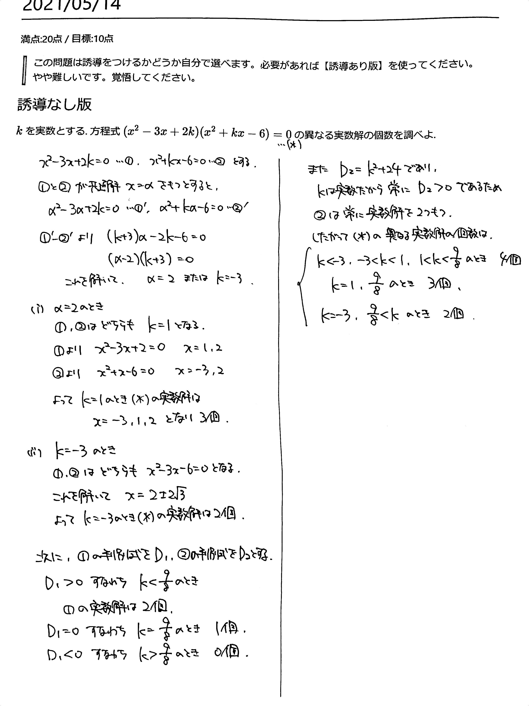

# 2021/05/14

満点:20点 / 目標:10点

> この問題は誘導をつけるかどうか自分で選べます。必要があれば【誘導あり版】を使ってください。
> やや難しいです。覚悟してください。

## 誘導なし版

$k$ を実数とする. 方程式 $(x^2-3x+2k)(x^2+kx-6)=0$ の異なる実数解の個数を調べよ.

## 誘導あり版

誘導あり版

$k$ を実数とする. 方程式 $(x^2-3x+2k)(x^2+kx-6)=0 \ \cdots (\ast)$ の異なる実数解の個数を調べたい. 
いま, 方程式 $x^2-3x+2k=0 \ \cdots (\mathrm{A})$, $x^2+kx-6=0 \ \cdots (\mathrm{B})$ について考える. 次の問に答えよ.

(1) 方程式 $(\mathrm{A})$ の異なる実数解の個数を調べよ.

(2) 方程式 $(\mathrm{A})$ と方程式 $(\mathrm{B})$ が共通解をもつとき, $k$ の値と共通解を求めよ.

(3) 方程式 $(\ast)$ の異なる実数解の個数を調べよ.

## 解答・解説

解答・解説

高次方程式の実数解の個数の問題です. 共通解をもつ場合の処理がちょっと難しいかなってところです.

$$
\begin{align}
&(x^2-3x+2k)(x^2+kx-6)=0 \newline
&\Leftrightarrow x^2-3x+2k=0 \ \ \ \mbox{or} \ \ \ x^2+kx-6=0
\end{align}
$$

ですから, それぞれの判別式の値から実数解の個数を確かめればいいのですが, **2つの2次方程式が共通の解を持つときは別に考える必要がある**のが大変です.

共通解の求め方はこのあたりが参考になります: 
[【高校数学Ⅰ】2つの2次方程式の共通解3パターン | 受験の月](https://examist.jp/mathematics/quadratic-function2/kyoutuukai/)

共通解の問題は結構高度な考え方で成り立っているので, 細かい説明が欲しければ別途対応します.

