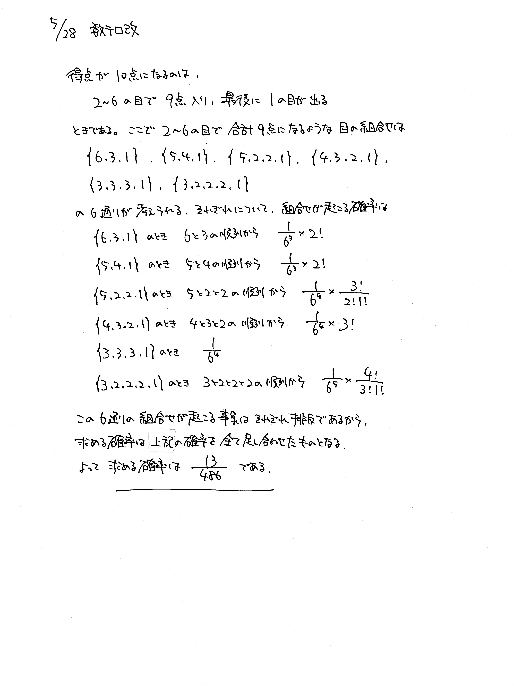

# 2021/05/28

満点:20点 / 目標:12点

> この問題は誘導をつけるかどうか自分で選べます。必要があれば【誘導あり版】を使ってください。

## 誘導なし版

さいころを $1$ の目が出るまで繰り返し投げ, $1$ が出たらそれまでに出たさいころの目の和を得点とする. 
例えば, $2$, $2$, $4$, $1$ の順に目が出たら, 得点は $2+2+4+1=9$ 点である.
また, 得点が $n$ 点になる確率を $P(n)$ と表す.
このとき, $P(10)$ を求めよ.

<div style="page-break-before:always"></div>

## 誘導あり版

さいころを $1$ の目が出るまで繰り返し投げ, $1$ が出たらそれまでに出たさいころの目の和を得点とする. 
例えば, $2$, $2$, $4$, $1$ の順に目が出たら, 得点は $2+2+4+1=9$ 点である.
また, 得点が $n$ 点になる確率を $P(n)$ と表す.
このとき, 次の問に答えよ.

(1) 例えば, $2$, $2$, $4$, $1$ の順のような目の出方を, $(2, 2, 4, 1)$ と書き表すことにする.<br>得点が $1$ 点, $2$ 点, $3$ 点, $4$ 点, $5$ 点, $6$ 点になるような目の出方をそれぞれ書き並べよ.

(2) $P(1)$, $P(2)$, $P(3)$, $P(4)$, $P(5)$, $P(6)$ をそれぞれ求めよ.

(3) $P(10)$ を求めよ.

<div style="page-break-before:always"></div>

## 解答・解説

問題文をよく読んで対処するタイプの確率の問題です. 答案はみなさん結構いい線いってました.<br>
得点が $10$ 点になるのは, $2$ から $6$ の目で $9$ 点稼いで, 最後に $1$ が出るときです. $9$ 点の稼ぎ方を十分に列挙できていない答案が目立ちました.

ちなみにこの問題の答えは $P(10)=\dfrac{13}{486} \fallingdotseq 0.02674897$ ですが, 試行回数を重ねたら本当にこの値に近くなるのでしょうか？

実際にやってみました. 以下はpythonのサンプルコードです.

```python
import random

result_counter = {}
for i in range(1000):
    result_counter[i+1] = 0

score = 0
n_trial = 100000000 # 試行回数

for _ in range(n_trial):
    while True:
        r = random.randrange(1, 7) # 1から6までの中からランダムで1つ選ぶ
        score += r
        if r == 1:
            result_counter[score] += 1
            score = 0
            break

print(result_counter[10])
```

結果は $\dfrac{2675054}{100000000}$ でした. 相対誤差 $5.9 \times 10^{-4}$ ということでかなりよい値です.

