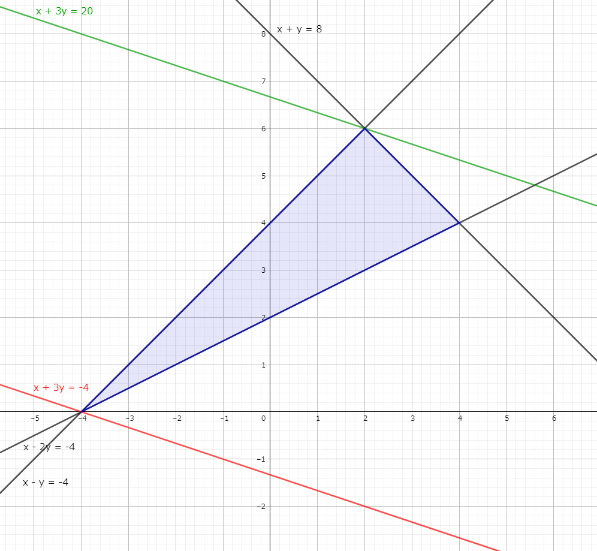
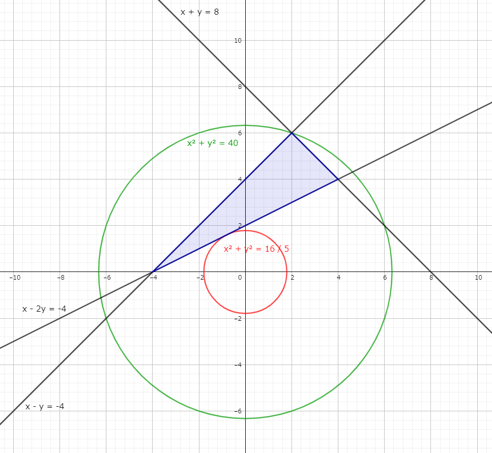
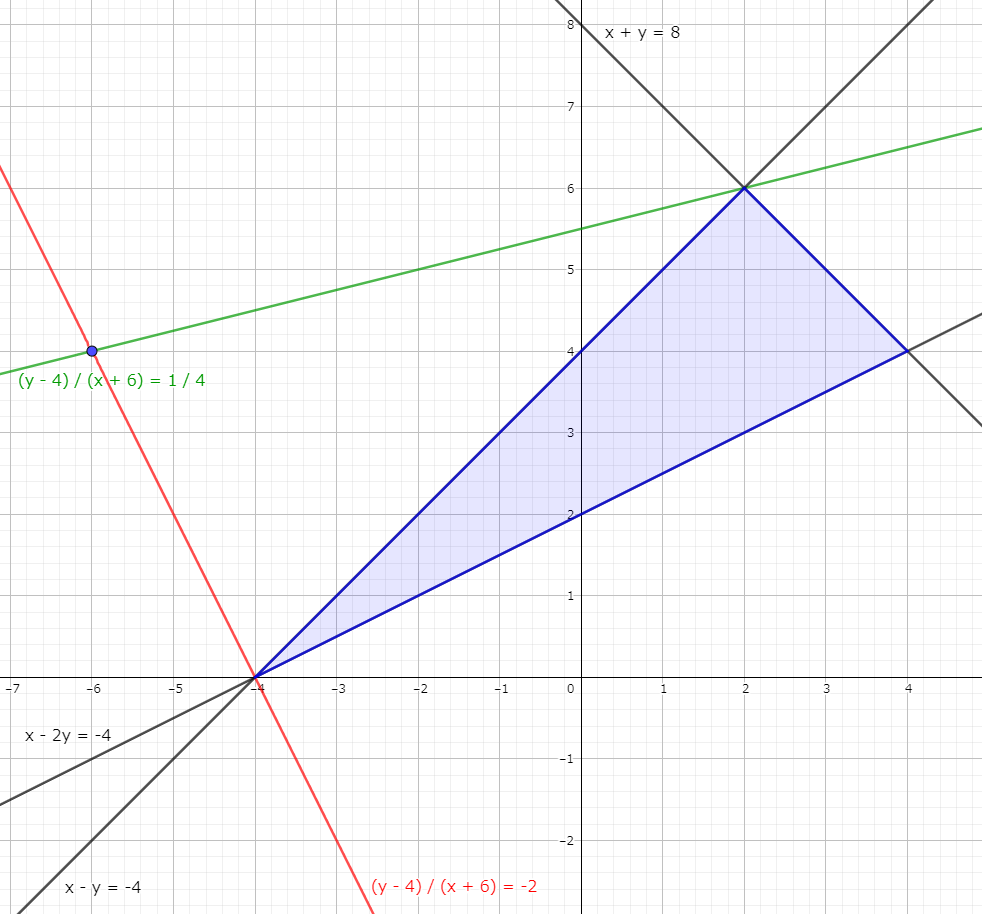
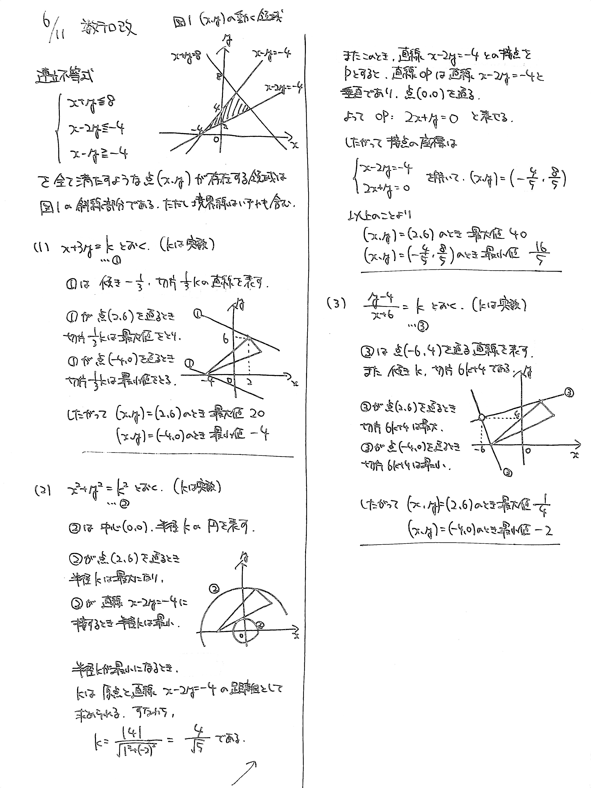

# 2021/06/11

満点:20点 / 目標:12点

> ヒントがあります。必要なら参考にしてください。

実数 $x$, $y$ が連立不等式
$$x+y \leqq 8, \ \  x-2y \leqq -4, \ \  x-y \geqq -4$$
を満たすとき, 以下の式の最大値と最小値を求めよ. また, そのときの $x$, $y$ の値をそれぞれ求めよ.

(1) &nbsp; $x+3y$ &emsp; (2) &nbsp; $x^2+y^2$ &emsp; (3) &nbsp; $\dfrac{y-4}{x+6}$

## ヒント・方針

ヒント

- まずは連立不等式の表す領域を図示する.
- (1) **線形計画法**の問題. $=k$ とおいて, 直線を動かして考える.
    - 黄チャートIIB 例題107
- (2) 線形(直線)ではないが, 考え方は (1) と同じ. $=k$ とおいて, 円を動かして考える.
    - 黄チャートIIB 例題110
    - できれば $=k^2$ とおくと後々の処理が楽になる
- (3) 同じく $=k$ とおく. 式がどのような図形を表しているか考える.
    - 黄チャートIIB 例題77

## 解答・解説

解答・解説

(1) 方針はよくできていましたが, よくわからない計算ミスや領域の図示ミスに気をつけましょう.

(2) 領域の端を通るときが最大・最小**ではありません**. 最小値は点と直線の距離の公式から求めるのが楽です.

(3) ちょっと難しいです. $\dfrac{y-4}{x+6}=k$ は, 変形すると $y-4=k(x+6)$ なわけですが, これを $k$ についての恒等式とみると, $k$ の値にかかわらず点 $(-6,\ 4)$ を通ることがわかります.

