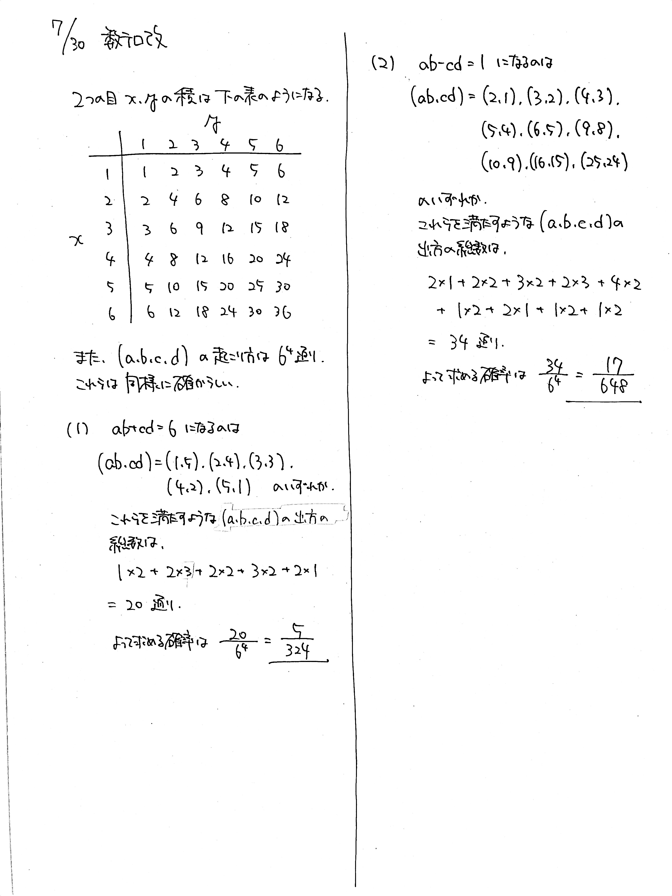

# 2021/07/30

満点:20点 / 目標:12点

サイコロを振って出た目の数をそれぞれ順に $a$, $b$, $c$, $d$ とする. 次の問に答えよ.

(1) $ab+cd=6$ になる確率を求めよ.

(2) $ab-cd=1$ になる確率を求めよ.

## ヒント・方針

ヒント

- サイコロを $2$ 回振って出た目の積の表を作っておくと楽.

## 解答・解説

解答・解説

根気よく数える系の確率の問題です. 入試本番でこのような問題が出た場合, 

- 数える方針を明確にする
- 整頓して書く

ことで多少ミスしても部分点を狙えます.

