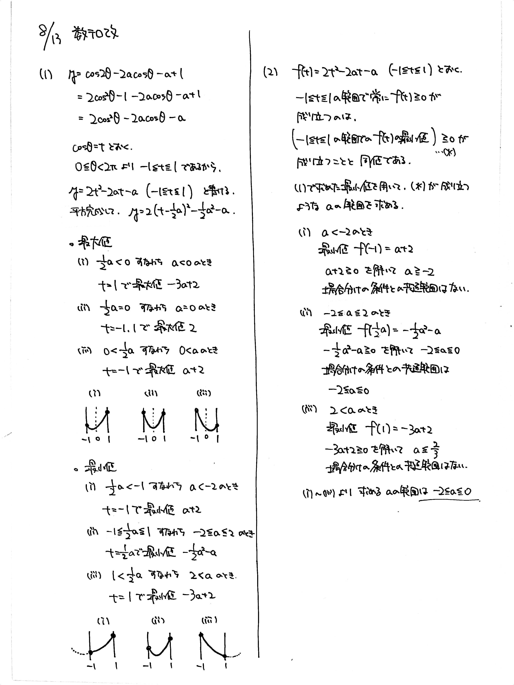

# 2021/08/13

満点:20点 / 目標:15点

(1) $a$ を定数とする. 関数 $y=\cos 2 \theta - 2a \cos\theta -a+1 \ (0 \leqq \theta < 2\pi)$ の最大値と最小値を求めよ.

(2) 不等式 $\cos 2 \theta - 2a \cos\theta -a+1 \geqq 0$ が常に成り立つような定数 $a$ の値の範囲を求めよ.

## 解答・解説

解答・解説

三角関数で味付けされた2次関数の問題です. よく似た出題が [2020/10/16](https://kampachi.tech/mathterro/20201016_trig) にあります.

