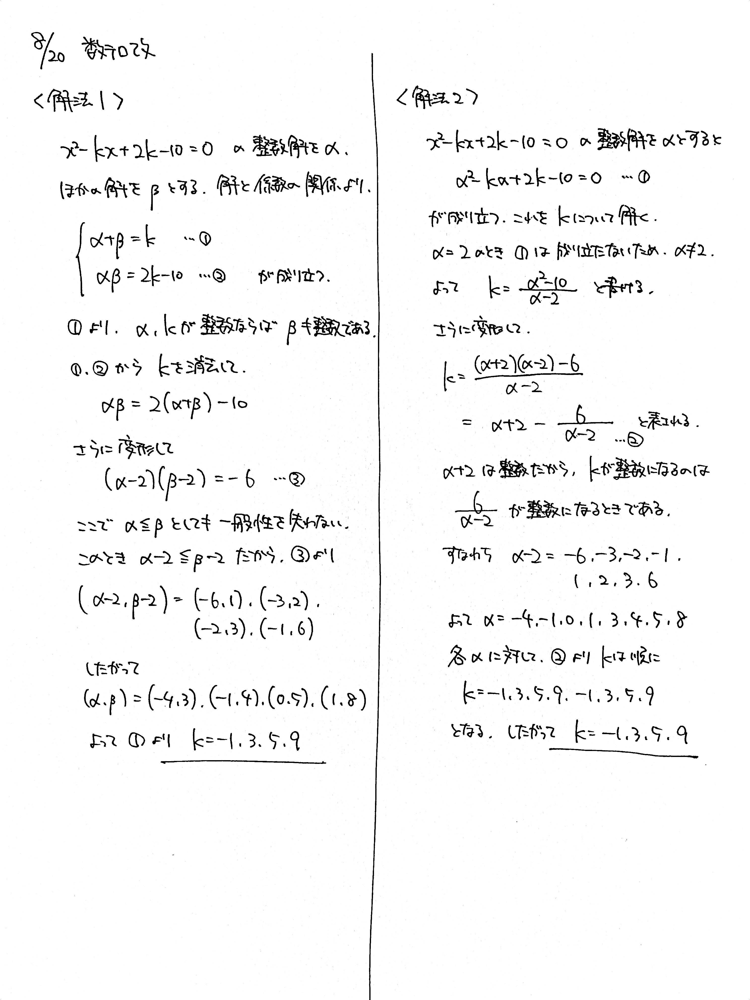
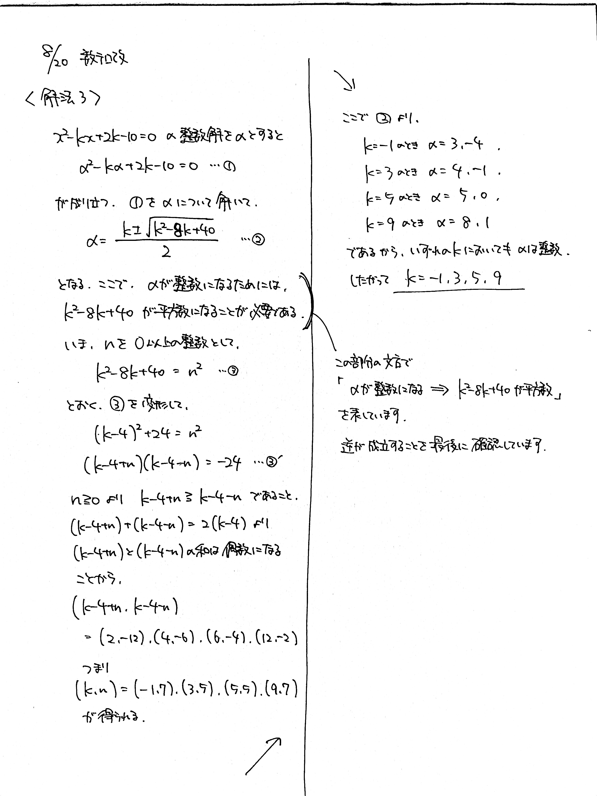
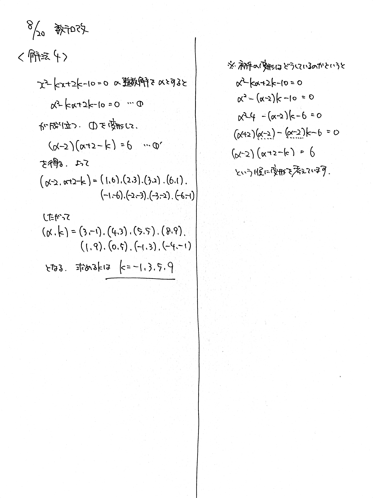

# 2021/08/20

満点:20点 / 目標:12点

> 異なる解法が少なくとも4つ考えられます。いずれも重要です。

$x$ の $2$ 次方程式 $$x^2-kx+2k-10=0$$ が少なくとも $1$ つ整数解をもつような整数 $k$ の値を求めよ.

## 方針・ヒント

方針1

- 整数解を $\alpha$, 他の解を $\beta$ として, 解と係数の関係を利用する.

方針2

- 整数解を $\alpha$ として, 方程式に代入し, $k$ について解く. $k$ が整数になるように, $\alpha$ の値を定める.

方針3

- 整数解を $\alpha$ として, 方程式に代入し, $\alpha$ について解く. $\alpha$ が整数になるように, $k$ の値を定める.

方針4

- 整数解を $\alpha$ として, 方程式に代入し, (整数) × (整数) = (定数) の形を作る.

## 解答・解説

解答・解説

方程式の**整数解**を求める問題です. 人によって出来がはっきり分かれました. この問題が求めていることを理解できたかどうかの違いだと思います.

4つの解法について, それぞれ解説していきます.

### 方針1: 解と係数の関係

パターン的な解法です. 特に**どちらも整数**のときはこの解法を選択することになります.

$2$ つの解を $\alpha$, $\beta$ とすると, 解と係数の関係から

$$
\left\lbrace
\begin{array}[l]
a\alpha + \beta = k\newline
\alpha \beta = 2k-10
\end{array}
\right.
$$

となります. ここで $\alpha + \beta = k$ に着目すると, $\alpha$ と $k$ が整数になるなら $\beta$ も整数になることがわかります. なによりこの問題は $k$ を求める問題ですから, $\alpha$ と $\beta$ が特定できればいいのです. $k$ を消去して $(\alpha,\ \beta)$ の組を見つけましょう.

### 方針2: $k$ について解く

不定方程式では**1つの文字について解く**ことで解決する方法が強力です.

整数解 $x=\alpha$ を代入した $\alpha^2-k\alpha+2k-10=0$ を, どちらか1文字の方程式として解くことになりますが, **$k$ は最高で $1$ 次ですから, 楽に解けます.** 実際に $k$ について解くときは, 分母が $0$ にならないように確認を忘れず行いましょう. $\alpha \neq 2$ に注意して,
$$k=\frac{\alpha^2-10}{\alpha-2} \ (\alpha \neq 2)$$
となります. あとは次数を下げてしらみつぶし.

### 方針3: $\alpha$ について解く

$\alpha$ について解くと,
$$\alpha = \frac{k \pm \sqrt{k^2-8k+40}}{2}$$
となります. あとは $k^2-8k+40$ が平方数になるように $k$ の値を求めることになります.

ここで注意したいのが,

> $\alpha$ が整数 $\Rightarrow$ $k^2-8k+40$ が平方数

ということで, 逆は成り立ちません. なぜなら $k \pm \sqrt{k^2-8k+40}$ が奇数になることがあるからです. そこで, 実際に $k$ が求まったあと, $\alpha$ が本当に整数になるか代入して確認する必要があります. これが**十分性の確認**です.

### 方針4: 直接 (整数) × (整数) = (定数) を作る

計算力さえあれば一撃で終わります. 少し技巧的な変形が要るので, その場で思いつかなくても仕方ないかなって感じです.

