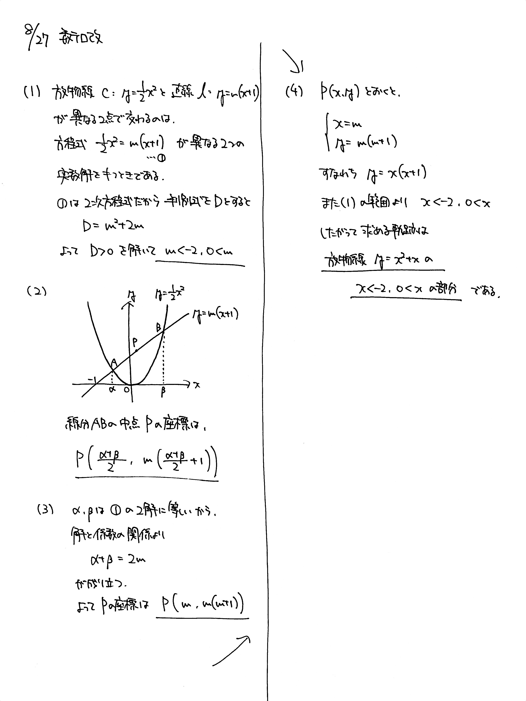

# 2021/08/27

満点:20点 / 目標:12点

放物線 $y=\dfrac{1}{2}x^2$ と直線 $y=m(x+1)$ が異なる $2$ 点 $\mathrm{A},\ \mathrm{B}$ で交わるとき, 線分 $\mathrm{AB}$ の中点の軌跡を求めよ.

## 誘導あり版

誘導あり版

放物線 $C: y=\dfrac{1}{2}x^2$ と直線 $l: y=m(x+1)$ がある.

(1) $C$ と $l$ が異なる $2$ 点で交わるような $m$ の値の範囲を求めよ.

(2) (1) のとき, $2$ つの交点をそれぞれ $\mathrm{A},\ \mathrm{B}$ とし, $\mathrm{A}$ の $x$ 座標を $\alpha$, $\mathrm{B}$ の $x$ 座標を $\beta$ とする. 線分 $\mathrm{AB}$ の中点 $\mathrm{P}$ の座標を, $m$, $\alpha$, $\beta$ を用いて表せ.

(3) (2) で得た $\mathrm{P}$ の座標表記から $\alpha$, $\beta$ を消去し, $\mathrm{P}$ の座標を $m$ を用いて表せ.

(4) $\mathrm{P}$ の軌跡を求めよ.

## 解答・解説

解答・解説

「放物線の弦の中点の軌跡」の問題です. 呼び方がある程度には典型問題です. 

(1) まず, 図形的な意味を確認しましょう. $y=m(x+1)$ は $m$ の値によらず $(x,\ y) = (-1, 0)$ を代入すると成り立つことから, 点 $(-1, 0)$ を通る傾き $m$ の直線を表します. 交点が $2$ つないと中点もなにもありませんから, 交点が $2$ つあるように $m$ の範囲を決めておく必要がありました.

(2)(3) $2$ 交点の $x$ 座標は, (1) で解いた方程式の $2$ 解です. 無理に表そうとすると非常に煩雑になってしまうことがあるので, いったん $\alpha,\ \beta$ として, 解と係数の関係を使って消去しました. $\mathrm{P}$ は直線 $y=m(x+1)$ 上にあることから, $x$ 座標が求まれば $y$ 座標はすぐ求まります.

ちなみに今回の問題では $\alpha=m-\sqrt{m^2+2m},\ \beta=m+\sqrt{m^2+2m}$ になりますから, 中点の $x$ 座標は $\dfrac{\alpha+\beta}{2}=m$ になります. 今回はたまたま簡単に求まる形だったということです.

(4) 媒介変数表示された点の軌跡の問題です. 媒介変数 $m$ を消去するのでした.

### 逆の確認は？

この問題の構造を確認します.

- 線分 $\mathrm{AB}$ の中点 $\mathrm{P}$ は, 放物線 $y=x^2+x$ 上のどこかにある.
- **逆に, $\mathrm{P}$ は, $m<-2,\ 0<m$ のとき存在する.**  $x=m$ の関係があるから, $x$ の範囲は $x<-2,\ 0<x$ である.
- ということで, $\mathrm{P}$ の軌跡は, 放物線 $y=x^2+x$ の $x<-2,\ 0<x$ の部分である.

どうしても「逆に, 求めた式の任意の点は条件を満たす」と書いてしまいがちですが, 論理の方向をよく考えて粘ってほしいと思います.

逆の記述を避けて, 同値変形を基に記述すると以下のようになります.

> $\mathrm{P}(x,\ y)$ が軌跡上の点である
>
> $\Leftrightarrow$ $\left\lbrace
\begin{array}[l]
mm<-2,\ 0< m \newline 
x=m \newline
y=m(m+1)
\end{array}
\right.$ を満たす実数 $m$ が存在する
> 
> $\Leftrightarrow$ $\left\lbrace
\begin{array}[l]
mx<-2,\ 0< x \newline
y=x(x+1)
\end{array}
\right.$
>
> $\therefore$ 求める軌跡は, 放物線 $y=x^2+x$ の $x<-2,\ 0<x$ の部分

以下はgeogebraによる作図です. スライダーで $m$ の値を動かして, $\mathrm{P}$ の動き方を観察してみてください.

<iframe scrolling="no" title="mathterro_20210827" src="https://www.geogebra.org/material/iframe/id/qzukqaca/width/700/height/500/border/888888/sfsb/true/smb/false/stb/false/stbh/false/ai/false/asb/false/sri/false/rc/false/ld/false/sdz/false/ctl/false" width="700px" height="500px" style="border:0px;"></iframe>

解答です

