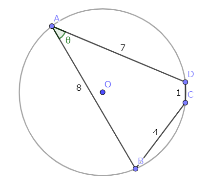
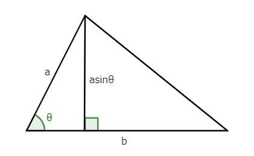
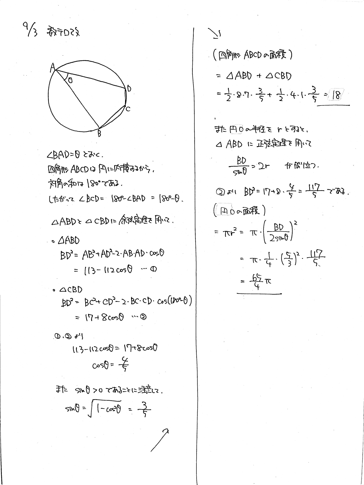

# 2021/09/03

満点:20点 / 目標:20点

四角形 $\mathrm{ABCD}$ は円 $\mathrm{O}$ に内接しており, $\mathrm{AB}=8$, $\mathrm{BC}=4$, $\mathrm{CD}=1$, $\mathrm{DA}=7$ である. 四角形 $\mathrm{ABCD}$ の面積と円 $\mathrm{O}$ の面積をそれぞれ求めよ.

## 解答・解説

解答・解説

基本かつ超頻出問題です. 小問集合で問われるタイプのものなので, 計算ミスは許容されません.

まずは図を描きます.

次に, 余弦定理を用いて, 対角線の長さを $2$ 通りに表します. 四角形 $\mathrm{ABCD}$ は円に内接しているから, 向かい合う角の大きさの和は $180^{\circ}$ になります.

### 三角形の面積の公式

もちろん上の三角形の面積は $\dfrac{1}{2}ab \sin \theta$ です. 垂線の長さに注目です.

### 計算ミスを防ぐために

対角線のとり方は $2$ 通りあります. この問題では $\mathrm{AC}$ と $\mathrm{BD}$ です. どちらを選んでも最終的な答えは変わりませんが, 計算量が変わります. 時間の許す限り両方計算して, $\cos \theta$ や $\sin \theta$ の値がよりシンプルになる方を選んで使いましょう.

### ブラーマグプタの公式 (検算用)

インドの数学者ブラーマグプタによる, 円に内接する四角形の面積を求める公式があります. ブラーマグプタの公式 (Brahmagupta's formula) と呼ばれます.

> 円に内接する四角形の $4$ 辺の長さをそれぞれ $a$, $b$, $c$, $d$ とする.
> $$ p=\frac{a+b+c+d}{2} $$
> とすると, 四角形の面積 $S$ は,
> $$ S=\sqrt{(p-a)(p-b)(p-c)(p-d)} $$
> と表される.

今回の問題でこれを用いると, $p=\dfrac{8+4+1+7}{2}=10$, $S=\sqrt{(10-8)(10-4)(10-1)(10-7)}=18$ となり, 爆速で面積が求まります. 穴埋め式の問題や解答の検算に用いるとよいでしょう.

参考: [【高校数学Ⅰ】円に内接する四角形の面積ブラーマグプタの公式(裏技)の証明と円に内接しない四角形の面積ブレートシュナイダーの公式(裏技) | 受験の月](https://examist.jp/mathematics/trigonometric-ratio/brahmagupta/)

