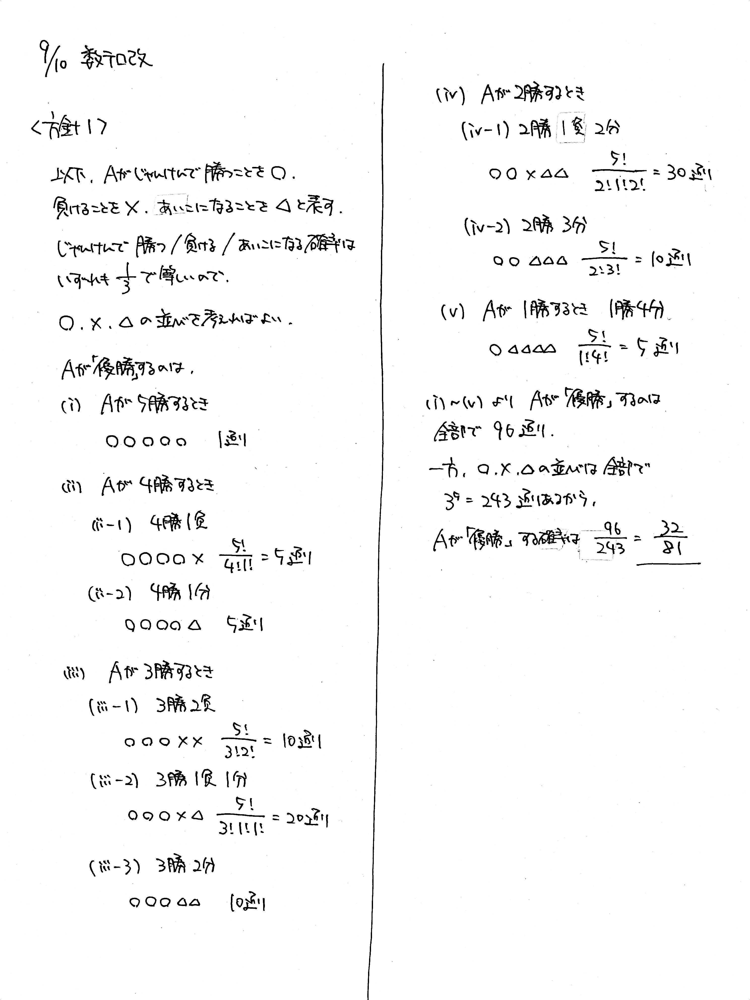
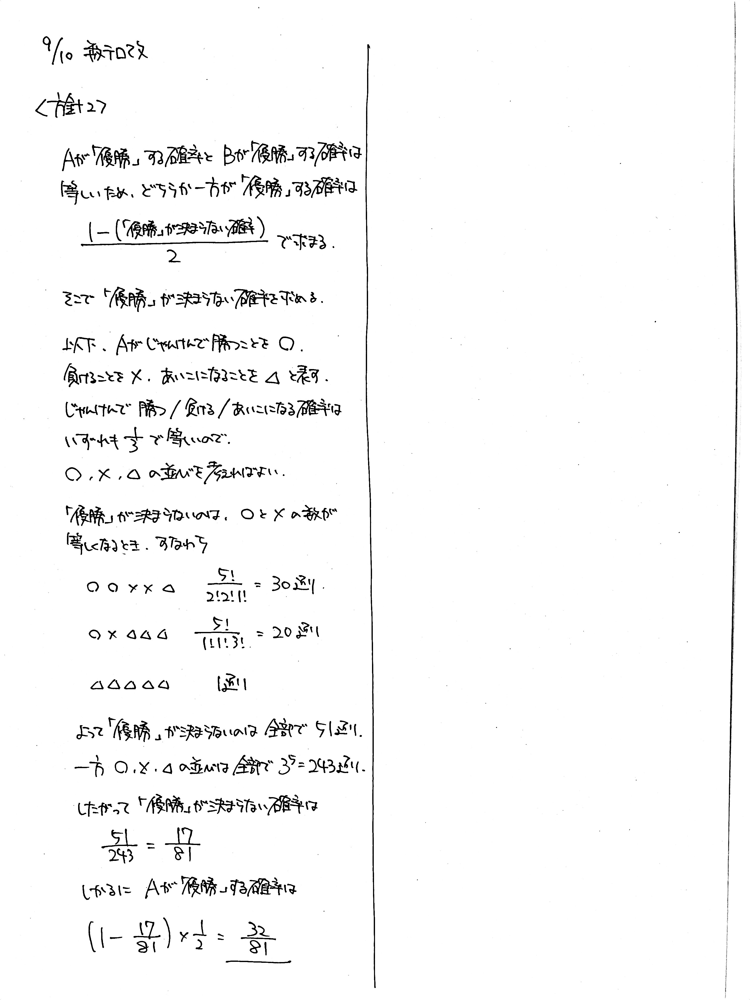

# 2021/09/10

満点:20点 / 目標:16点

$\mathrm{A}$, $\mathrm{B}$ の $2$ 人が全部で $5$ 回じゃんけんをして, 勝った数が多い方を「優勝」とする. ただし, あいこの場合も $1$ 回と数え, 勝った数が等しいときは「優勝」ではないとする. $\mathrm{A}$ が「優勝」する確率を求めよ.

## ヒント・方針

方針1

- $\mathrm{A}$ が勝つ回数で場合分けして数える.

方針2の発想

- $\mathrm{A}$ と $\mathrm{B}$ が「優勝」する確率はそれぞれ等しい.

## 解答・解説

解答・解説

オーソドックスな確率の問題です. 正確に場合分けと計算を遂行する能力をみました.

この問題では, 2人でじゃんけんをしているので, **勝ち/負け/あいこが等確率**です. つまり, 単純な「同じものを含む順列」の問題に帰着させることができます. 解答ではかならずこの点に触れましょう. 等確率でない場合, 反復試行の考え方が必要になり, 同じように計算しても答えが合いません. 

### 方針1: $\mathrm{A}$ が勝つ回数で場合分け

場合分けがだるいけど基本の考え方です.

### 方針2: 「優勝」が決まらない確率を先に求める

たぶんこっちのほうが簡単です. 思いつきさえすれば.

