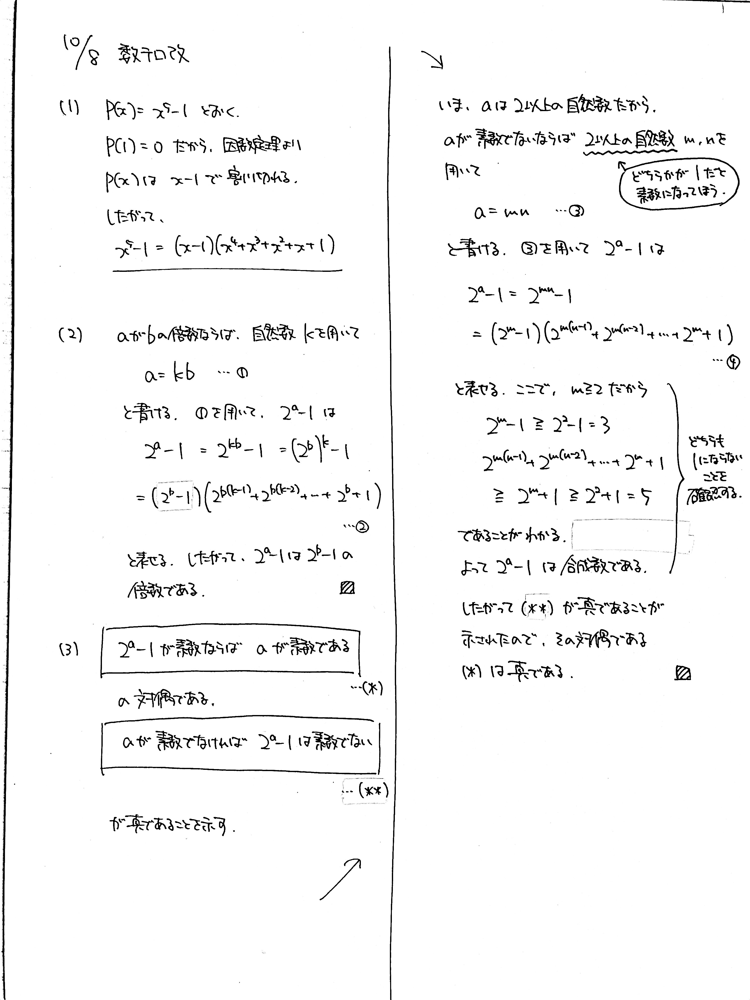

# 2021/10/08

> (1) をよく観察して、どのような意味を持つか考えてほしいです。  
> もし解けなくても、考えたことをできるだけ多く言葉で書いておきましょう。考えた過程そのものが採点対象になります。

満点:20点 / 目標:10点

(1) $x^5-1$ を因数分解せよ.

以下, $a$, $b$ は $2$ 以上の自然数とする.

(2) $a$ が $b$ の倍数ならば, $2^a-1$ は $2^b-1$ の倍数であることを示せ.

(3) $2^a-1$ が素数ならば, $a$ は素数であることを示せ.

## 解答・解説

解答・解説

実は数テロ1周年です. みなさんお疲れさまです.

**メルセンヌ数**の有名性質を題材にした問題です. メルセンヌ数は, 自然数 $n$ に対して $$M_n = 2^n-1$$ で表される数です. $M_n$ は $n$ 番目のメルセンヌ数です. $M_n$ が素数であるとき, **メルセンヌ素数**といいます. 本問 (3) で示したように,

> $M_n$ が素数 $\Rightarrow$ $n$ が素数

が成り立ちます. しかし, 逆は成り立ちません. 

> $n$ が素数 $\nRightarrow$ $M_n$ が素数

反例としては, $n=11$ のとき, $M_{11} = 2047 = 23 \times 89$ が挙げられます. なお, この事実が題材となった問題もあるのですが, 難しいので扱いませんでした. 興味のある人はやってみてください.

> $2^n-1=(2n+1)(8n+1)$ となるような自然数 $n$ を求めよ. (一橋2020後)

ちなみに現在見つかっている最大のメルセンヌ素数は $M_{82589933}$ で, 頑張って書き表すと約 $2500$ 万桁になります.

### 交代式の因数分解

整数分野でよく使う交代式の因数分解があります. $2$ 以上の自然数 $n$ に対して,

$$x^n-y^n=(x-y)(x^{n-1}+x^{n-2}y+\cdots+xy^{n-2}+y^{n-1})$$

が成り立ちます. 右辺を展開してみると, ちょうどよく各項が打ち消しあうのがわかります. 特に $y=1$ としたとき,

$$x^n-1 = (x-1)(x^{n-1}+x^{n-2}+\cdots+x+1)$$

となります. 本問 (1) はこの形を使うための誘導でした.

### 難しい問題に対する発想

一目見ただけではさっぱりわからない問題というのがあります. 高校数学の問題は, あくまで解けるように作られています. つまりパズル的な要素があるので,

- 過去にやった演習問題が, 擬態して隠れている
- 教科書には載っていないが, 数学的には有名な性質を基に作られている

のどちらかに分類できることが多いです.[^1] 有名性質を用いた問題はある程度の発想が必要なため, ほぼ確実に誘導がつきます.

本問はメルセンヌ素数の性質を知っていれば何も考えず答案を書くことができますが, 知らなくても頑張れば書けるように設計されています. まず (2) は,

- $x^5-1=(x-1)(x^4+x^3+x^2+x+1)$ と因数分解されたのを見て, **一般化**する
- $2^a-1$ の形が $x^n-1$ と同じだから, うまくやれば因数分解できる
- **「 $a$ が $b$ の倍数」は, $a=kb$ と書ける**
- **「 $2^a-1$ が $2^b-1$ の倍数」は, $2^a-1 = (2^b-1)(\cdots)$ と書けるはず**
- 式を見比べて, $2^b$ が $x$ にあたることがわかる

こんな感じでいけます.[^2] 特に $a=kb$ なんかは自力でも十分書けると思います. 次に (3) は,

- 素数の証明だと, 背理法か対偶をとる証明っぽいな
- 対偶をとったら (2) と同じだ

となります.

[^1]: 一部の医科大や難関大の特色入試など, 大学数学を知っていないと解けないようなとんでもない問題もありますが, ここでは触れません.

[^2]: いけないよ！！って思うかもしれませんが, 正直なところ経験値の差です. 一度やっておくと次はできるようになります.

