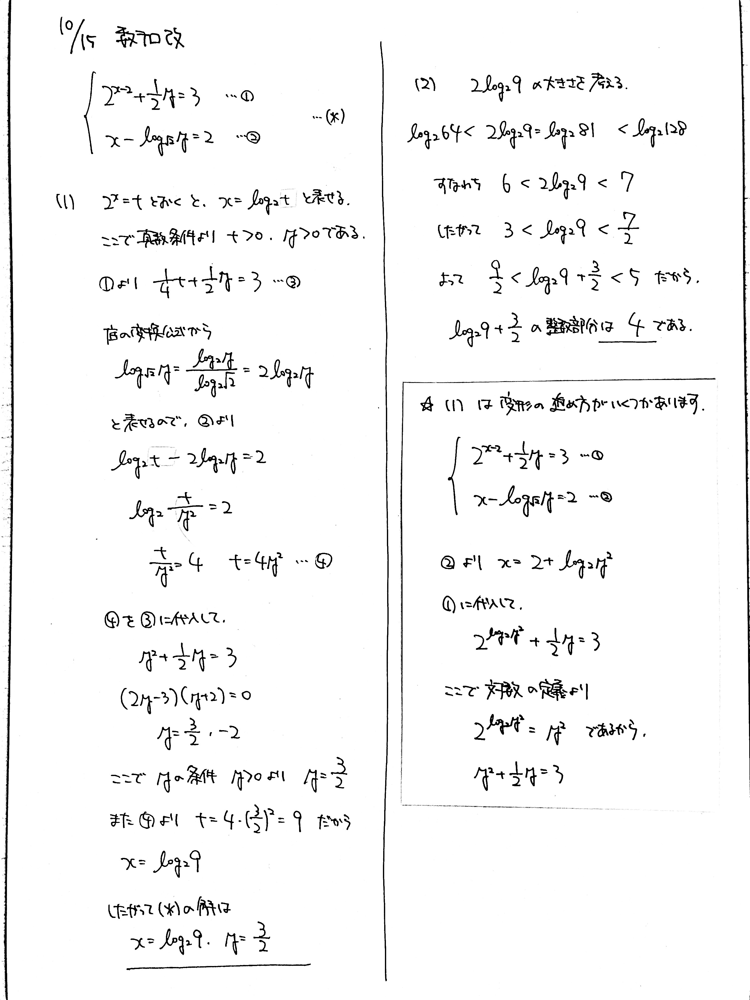

# 2021/10/15

満点:20点 / 目標:12点

$x$, $y$ を実数として, 以下の連立方程式 $(\ast)$ を考える.

$$\left\lbrace
\begin{array}[l]
x2^{x-2}+\dfrac{1}{2}y=3 \newline
x-\log_{\sqrt{2}}y=2 \tag*{($\ast$)}
\end{array}
\right.$$ 

(1) 連立方程式 $(\ast)$ を解け.

(2) 連立方程式 $(\ast)$ の解 $(x,\ y)$ について, $x+y$ の整数部分の値を求めよ.

## ヒント・方針

(1) のすごく重大なヒント

- $2^x=t$ とおく.

(2) の方針

- 対数の大きさを厳しく評価するために, $\log_a x^2 = 2 \log_a x$ の性質を用いる.

## 解答・解説

解答・解説

指数・対数の連立方程式の問題です. 頑張って答えを導いていたものの, 怪しい計算をしている答案もありました.

### 指数・対数の計算

特に対数はできることが非常に少ないので, **計算規則に従って計算する**ことを意識しましょう.

- 対数の定義 $$p^{\log_p a} = a$$
- 真数の指数を前に出す $$\log_p a^t = t \log_p a$$
- 底の揃った対数の合成 
$$\begin{array}[l]
x\log_p a + \log_p b = \log_p ab \newline
\log_p a - \log_p b = \log_p \dfrac{a}{b}
\end{array}$$ 
- 底の変換 $$\log_a b = \frac{\log_p b}{\log_p a}$$

また, 方程式の両辺の対数をとるときは**両辺が正である**必要があります. 真数条件を考えれば当然ですが, 案外見落としがちですので気を付けましょう.

