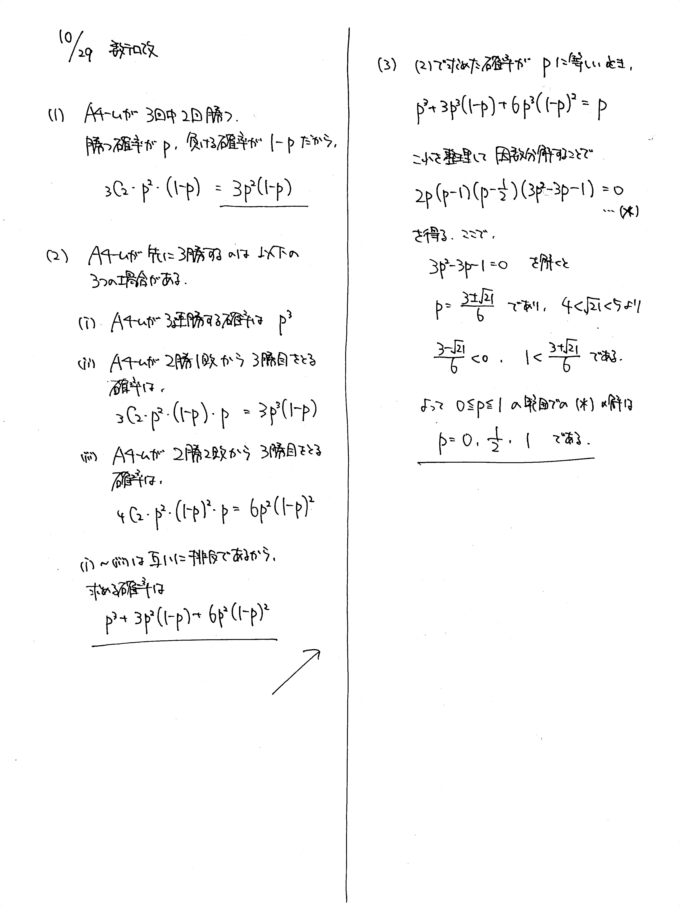

# 2021/10/29

出典: 2021東北大(理)AO (改題)

満点:20点 / 目標:15点

$0 \leqq p \leqq 1$ とする. $\mathrm{A}$ チームと $\mathrm{K}$ チームが試合を繰り返す. 各試合において $\mathrm{A}$ チームは確率 $p$ で $\mathrm{K}$ チームに勝つ. ただし, 引き分けはないものとする. $\mathrm{A}$ チームが先に $3$ 勝する確率が $p$ に等しいとき, $p$ のとりうる値をすべて求めよ.

## 誘導あり版

誘導あり版

$0 \leqq p \leqq 1$ とする. $\mathrm{A}$ チームと $\mathrm{K}$ チームが試合を繰り返す. 各試合において $\mathrm{A}$ チームは確率 $p$ で $\mathrm{K}$ チームに勝つ. ただし, 引き分けはないものとする.

(1) $3$ 試合行って, $\mathrm{A}$ チームの対戦成績が $2$ 勝 $1$ 敗になる確率を $p$ を用いて表せ.

(2) $\mathrm{A}$ チームが先に $3$ 勝する確率を $p$ を用いて表せ.

(3) $\mathrm{A}$ チームが先に $3$ 勝する確率が $p$ に等しいとき, $p$ のとりうる値をすべて求めよ.

## 解答・解説

解答・解説

通称「日本シリーズ」の問題です. 確率を求めるだけなら難しい部分はないのですが, 問題は (3) です.

$$p^3+3p^2(1-p)+6p^2(1-p)^2=p$$

を $p$ で整理して因数分解していくと,

$$p(p-1)(6p^3-9p^2+p+1)=0$$

となりますが, ここで詰むようです.

方程式 $6p^3-9p^2+p+1=0$ に因数定理を適用しようと思っても, 整数の範囲ではうまくいきません. 実は $p=\dfrac{1}{2}$ のとき左辺が $0$ になるので,

$$6p^3-9p^2+p+1=(2p-1)(3p^2-3p-1)$$

と因数分解できます. では $p$ をどのように見つけたかというと, 因数定理の対象になる数の候補は

$$\pm \frac{\mbox{定数項の約数}}{\mbox{最高次の項の係数の約数}}$$

に限られることが知られています.

証明

$n$ を自然数, $a$, $b$, $p_1$, $p_2$, ..., $p_n$ を整数とする. また, $p_1 \neq 0$, $p_n \neq 0$ とする.  
$n$ 次方程式 $P(x)=0$ が $x=\dfrac{a}{b}$ を解に持つとする. このとき,

$$P(x) = (ax-b)(p_1 x^{n-1} + p_2 x^{n-2} + \cdots + p_n)$$

と書ける. これを展開すると,

$$P(x) = ap_1 x^{n} + (ap_2 - bp_1) x^{n-1} + \cdots - bp_n$$

したがって, $a$ は最高次の項の係数の約数であり, $b$ は定数項の約数である. (証明終わり)

つまり, 今試すべき $p$ の候補は,

$$p = \pm 1,\ \pm \frac{1}{2},\ \pm \dfrac{1}{3},\ \pm \frac{1}{6}$$

のうちのどれかです. これ以外には存在しません.

### 余談

元の問題は東北大の AO 入試で出題されたので, 青葉チームと川内チームになっていました. 青葉山キャンパスには理系学部の建物が, 川内キャンパスには文系学部の建物と大学本部があります.

