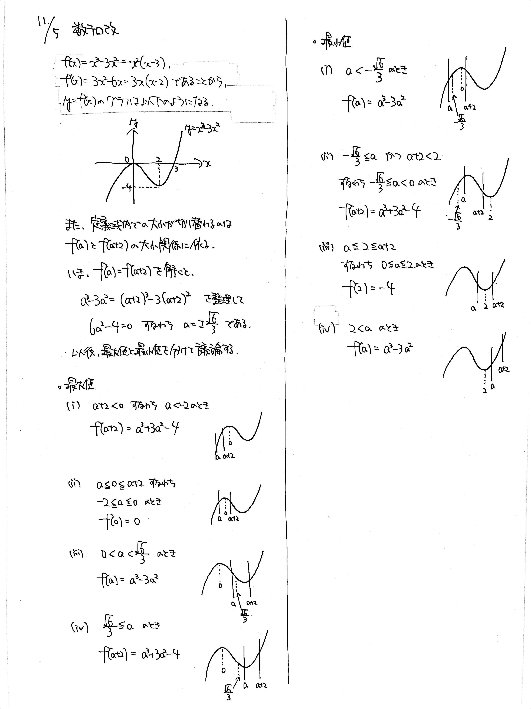

# 2021/11/05

> 次数が上がっても、考え方は同じ

満点:20点 / 目標:12点

$a$ を定数とする. $3$ 次関数 $f(x)=x^3-3x^2$ の $a \leqq x \leqq a+2$ における最大値と最小値を, $a$ の値によって場合分けして求めよ.

## ヒント・方針

方針

- **最大値・最小値がいつ切り替わるか**を意識する.
- 定義域全体が動く場合の関数の最大・最小
    - 2次関数: 黄チャートIA 基本例題63
    - 3次関数: 黄チャートIIB 重要例題191
        - なぜかLv5表記だが, 逆難易度詐欺なのであまり難しくない

すごいヒント(ほぼ答え)

- $f(a)$ と $f(a+2)$ の大小関係に注目

<iframe scrolling="no" title="mathterro_20211105" src="https://www.geogebra.org/material/iframe/id/wptqtgx4/width/700/height/500/border/888888/sfsb/true/smb/false/stb/false/stbh/false/ai/false/asb/false/sri/false/rc/false/ld/false/sdz/false/ctl/false" width="700px" height="500px" style="border:0px;"> </iframe>

## 解答・解説

解答・解説

$3$ 次関数の最大・最小の問題です. 正直なところ $2$ 次関数の最大・最小とほとんど変わらないので, 後述する「切り替わり」の部分以外で詰まる場合は $2$ 次関数をやり直してください. 

さて, $2$ 次関数の最大・最小と唯一変わる部分が, 切り替わりの部分です. $2$ 次関数のときはグラフが左右対称だったので, 定義域の中心を考えるだけでよかったのですが, 今回は違います.

具体的には, $f(a)$ と $f(a+2)$ の大小関係を考えます. $f(a)=f(a+2)$ のとき, $a=\pm \dfrac{\sqrt{6}}{3} (= \pm 0.816)$ です. グラフを動かして観察してみると, 確かに $a=-\dfrac{\sqrt{6}}{3}$ のとき最小値が切り替わり, $a=\dfrac{\sqrt{6}}{3}$ のとき最大値が切り替わっています.

ここだけ押さえれば, あとは丁寧に場合分けして記述するだけです.

