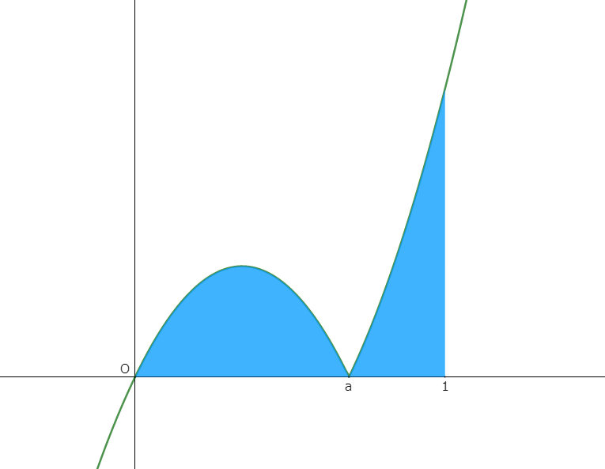
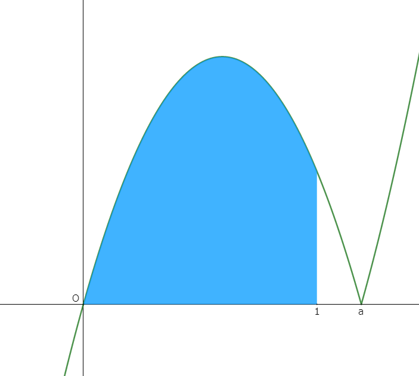
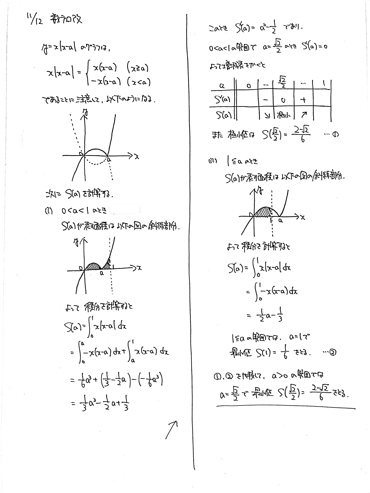

# 2021/11/12

満点:20点 / 目標:12点

$a>0$ とする. $a$ の関数

$$ S(a) = \int_0^1 x|x-a| dx $$

の最小値を求めよ.

## 誘導あり版

誘導あり版

$a>0$ とする.

(1) $ y=x \| x-a \| $ のグラフを描け.

(2) **$a$ と $1$ の大小に注意して,** $a$ の関数

$$ S(a) = \int_0^1 x|x-a| dx $$

を $a$ の整式で表せ.

(3) $S(a)$ の最小値を求めよ.

## 解答・解説

解答・解説

絶対値付き関数の積分の問題です. 一見しただけだと混乱しそうな形になっています.

基本に忠実に考えましょう. まずは積分の対象になっている関数を考えます. 絶対値は確実に場合分けして外しましょう.

$$ x|x-a| =
\begin{cases}
    x(x-a)  & (x \geqq a)  \\
    -x(x-a) & (x < a)
\end{cases}
$$

すると $ y=x \| x-a \| $ のグラフが描けますが, $a$ の値によってグラフは $2$ 通りに分かれます.

|||
|:--:|:--:|
| $0<a<1$ のときの $S(a)$ | $1 \leqq a$ のときの $S(a)$ |

もちろん積分の式も変わります. 丁寧に積分しましょう.

すると $a$ の $3$ 次式が求まるので, あとは極小値を求めて終わり……といいたいところですが, 最後にそれぞれの区間での最小値を比較しておくことを忘れないようにしましょう.

