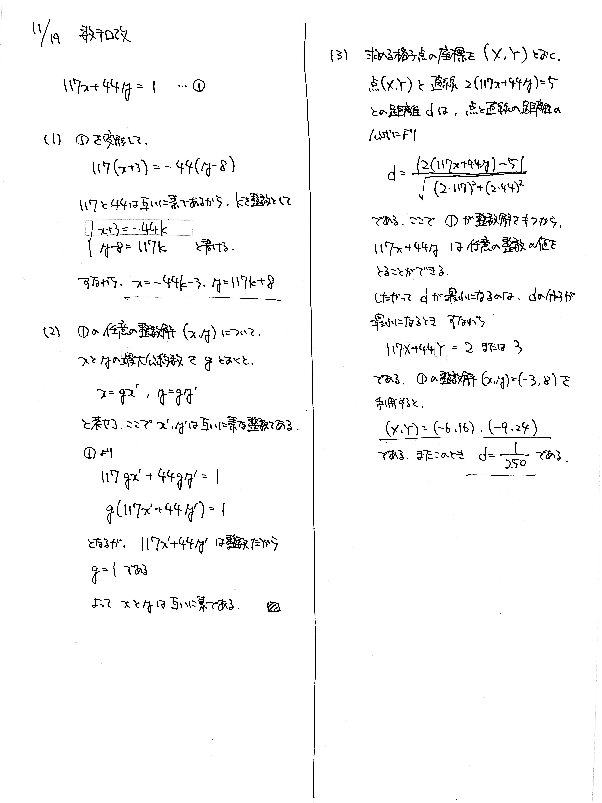

# 2021/11/19

満点:20点 / 目標:14点

(1) 方程式 $117x+44y=1$ の整数解をすべて求めよ.

(2) 方程式 $117x+44y=1$ のどんな整数解 $(x,\ y)$ についても, $x$ と $y$ が互いに素であることを示せ.

(3) $xy$ 座標平面における格子点[^1]と, 直線 $2(117x+44y)=5$ との距離の最小値を求めよ. また, 距離が最小になるような格子点の座標をすべて求めよ.

解答・解説

ユークリッドの互除法を用いた不定方程式の問題に, 格子点の考え方が複合した問題です.

(1) は, 整数解を求めるのにユークリッドの互除法を用いると思いますが, その過程を書く必要はありません. 変形が正しいかどうかはすぐに計算して確かめられるからです. ただ, 求める過程は非常に大切なので, 2通り示しました.

(2) では, 整数や不定方程式の基本となる定理の証明でした. 改めて確認しておきます.

> $a$, $b$ を $0$ でない整数とするとき,  
> 整数 $a$, $b$ が互いに素
> $\Leftrightarrow$ $ax+by=1$ を満たす整数 $x$, $y$ が存在する

証明は以下のページが詳しいのでそちらを確認してください. ~~書くのが面倒だった~~

[【高校数学A】1次不定方程式ax+by=cの整数解の存在条件、格子点と直線の最短距離 \| 受験の月](https://examist.jp/mathematics/integer/axby-sonzaijyouken/)

[^1]: $x$ 座標, $y$ 座標がともに整数である点