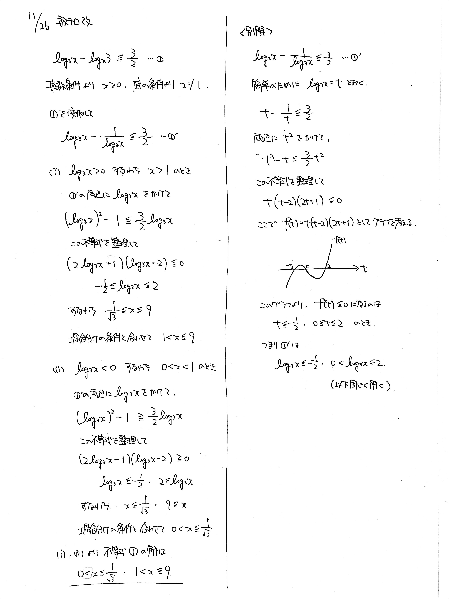

# 2021/11/26

満点:20点 / 目標:14点

以下の不等式を解け.

$$ \log_3 x - \log_x 3 \leqq \frac{3}{2} $$

## ヒント・方針

方針

- 対数を見かけたら**真数条件**と**底の条件**を必ず確認する
- 底の異なる対数を扱うときは底を揃える
- 不等式の両辺に文字をかけるときは正負に注意する

## 解答・解説

解答・解説

対数を含む分数不等式の問題です. $\log_x 3$ を $\dfrac{1}{\log_3 x}$ に変換できている答案が多く, よくできていると感じました. 一方で, 不等式の扱いを忘れているように思います.

> 不等式の両辺に負の数をかけると, 不等号の向きが逆転する

ことを押さえておきましょう. とても大事です.

このような不等式の場合分けを避けるための手法が, **2乗したものをかける**というものです. 今回であれば, $(\log_3 x)^2$ を両辺にかけると, 場合分けする必要がなくなります. ただ, 3次式になってしまうので, グラフを使って正負を判定するとよいでしょう.

ちなみに,「指数・対数」を学習するときにはまだ3次関数を扱っていなかったので, この解き方は出てきません. 3次関数を学習したからこの方法を使うことができます. 

