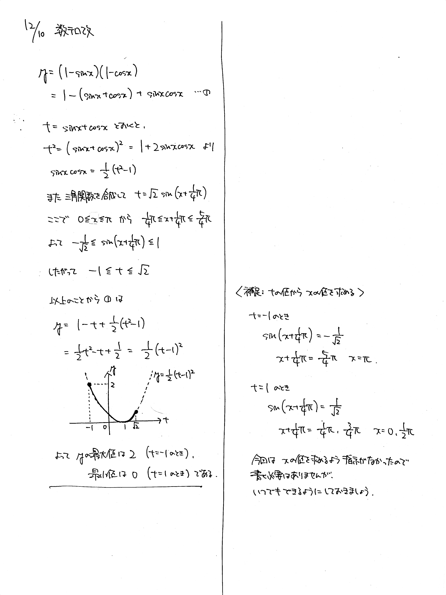

# 2021/12/10

満点:20点 / 目標:14点

$0 \leqq x \leqq \pi$ とする. $x$ の関数 $y=(1 - \sin x)(1 - \cos x)$ の最大値と最小値を求めよ.

## ヒント・方針

重大な方針

- $t = \sin x + \cos x$ とおく.
- **文字を置き換えたら必ず変域を確認する.**

## 解答・解説

解答・解説

三角関数の最大・最小の問題です. 基本的にはよくできていましたが, 平方完成を間違える答案が多いのが謎です.

マーク式の試験ではおそらく $t=\sin x+ \cos x$ とおくように誘導が付きます. とはいえ, 誘導がなくても知識として持っておいたほうがよいでしょう. $\sin x$ と $\cos x$ が対称式になっているときはこの方法がよく使えます. 当然ながら, $t$ の変域は必ず確認しなければなりません.

### $x$ の値は必要か？

本問では,

> $y$ の最大値と最小値を求めよ.

と書いてあり, $y$ が最大値や最小値をとるときの $x$ の値には触れられていないので, $x$ の値を書く必要はありません. しかし一方で,

> $y$ の最大値と最小値を求めよ. また, そのときの $x$ の値をそれぞれ求めよ.

と書いてあれば, もちろん必要でしょう.

たとえば,「関数の最大値が $M$ である」と主張したいとき, その根拠は

- 関数の値は常に $M$ 以下である
- 関数の値が $M$ になることがある

の 2 つですが, いずれも**グラフを描く**ことで示すことができます.
本問の解答例では, 三角関数の合成で $t$ と $x$ が対応することを示し, また $2$ 次関数のグラフを示して $y$ に対応する $t$ が確かに存在することを明示しています.

そんなわけで, 

- $x$ の値を書く必要がない問題では, 「聞かれてはないけど一応確認したので書いておきますね」の気持ちで記述しておく.
- $x$ の値を書く必要がある問題は必ず書く.
- いずれも $x$ と $y$ の対応関係をわかりやすく示す.
- グラフを描く.

くらいがいい落としどころなのではないでしょうか.

