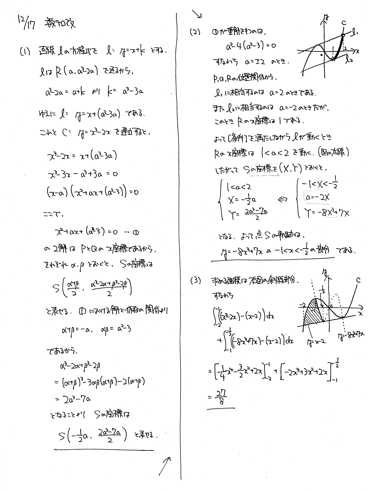
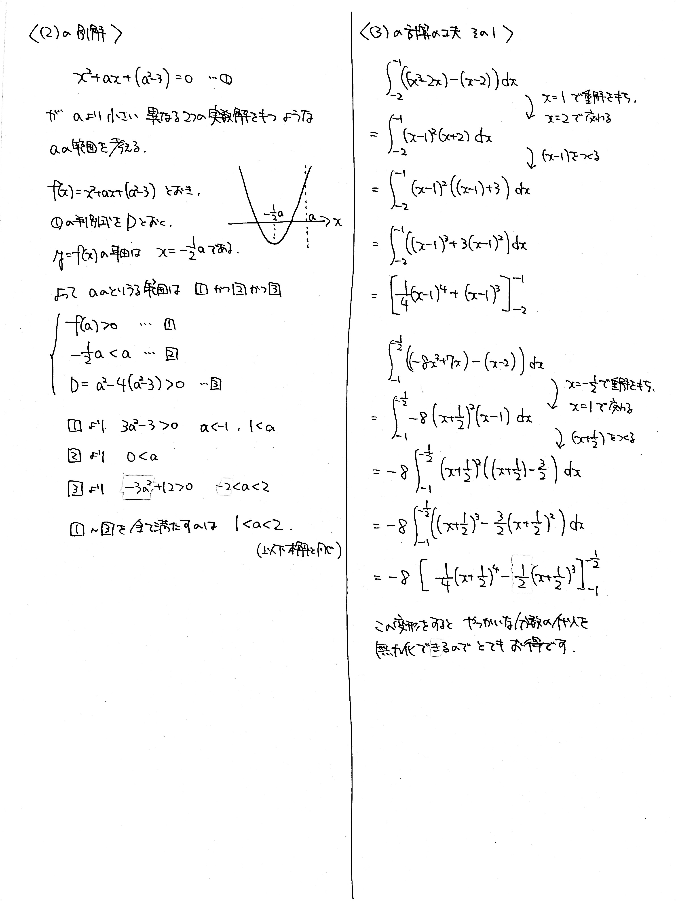
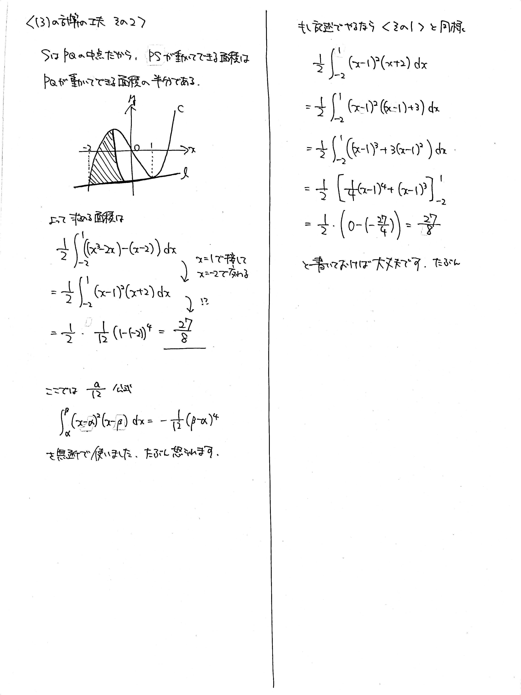
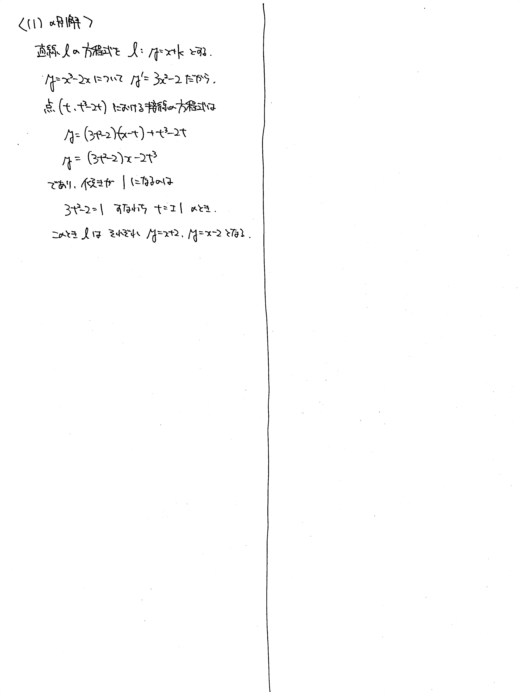

# 2021/12/17

> すべての小問に目を通しましょう。

出典:東北大理系数学2021大問4

満点:20点 / 目標:10点

座標平面において, 次の【条件】を満たす直線 $l$ を考える.

> 【条件】 $l$ の傾きは $1$ で, 曲線 $y=x^3-2x$ と異なる $3$ 点で交わる.

その交点を $x$ 座標が小さいものから順に $\mathrm{P}$, $\mathrm{Q}$, $\mathrm{R}$ とし, さらに線分 $\mathrm{PQ}$ の中点を $\mathrm{S}$ とする. 

(1) 点 $\mathrm{R}$ の $x$ 座標を $a$ とする. 点 $\mathrm{S}$ の座標を $a$ を用いて表せ.

(2) 直線 $l$ が【条件】を満たして動くとき, 点 $\mathrm{S}$ の軌跡を求めよ.

(3) 直線 $l$ が【条件】を満たして動くとき, 線分 $\mathrm{PS}$ が動いてできる領域の面積を求めよ.

解答・解説

$3$ 次関数のグラフをベースに,

- 解と係数の関係
- 高次方程式
- 軌跡

を融合した問題です. こういう問題を見ると, 作題した先生本当にすごいなと感心してしまいます.

では, 各小問の方針を立ててみます.

(1) まずはどうにかして $l$ の式を求めたい. 傾きが $1$ であることはわかっているから,

- $3$ 次方程式に持ち込み, $3$ 次方程式の解と係数の関係を用いる
- $3$ 次方程式に持ち込み, 因数定理を使って $2$ 次に落とす
- 接線の方程式を立てて, 傾きが $1$ になるときの切片を調べる

(2) $a$ の範囲を定めて, 軌跡を求める. $a$ の範囲の定め方は,

- グラフを眺めて決める
- 解の存在範囲の考え方を使う

(3) グラフを描いて, 積分区間を考えつつ式を立てる. 計算が割と面倒なので, できれば省力化を試みる.

### 部分的に解く

(3) だけ解くのなら, 

> $\mathrm{S}$ は $\mathrm{PQ}$ の中点だから, $\mathrm{PS}$ が動いてできる領域の面積は, $\mathrm{PQ}$ が動いてできる領域の面積の半分である.

ということを見抜ければ瞬殺できます. また, 正攻法で解くにしても, 検算に使えます.

以下が解答例ですが, 解説付きで別解をたくさん載せたら 4 枚になりました. 

