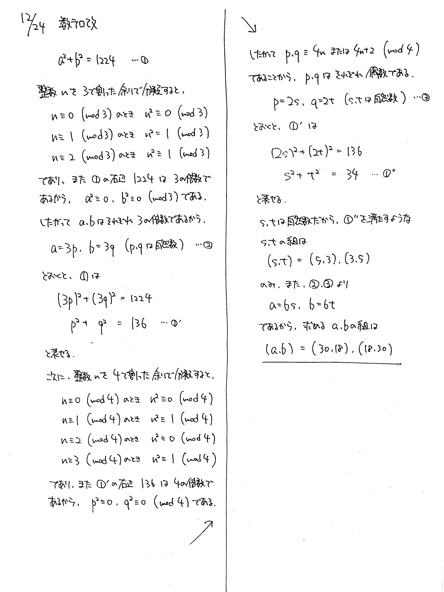
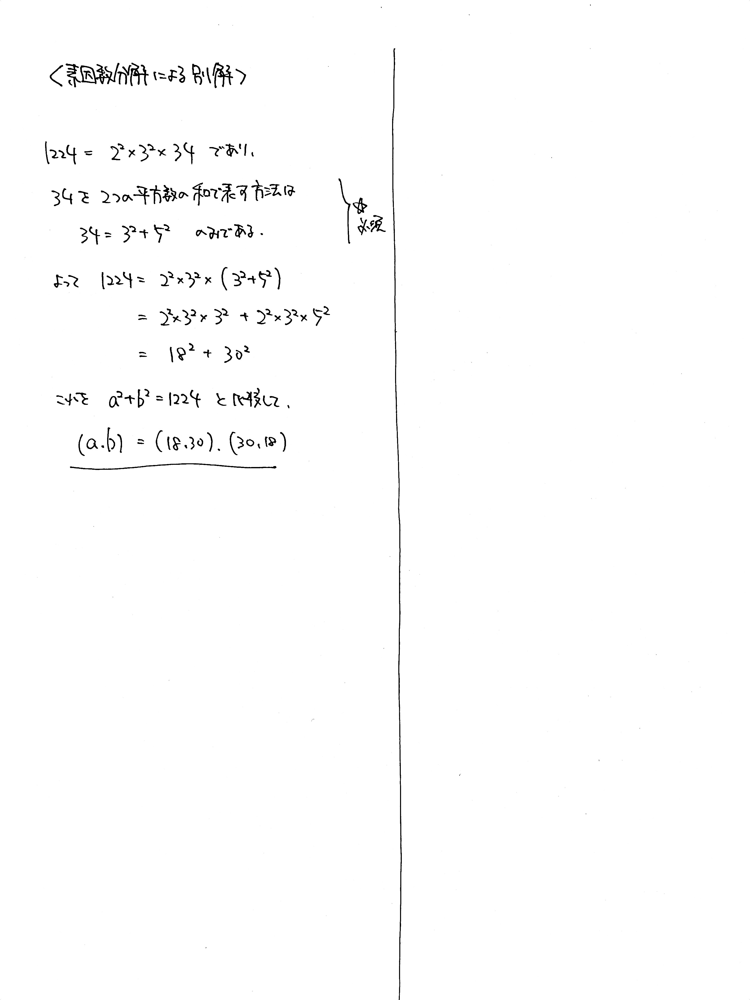

# 2021/12/24

> 今年ラストです。手も足も出なければ誘導あり版をやってみましょう。

満点:20点 / 目標:10点

$a^2 + b^2 = 1224$ を満たす自然数の組 $(a, b)$ を全て求めよ.

## 誘導あり版

誘導あり版

以下, $a$, $b$ を自然数, $n$ を整数とする. 

(1-1) $n^2$ を $3$ で割った余りは $0$ または $1$ であることを示せ.

(1-2) $n^2$ を $4$ で割った余りは $0$ または $1$ であることを示せ.

(2) $a^2 + b^2 = 1224$ を満たす自然数の組 $(a, b)$ を全て求めよ.

ヒント

- (1) キーワード: **余りによる整数の分類**
  - 黄チャートIA 例題113

ほぼ答え

- [【正答率鬼低】最恐の整数問題キミは解けるか？！ - YouTube](https://www.youtube.com/watch?v=B8sHhZRajO4)

## 解答・解説

解答・解説

平方剰余で絞り込みをする整数問題です. 難しいですね.

### 正攻法

もしこの問題が

> $a^2+b^2=34$ を満たす自然数の組 $(a, b)$ を全て求めよ.

だったら, 簡単に解けます. 右辺においてある数があまりに大きいので, なんとかして小さくしたいところです.

ここで余りによる分類を考えます. **これは経験則です.** 初見で思いつくことはないでしょう. 似たような問題をいくつかこなしていくうちに, 「あっこれ使えるかも」となる類のテクニックです.[^2]

「 $n^2$ を $3$ で割った余りは $0$ または $1$ である」ことがわかっている[^1]ので, それを踏まえてもう一度元の式を眺めてみましょう.

$$a^2+b^2=1224$$

ここで, $a^2$ と $b^2$ と $1224$ のどれかひとつでも $3$ で割って $1$ 余ってしまうと, 整合性が取れなくなります. つまりどれも $3$ の倍数です. そして, $n^2$ が $3$ の倍数になるのは, $n$ が $3$ の倍数になるときです. 

こんな感じでうまく右辺の数を小さくしていきましょう.

### 抜け道

$1224$ を因数分解して, うまく $a^2+b^2$ の形に変形することを考えます. この方法で解き進めるときは, 解がこれ以外にないこと(十分性の確認)を注意して行う必要があります.

[^1]: 小問で与えられていた場合, **たとえ示せなくても**そのあとの小問で既知として使ってかまいません.

[^2]: 今回であれば, 「平方数だから $3$ とか $4$ で割った余りをとって絞るかな」という発想自体が経験則としてあります.