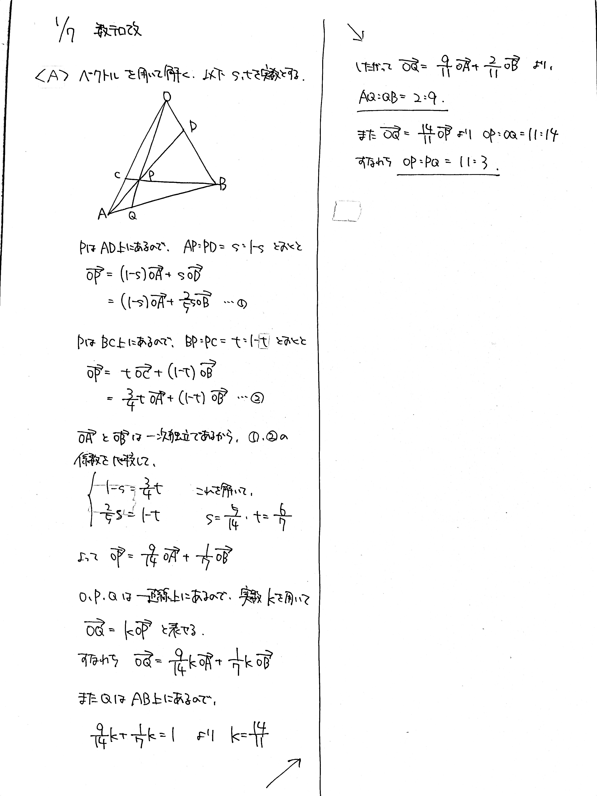
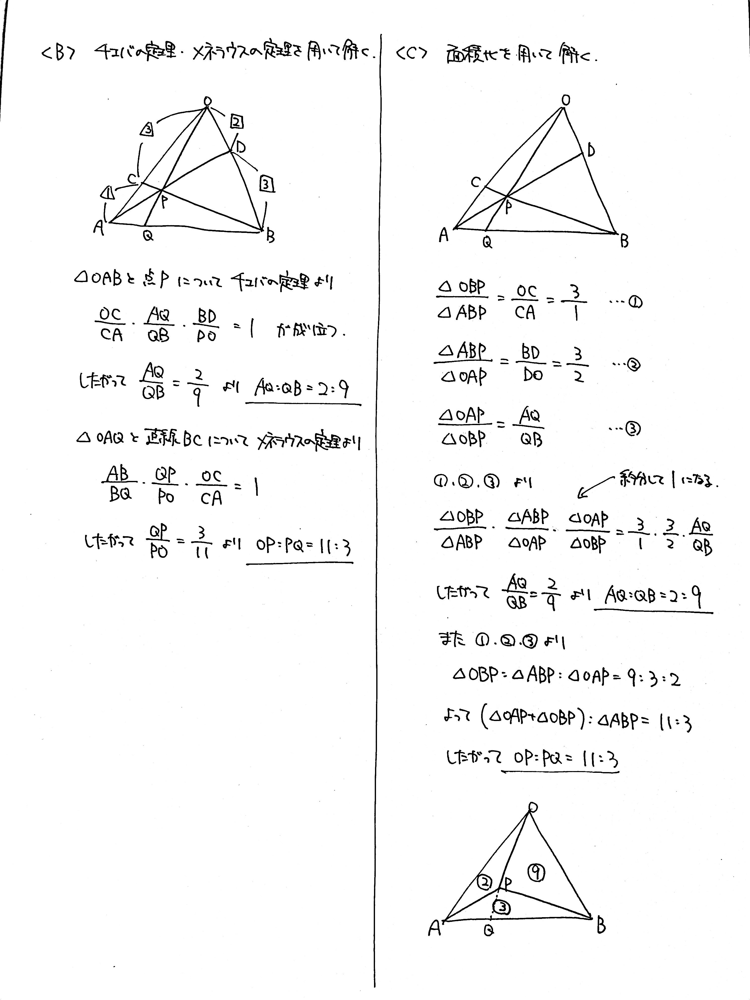
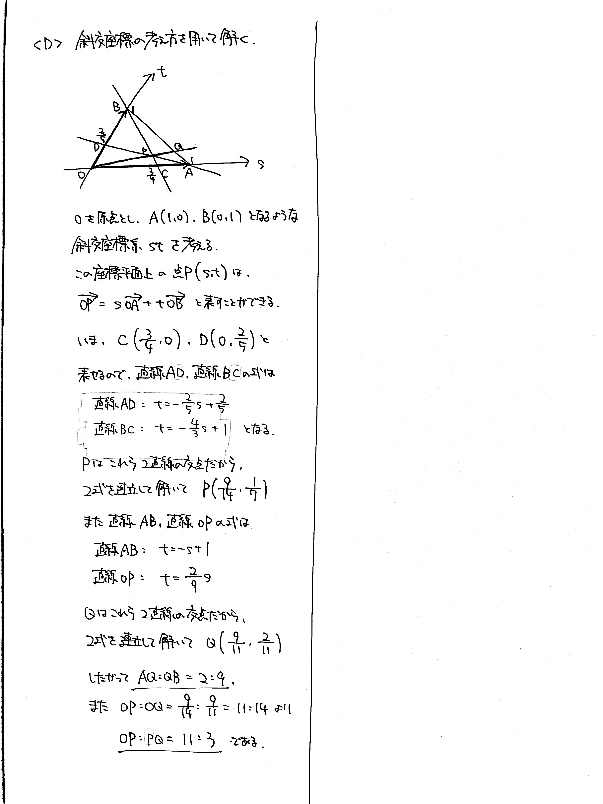

# 2022/01/07

満点:30点 / 目標:18点

$\triangle \mathrm{OAB}$ において, 辺 $\mathrm{OA}$ を $3:1$ に内分する点を $\mathrm{C}$, 辺 $\mathrm{OB}$ を $2:3$ に内分する点を $\mathrm{D}$ とし, 線分 $\mathrm{AD}$ と線分 $\mathrm{BC}$ の交点を $\mathrm{P}$ とする. また, 直線 $\mathrm{OP}$ と辺 $\mathrm{AB}$ の交点を $\mathrm{Q}$ とする. 

(1) $\mathrm{AQ}:\mathrm{QB}$ および $\mathrm{OP}:\mathrm{PQ}$ を求めよ.

(2) (1) とは別の解法で, $\mathrm{AQ}:\mathrm{QB}$ および $\mathrm{OP}:\mathrm{PQ}$ を求めよ.

(3) (1), (2) とは別の解法で, $\mathrm{AQ}:\mathrm{QB}$ および $\mathrm{OP}:\mathrm{PQ}$ を求めよ.

## 方針

方針

- **まずは図を描く**
- 中学, 高1, 高2のそれぞれで図形問題を解く道具を学習している
    - [2021/04/16](https://kampachi-dev.github.io/mathterro/2021/20210416_geom/) の解説を参照して, できることを探す

## 解答・解説

解答・解説

平面図形の計量の問題です。ただ解くだけなら簡単ですが、複数の解き方を要求されたときに、ひとつずつ挙げていくのは結構難しいのではないでしょうか。

思いつきやすい解法を順に 4 つ紹介していきます。

### ベクトル

高校 2 年生だとちょうど学習が進んだ内容ですから、最初に思いついたのではないでしょうか。そもそも問題設定の時点で $\triangle \mathrm{OAB}$ と書いてあるので、$\mathrm{O}$ を始点とした位置ベクトルを設定するのが自然です。

高校数学におけるベクトルの本質は**座標を設定する**ことです。それゆえ適切にベクトルを設定すれば機械的に解くことができます。

### チェバの定理・メネラウスの定理

辺の長さの比がわかっているので、チェバの定理とメネラウスの定理で瞬殺です。図を描くとわかりやすいですね。記述答案では、どの三角形に対して各定理を適用しているかを明記しましょう。

### 三角形の面積比

小学生・中学生ならこの方法を用いるしかありません。大半の高校生は、図形的な処理の練習を怠っているので、辺の長さの比と面積比を関連させる考え方自体を失っています。

チェバの定理・メネラウスの定理を導出するために面積比を用いているので、より使いやすい形に変わったと解釈することもできますが……いずれにしても選択肢のうちに入れておきたいですね。

### 斜交座標の設定

さきほど「ベクトルの本質は**座標を設定する**こと」と述べましたが、実際に斜交座標を設定すると直線の方程式を連立して求めることができます。

斜交座標の考え方は本当に大切ですが、学校や塾では触れられないことが多く、教科書に載っていないことすらあります。「ベクトルの終点の存在範囲」の問題を解くうえで非常に有用です。

ということで[詳しい解説](https://kampachi-dev.github.io/mathterro/tips/oblique/)を書きました。

## 出題意図

以下の問題が、2021 年の浜松医科大の入試に出題されました。

> $\mathrm{AB}=4$, $\mathrm{AC}=3$ である三角形 $\mathrm{ABC}$ の辺 $\mathrm{BC}$ を $2:1$ に内分する点を $\mathrm{D}$ とする. また, $\mathrm{AD}=1$ とする.  
> (a) $\mathrm{BC}$ の長さを求めよ.  
> (b) (a) とは別の解法で $\mathrm{BC}$ の長さを求めよ.

この問題は、おそらく「多角的な見方・考え方を養い、深く学ぶ」ことを求めて出題されたと考えています。最近の教育界の流行りです。

**共通テストってこういう感じの問題好きそうですよね？**

私の勝手な予想ですが、ひとつの問題に対して複数のアプローチで取り組むような問題が、今後も入試で出題されると考えています。そんなわけで、別解を複数求める形式の問題をいくつか用意しています。

