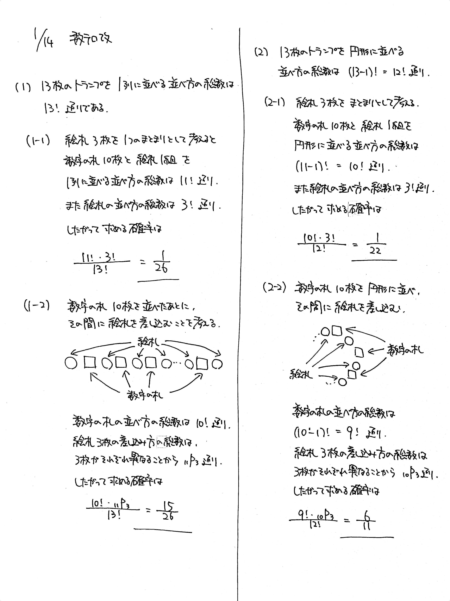

# 2022/01/14

> このトランプはふつうのトランプで、JQK の 3 枚が絵札です。

満点:20点 / 目標:16点

ダイヤのトランプ $1$ 組 $13$ 枚をシャッフルして, $1$ 列に並べる.

(1-1) 絵札が $3$ 枚連続して並ぶ確率を求めよ.

(1-2) どの絵札も連続して並ばない確率を求めよ.

次に、ハートのトランプ $1$ 組 $13$ 枚をシャッフルして, 円形に並べる.

(2-1) 絵札が $3$ 枚連続して並ぶ確率を求めよ.

(2-2) どの絵札も連続して並ばない確率を求めよ.

## 解答・解説

解答・解説

基本的な順列の問題です。(1) では普通の順列、(2) では円順列ですが、どちらも

- 連続して並べるときはまとまりとして考える
- 連続しないときは間に差し込む (合コンの順列)

ができれば大丈夫でしょう。

