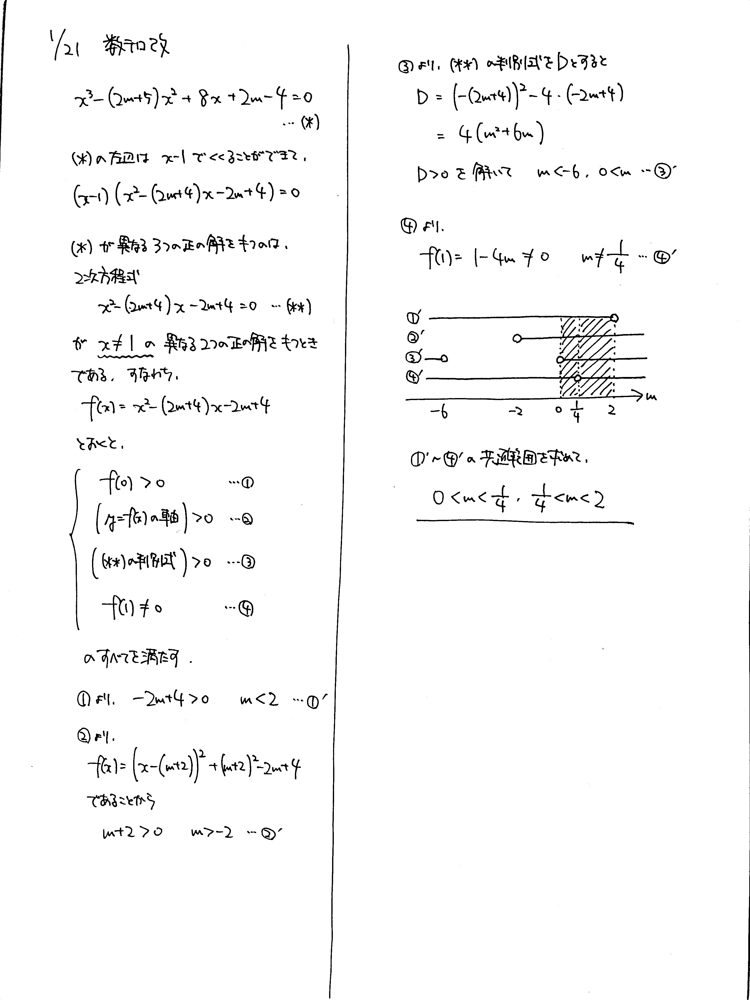

# 2022/01/21

満点:20点 / 目標:14点

$m$ を実数の定数とする. $x$ の $3$ 次方程式 $$ x^3-(2m+5)x^2+8x+2m-4=0 $$ が異なる $3$ つの正の解を持つように, $m$ の値の範囲を定めよ.

解答・解説

方程式の解の存在範囲の問題です。$3$ 次方程式が見えてびっくりしたかもしれませんが、因数定理を使って因数分解すれば親の顔より見た $2$ 次方程式に帰着します。

$2$ 次方程式の解の存在範囲の問題は過去にも何度か出題していますが、久しぶりですね。改めて確認しておきます。

- (判別式の値) $>0$
- 軸の位置
- 端点の座標の符号

これを必ず確認する。確実に押さえましょう。

今回は $3$ 次方程式ですので、$x \neq 1$ にならないという特殊事項が入っているところに要注意です。

