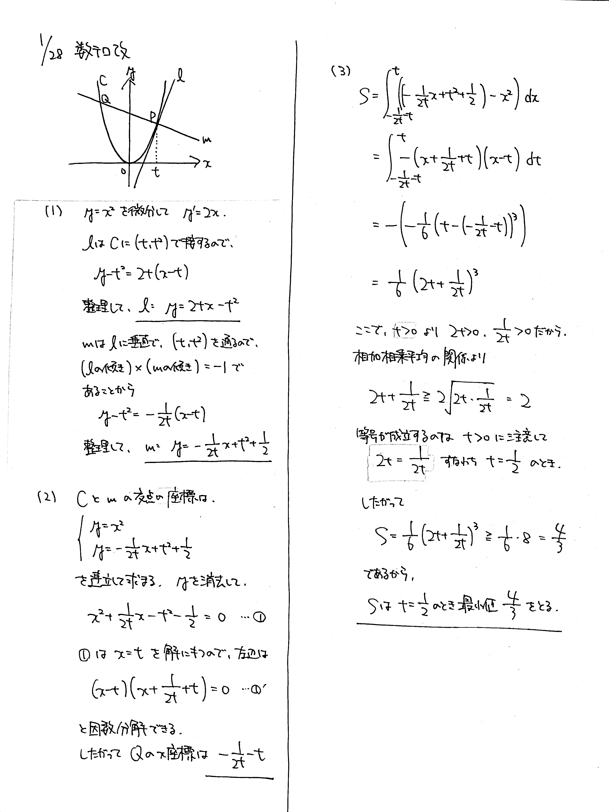
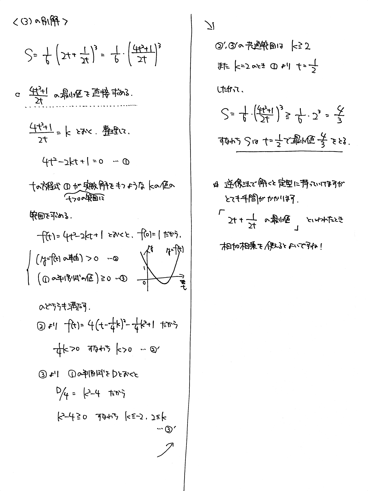

# 2022/01/28

満点:20点 / 目標:12点

$t$ は実数で, $t>0$ を満たす. 放物線 $C: y=x^2$ 上の点 $\mathrm{P}(t,\ t^2)$ における $C$ の接線を $l$ とし, $\mathrm{P}$ を通り $l$ に垂直な直線を $m$ とする.

(1) 直線 $l$, $m$ の方程式をそれぞれ $t$ を用いて表せ.

(2) $C$ と $m$ の交点のうち, $\mathrm{P}$ と異なる点を $\mathrm{Q}$ とする. $\mathrm{Q}$ の $x$ 座標を $t$ を用いて表せ.

(3) $C$ と $m$ によって囲まれた部分の面積を $S$ とする. $S$ の最小値を求めよ.

## ヒント

ヒント

- (1) $2$ 直線が垂直 $\Leftrightarrow$ (傾きの積) $=-1$
- (2) 交点の座標は連立して求める. $x=t$ で交わっているので……

## 解答・解説

解答・解説

放物線と法線 (接線に垂直な直線) の間の面積の最小値を求める問題です。誘導を丁寧につけたので、発想の飛躍はないでしょう。正確に処理できるかどうかで得点が大きく変わる問題だと思います。

放物線と直線で囲まれた面積を求めるとき、交点の $x$ 座標がきれいな値になっていないと計算が大変です。交点の $x$ 座標の差が簡単に求まる場合には、通称 1/6 公式が便利です。

$$ \int_\alpha^\beta (x-\alpha)(x-\beta) dx = -\frac{1}{6}(\beta-\alpha)^3 $$

これです。放物線と直線で囲まれた面積の計算では、その性質上必ず 1/6 公式を使うことができます。

好みじゃないといって教えたがらない先生は結構いるのですが、こういう計算技法を知らないと素早く処理できない問題が存在するので、必ず習得するべきだと思います。詳しい説明は[受験の月](https://examist.jp/mathematics/integral/16menseki1/)で確認しましょう。

(3) の最後は相加相乗です。見た目からして $t$ と $\dfrac{1}{2t}$ があるので、相加相乗を思い浮かべてほしいところですが、経験値がないと厳しいでしょう。[2021/03/19](https://kampachi-dev.github.io/mathterro/2021/20210319_eq/) のように逆像法 (いわゆる $=k$ とおく方法) で直接求めることもできますが、本解に比べて煩雑です。一応別解に載せました。

