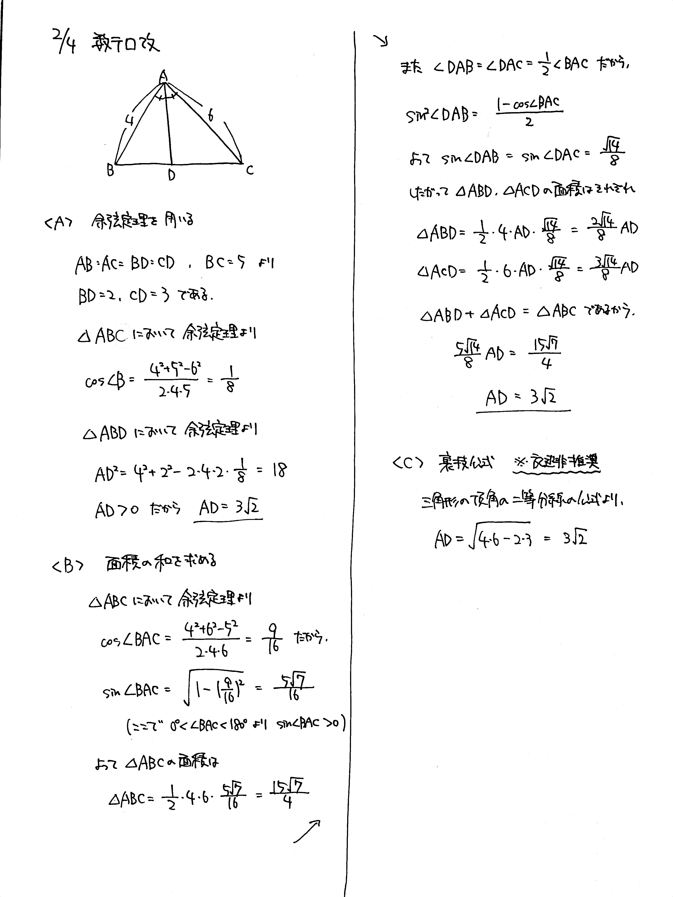
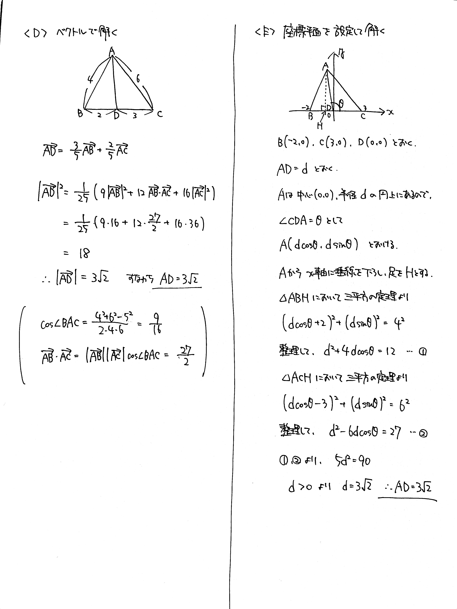

# 2022/02/04

満点:30点 / 目標:18点

$\triangle \mathrm{ABC}$ において, $\mathrm{AB}=4$, $\mathrm{BC}=5$, $\mathrm{CA}=6$ である. $\angle \mathrm{BAC}$ の二等分線と辺 $\mathrm{BC}$ の交点を $\mathrm{D}$ とする.

(1) 線分 $\mathrm{AD}$ の長さを求めよ.

(2) (1) とは別の解法で, 線分 $\mathrm{AD}$ の長さを求めよ.

(3) (1), (2) とは別の解法で, 線分 $\mathrm{AD}$ の長さを求めよ.

## 解答・解説

解答・解説

三角形の頂角の二等分線を、異なる方法で求める問題です。解き方を 5 つ紹介します。

### 余弦定理

角を 2 通りに表す、最も基本的な考え方です。非常によくできていました。

### 面積比較

面積を 2 通りに表す、こちらも基本的な考え方です。途中で半角の公式を使うので、処理に気を付けましょう。

### 裏技公式を使う

本問のような構図の三角形の頂角の二等分線について、

$$ \mathrm{AD} = \sqrt{\mathrm{AB} \cdot \mathrm{AC} - \mathrm{BD} \cdot \mathrm{CD}} $$

が成り立ちます。マーク式の試験や計算結果の検算に使うとよいでしょう。

なぜ？ (図を描いて確認してみましょう)

$\triangle \mathrm{ABC}$ の外接円と直線 $\mathrm{AD}$ との交点を $\mathrm{E}$ とする.  
$\triangle \mathrm{ABD} \sim \triangle \mathrm{AEC}$ より, $\mathrm{AB}:\mathrm{AD}=\mathrm{AE}:\mathrm{AC}$  
これを整理して $\mathrm{AD}^2 + \mathrm{AD} \cdot \mathrm{DE} = \mathrm{AB} \cdot \mathrm{AC}$  
一方, 方べきの定理より $\mathrm{AD} \cdot \mathrm{DE} = \mathrm{BD} \cdot \mathrm{CD}$  
したがって $\mathrm{AD}^2 = \mathrm{AB} \cdot \mathrm{AC} - \mathrm{BD} \cdot \mathrm{CD}$ 【説明終わり】

### ベクトルを設定する

まあベクトルならなんとかなるよね、という思想で計算を頑張りましょう。

### 座標平面を設定する

図形的な考察で行き詰まったときにこちらを使えるようにしておきたいところです。**内分点・外分点を原点に設定し**、式を立てて計算で処理します。計算量は多くなりがちですが、見通しを立てやすいことがメリットです。

