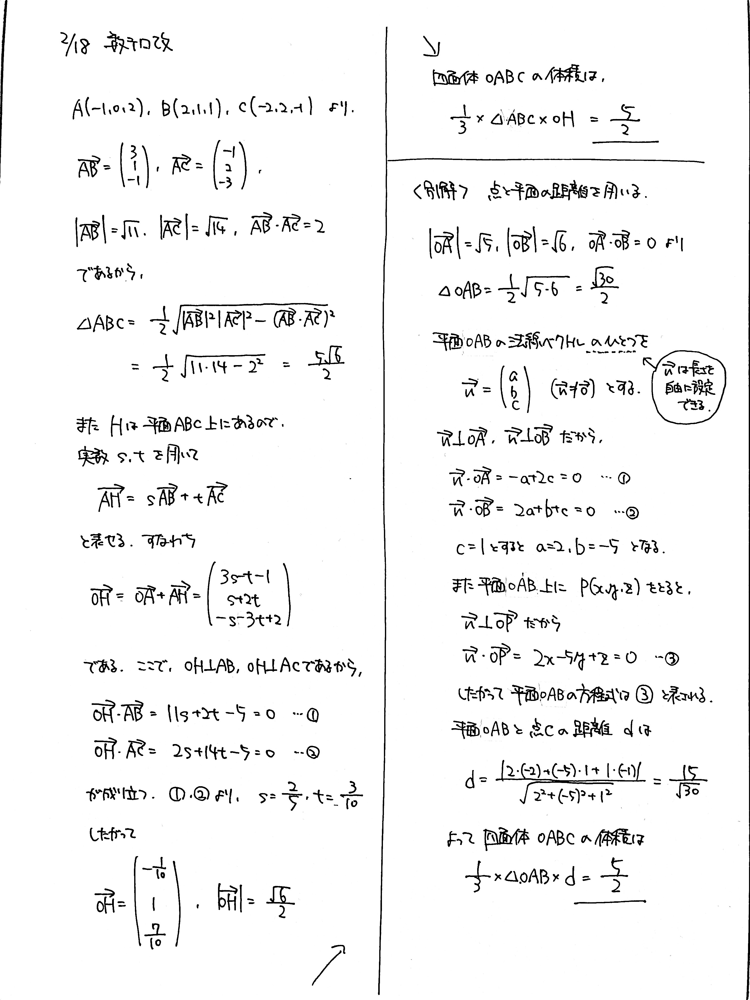

# 2022/02/18

満点:20点 / 目標:16点

空間上に $\mathrm{O}(0,\ 0,\ 0)$, $\mathrm{A}(-1,\ 0,\ 2)$, $\mathrm{B}(2,\ 1,\ 1)$, $\mathrm{C}(-2,\ 2,\ -1)$ をとる. 四面体 $\mathrm{OABC}$ の体積を求めよ.

## 誘導あり版

誘導あり版

(1) $\triangle \mathrm{ABC}$ の面積を求めよ.

(2) $\mathrm{O}$ から平面 $\mathrm{ABC}$ に垂線を下ろし, 垂線の足を $\mathrm{H}$ とする. $\overrightarrow{\mathrm{AH}}$ を $\overrightarrow{\mathrm{AB}}$, $\overrightarrow{\mathrm{AC}}$ を用いて表せ.

(3) 四面体 $\mathrm{OABC}$ の体積を求めよ.

## 解答・解説

解答・解説

四面体の体積を求める典型問題です。解き方がいろいろあるので、使い分けられるようになるのが大事です。結局のところ、底面積と高さが求まればいいので、どのようにしてそれらを導くかを考えればいいです。

まずは底面積ですが、$\triangle \mathrm{ABC}$ の面積は、$$ \triangle \mathrm{ABC} = \frac{1}{2} \sqrt{ | \overrightarrow{\mathrm{AB}} |^2 | \overrightarrow{\mathrm{AC}} |^2 - (\overrightarrow{\mathrm{AB}} \cdot \overrightarrow{\mathrm{AC}})^2 } $$ で求まります。これは大丈夫でしょう。

問題は高さで、方針がいくつか浮かびます。

- 垂線 $\mathrm{OH}$ の長さを求めるために $\mathrm{H}$ の座標を求める
    - $\overrightarrow{\mathrm{OH}}$ をうまく表す
    - 平面の方程式を用いる
- 点と平面の距離の公式を用いる

【誘導あり版】では $\overrightarrow{\mathrm{OH}}$ をうまく表す方法を考えてもらいました。平面 $\mathrm{ABC}$ 上のどの直線も $\mathrm{OH}$ と垂直であることを使うのが大事でしたね。

さて、平面の方程式を使う方法は、場合によってはかなり簡潔に答案を書くことができます。順に紹介していきます。

### 平面の方程式

一般に、平面の方程式は $$ ax+by+cz+d=0 $$ の形で表されます。平面上の直線の方程式 (数学II) の拡張版だと思うと理解しやすいでしょう。平面の方程式を求めるには、法線ベクトルを使うのが便利です。[^1] 法線ベクトルはその名の通り平面に垂直なベクトルで、長さを自由に決めることができます。別解では、最初に法線ベクトル $\overrightarrow{n}$ をひとつ設定し、途中で長さを勝手に決めました。[^2]

**平面を構成する $3$ 点に原点が含まれている**場合、平面の方程式が楽に求まるのでおすすめです。

### 点と平面の距離

点 $(x_1, y_1, z_1)$ と平面 $ax+by+cz+d=0$ の距離を $L$ とすると、 $$ L = \frac{| ax_1 + by_1 + cz_1 + d |}{\sqrt{a^2+b^2+c^2}} $$ と求まります。こちらも平面上の点と直線の距離 (数学II) の拡張版です。

### 行列式を用いた裏技

おそらく答案には書けませんが、検算用としてお使いください。

$\mathrm{O}(0, 0, 0)$, $\mathrm{A}(x_1, y_1, z_1)$, $\mathrm{B}(x_2, y_2, z_2)$, $\mathrm{C}(x_3, y_3, z_3)$ を頂点とする四面体の体積 $V$ は、以下に示す行列 $M$ を用いて

$$ V = \frac{1}{6} |\det M |,\ \ 
M = \begin{pmatrix}
x_1 & x_2 & x_3 \\
y_1 & y_2 & y_3 \\
z_1 & z_2 & z_3 \\
\end{pmatrix} $$

と表されます。

いきなり行列の話をするなよというところですが、計算方法だけ書いておくと

$$ \begin{align}
\det M = x_1&y_2z_3 + x_2y_3z_1 + x_3y_1z_2 \\
&- (x_1y_3z_2 + x_2y_1z_3 + x_3y_2z_1) 
\end{align}
$$

となります。行列表記の数を斜めにかけ算したものを足し引きして求めるイメージです。[^3]

[^1]: 点が平面上にある条件 $$ \overrightarrow{\mathrm{OP}} = s \overrightarrow{\mathrm{OA}} + t \overrightarrow{\mathrm{OB}} + u \overrightarrow{\mathrm{OC}},\ \ s+t+u=1 $$ を用いても求められますが、計算がやや面倒になります。

[^2]: 長さを自由に決めても、平面の方程式はただ $1$ 通りに定まります。【別解】では $c$ を変えても式③を同じ形に変形できます。

[^3]: 大学初年度に**サラスの公式**として学習します。解説は[こちら](https://manabitimes.jp/math/561)