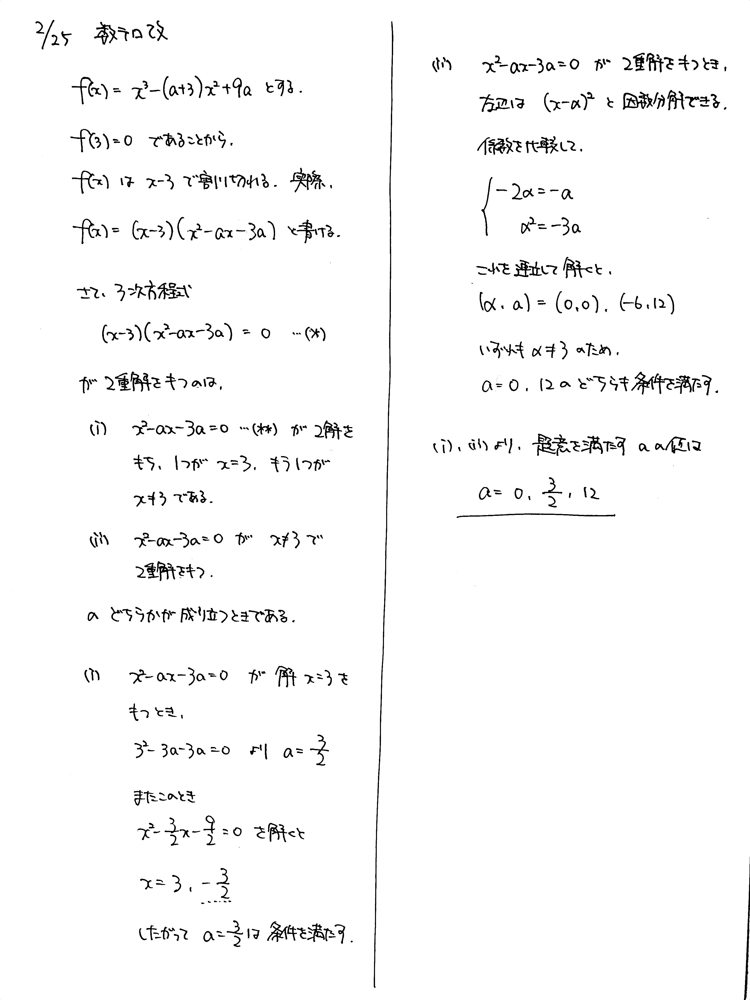

# 2022/02/25

満点:20点 / 目標:14点

$a$ を実数の定数とする. $x$ の方程式 $$x^3-(a+3)x^2+9a=0$$ が $2$ 重解を持つように $a$ を定めよ.

## ヒント・方針

方針

- まずは因数分解
- $2$ 重解になるのはどんなときか考える
- 黄チャートIIB 基本例題64

## 解答・解説

解答・解説

方程式の重解を考える問題です。基本的です。

とりあえず因数分解して、$$(x-3)(x^2-ax-3a)=0$$ を得ます。この方程式は明らかに $x=3$ を解に持つので、 $2$ 重解を持つのはどんなときか考えると、

- $x^2-ax-3a=0$ が $x \neq 3$ の重解を持つとき
- $x^2-ax-3a=0$ が $x=3$ と $x \neq 3$ の $2$ 解を持つとき

のどちらかです。あとはそれぞれ確かめればいいですね。

ところで、この記述をするときに

> $x^2-ax-3a$ が $x \neq 3$ の重解を持つ

などと書いてしまうと、これは方程式ではないため、重大な論理不備とみなされてこの行以降の点がなくなります。気を付けましょう。

