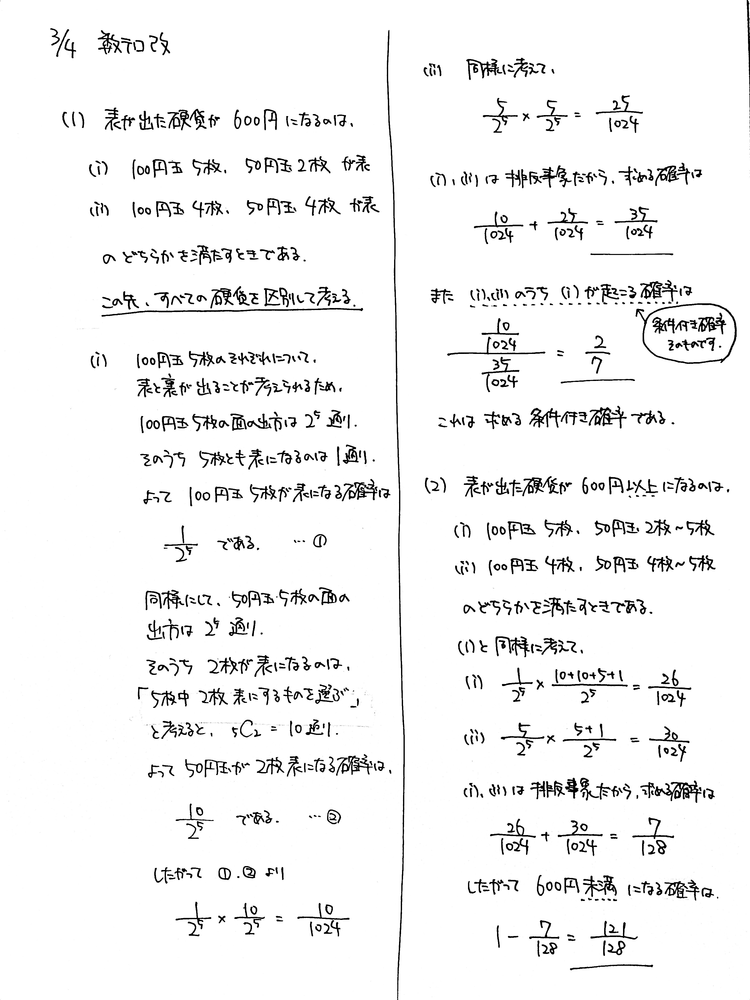

# 2022/03/04

満点:20点 / 目標:14点

$100$ 円硬貨 $5$ 枚と $50$ 円硬貨 $5$ 枚の合わせて $10$ 枚の硬貨を同時に投げるとき, 次の問に答えよ. ただし, どの硬貨も表と裏が出ることは同様に確からしいとする.

(1) 表が出た硬貨の合計金額が $600$ 円になる確率を求めよ. また, 表が出た硬貨の合計金額が $600$ 円であったとき, $100$ 円硬貨 $5$ 枚がすべて表になっている条件付き確率を求めよ.

(2) 表が出た硬貨の合計金額が $600$ 円未満になる確率を求めよ.

## 解答・解説

解答・解説

基本的な確率の問題です。場合を尽くして検討する力が求められます。

解説を含めて書いたので、読んで確認してください。実際はここまで記述する必要はありません。

