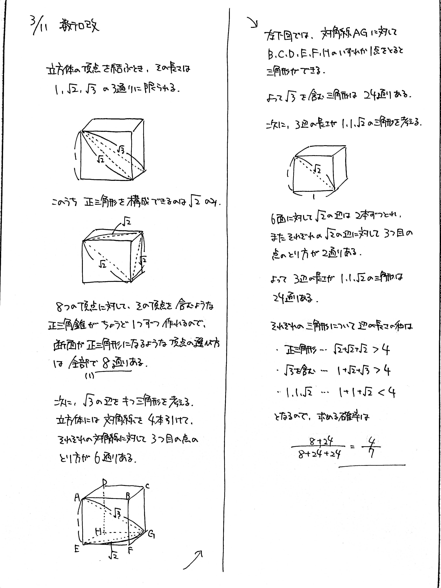

# 2022/03/11

満点:20点 / 目標:14点

$1$ 辺の長さが $1$ の立方体 $\mathrm{ABCD-EFGH}$ がある. この立方体の $8$ 個の頂点から $3$ 個を選んで三角形をつくる.

(1) 正三角形になるような頂点の選び方は何通りあるか求めよ.

(2) 頂点を無作為に $3$ 個選んだとき, 三角形の $3$ 辺の長さの和が $4$ 以上になる確率を求めよ.

## 解答・解説

解答・解説

適切な選び方に関する雑題です。

立方体の $8$ 個の頂点のなかから $3$ 個選ぶので、その組み合わせは $_8 \mathrm{C}_3 = 56$ 通りになります。それぞれの三角形の形を慎重に分類しましょう。

