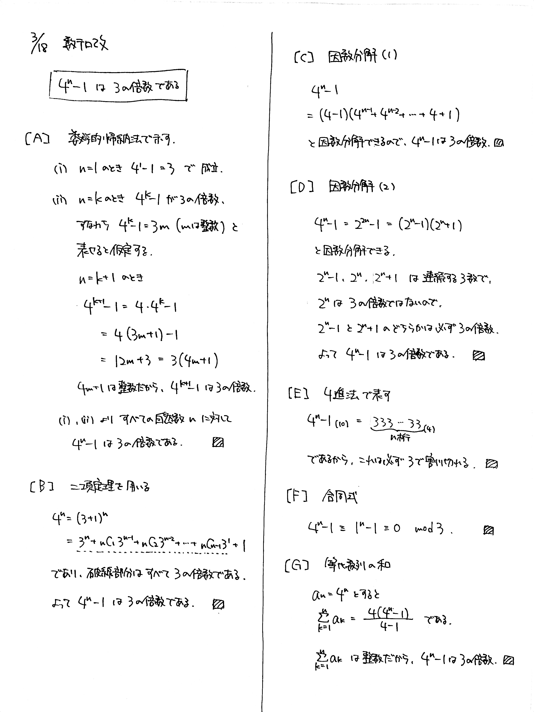

# 2022/03/18

満点:30点 / 目標:18点

$n$ を自然数とする.

>【命題】$4^n-1$ は $3$ の倍数である.

(1) 【命題】を示せ.

(2) (1) と異なる解法で, 【命題】を示せ.

(3) (1), (2) と異なる解法で, 【命題】を示せ.

## 解答・解説

解答・解説

倍数の証明です。例によって方針を挙げていきます。

### 数学的帰納法

自然数が絡んだ問題は数学的帰納法が強いです。

- (i) $n=1$ のとき成り立つ
- (ii) $n=k$ のとき成り立つ<u>と仮定すると</u>、$n=k+1$ のときも成り立つ

ただし少し扱いが難しく、いま何を示すのかを明確にしておかないと途中で迷ってしまうので気を付けましょう。

### 二項定理の利用

$$ 4^n = (3+1)^n = 3^n + {}_n\mathrm{C}_1 3^{n-1} + {}_n \mathrm{C}_2 3^{n-2} + \cdots + {}_n \mathrm{C}_{n-1} 3^1 + 1 $$ であり、最後の $1$ 以外すべて $3$ の倍数です。

### 因数分解

因数分解は下のいずれかを使えばよいです。

- $(2^n-1)(2^n+1)$
- $(4-1)(4^{n-1}+4^{n-2}+\cdots+4^1+1)$

特に $x^n-1 = (x-1)(x^{n-1}+x^{n-2}+\cdots+x^1+1)$ を使うのは盲点になりがちなので、覚えておくと便利です。

### 4進法

$4^n-1_{(10)}=333\cdots33_{(4)}$ ( $3$ が $n$ 桁) と表せるので、$3$ で割り切れます。 

### 合同式

$a \equiv b \pmod{n}$ のとき $a^n \equiv b^n \pmod{n}$ であることを利用するものです。おそらくこれが一番早いです。[動画](https://www.youtube.com/watch?v=x53989F_cqc)もあります(淫夢要素注意)。9秒しかない

### 等比数列の和

$a_n=4^n$ とすると、$S_n = \displaystyle \sum_{k=1}^n a_k = \dfrac{4(4^n-1)}{3}$ で、$S_n$ は整数なので $4^n-1$ は $3$ の倍数です。

