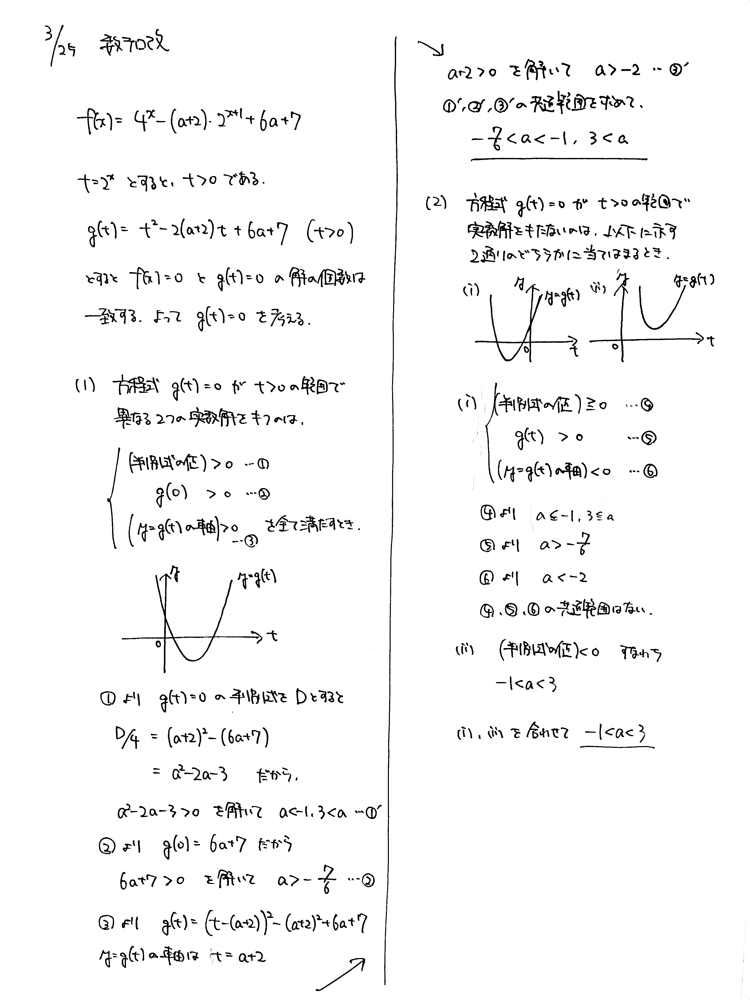

# 2022/03/25

> 数テロ改、最終回です。

満点:20点 / 目標:12点

$a$ を実数の定数とし, $$ f(x) = 4^x-(a+2) \cdot 2^{x+1} +6a+7 $$ とする.

(1) 方程式 $f(x)=0$ が異なる $2$ つの実数解をもつような $a$ の値の範囲を求めよ.

(2) 方程式 $f(x)=0$ が実数解をもたないような $a$ の値の範囲を求めよ.

## 解答・解説

解答・解説

数テロ改、長らくのご愛顧誠にありがとうございました。

みんなだいすき解の存在範囲の問題です。

定石通り $t=2^x$ とおけば $$ g(t) = t^2-2(a+2)t+6a+7 \ (t>0) $$ になるので[^1]、あとはいつもの処理をします。それぞれ

- (1) $g(t)=0$ が $t>0$ で異なる $2$ つの実数解をもつ
- (2) $g(t)=0$ が $t>0$ に実数解をもたない

と読み替えられます。特に (2) はグラフをいろいろ描いてみて丁寧に場合分けしましょう。

[^1]: ここで $f(t)=$ と書き始めてはいけません。$f(t)$ はあくまで $f(x)$ の $x$ を $t$ に置き換えたものなので、別物の関数として書く必要があります。