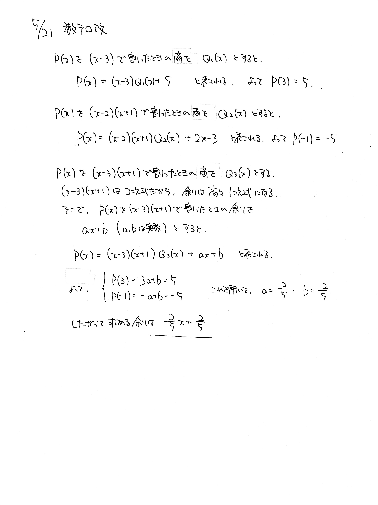

# 2021/05/21

満点:10点 / 目標:8点

$x$ の多項式 $P(x)$ を $(x-3)$ で割ったときの余りは $5$, $(x-2)(x+1)$ で割ったときの余りは $2x-3$ である. このとき, $P(x)$ を $(x-3)(x+1)$ で割ったときの余りを求めよ.

## 解答・解説

解答・解説

基本的な剰余の定理の問題です. 3分くらいで解けないと勉強不足です. 2次式で割ったら余りは1次式になることを理解していない答案が多く見受けられました. 復習してください.

記述するうえで大事なこととして, **必要なことは書き, 必要ないことは書かない**というのが挙げられます. たとえば今回の問題では素直に進めると $P(3)=5$, $P(2)=1$, $P(-1)=-5$ であることがわかります. ただ, 問題に答えるには $P(3)$ の値と $P(-1)$ の値が分かればいいので, $P(2)$ は必要ありません. ということで, 答案には $P(2)=1$ であることは書かないほうがよいことになります.

「書かないほうがよい」というと, たくさん消しゴムで消す人いますよね. 愚かです. 自分が答案に書いた内容が正しいかどうか自分で判定できないのに, わざわざ消しゴムで消す意味がありません.
答案を一通り書き終わってから, 使わなかったところを四角で囲ってバツを付けておけばそれで十分です.

そもそも今回の問題なら $P(3)$ の値と $P(-1)$ の値が分かればいいことを先に見抜けるので, このような心配はいらないはずなのですが, そのレベルまで頑張ってくれることを望みます.

### 答案をセルフチェックする

よくありがちなミスは以下の通りです:
- 使う文字を説明していない
    - 特に「 $a,\ b$ は実数とする」とか大事です
- 使う文字が被っている
    - 商を $Q(x)$ と表したいのはよくわかりますが, 違うものを指すなら名前も変える必要があります
    - $Q_1(x)$ のように添え字で表現するとよいです
    - 判別式でも同様のミスが起きやすいです( $D$ が何回も出てきてしまうとか)

### 整式の除算

定義を確認します.

> 2つの整式 $f(x)$, $g(x)$ (ただし, $g(x)$ は $0$ ではない) に対して,
$$
\left\lbrace
\begin{array}[l]
ff(x) = g(x) \cdot q(x) + r(x) \newline
(q(x) の次数) > (r(x) の次数)
\end{array}
\right.
$$
> を満たすような整式 $q(x)$, $r(x)$ が, ただ1組存在する. 
> このとき, $q(x)$ を**商**(quotient), $r(x)$ を**余り**(remainder)という.

