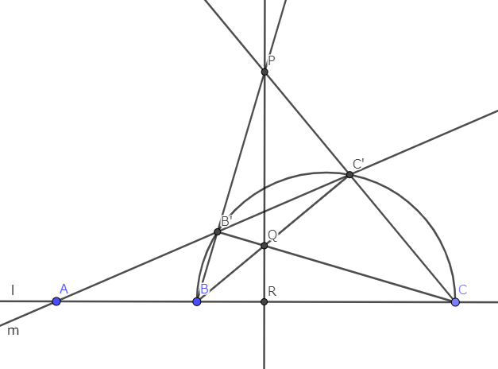
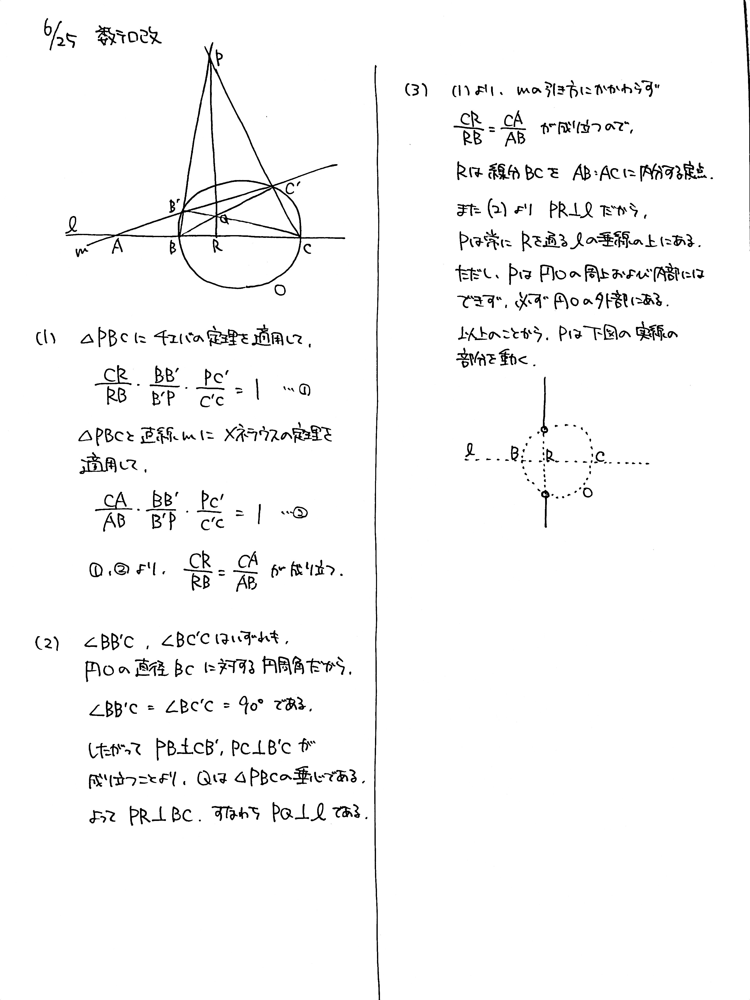

# 2021/06/25

満点:20点 / 目標:12点

> 2021/06/28 誤記修正しました

直線 $l$ 上に $3$ 点 $\mathrm{A}$, $\mathrm{B}$, $\mathrm{C}$ をこの順にとり, 線分 $\mathrm{BC}$ を直径とする円を $\mathrm{O}$ とする. 直線 $m$ は点 $\mathrm{A}$ を通り, 円 $\mathrm{O}$ の円周と $2$ 点で交わる. ただし, $l \neq m$ である. $m$ と $\mathrm{O}$ の $2$ 交点のうち, $\mathrm{B}$ に近い交点を $\mathrm{B'}$, 他の交点を $\mathrm{C'}$ とする. 直線 $\mathrm{BB'}$ と直線 $\mathrm{CC'}$ の交点を $\mathrm{P}$ とし, 直線 $\mathrm{BC'}$ と直線 $\mathrm{CB'}$ の交点を $\mathrm{Q}$, 直線 $\mathrm{PQ}$ と $l$ の交点を $\mathrm{R}$ とする.

(1) $\dfrac{\mathrm{CR}}{\mathrm{RB}} = \dfrac{\mathrm{CA}}{\mathrm{AB}}$ が成り立つことを示せ.

(2) 直線 $\mathrm{PQ}$ は $l$ に垂直であることを示せ.

(3) 直線 $m$ が上の条件を満たしながら動くとき, 点 $\mathrm{P}$ の軌跡を求めよ.

## 解答・解説

解答・解説

純粋な幾何の問題です. 問題文ミスってて大変申し訳ありませんでした.

(2) では三角形の垂心の性質を使って解答することになります. 三角形の五心について, 定義を確認しておきましょう.

||定義|性質|
|:--|:--|:--|
|重心|中線の交点|各中線を 2:1 に内分する|
|内心|内角の二等分線の交点|内接円の中心 3辺からの距離が等しい|
|外心|辺の垂直二等分線の交点|外接円の中心 3頂点からの距離が等しい|
|垂心|頂点から対辺に下ろした 垂線の交点||
|傍心|1つの内角の二等分線と 他の外角の二等分線の交点|傍接円の中心 1つの三角形に対して3つある|

きれいに図を描くと以下のようになります. ただし実際には半円ではなく円であり, 直線 $m$ は右下がりにもなりうることに注意してください.

(3) は説明が難しいですが, 文章で

> 線分 $\mathrm{BC}$ を $\mathrm{AB}:\mathrm{AC}$ に内分する点における直線 $l$ の垂線のうち, 円 $\mathrm{O}$ の外部にある点

と記述してもいいし, あるいは図示してもいいと思います. 解答例では図示しました.

