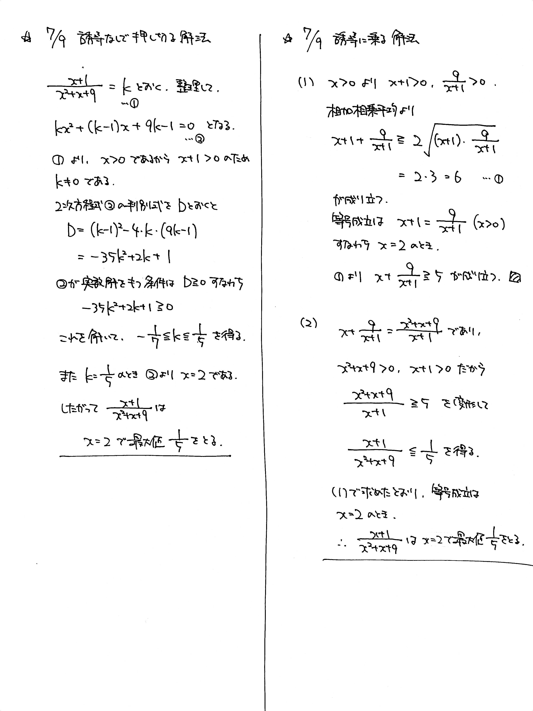

# 2021/07/09

満点:20点 / 目標:12点

> この問題は誘導をつけるかどうか自分で選べます。必要があれば【誘導あり版】を使ってください。

## 誘導なし版

$x>0$ のとき, $\dfrac{x+1}{x^2+x+9}$ の最大値を求めよ.

## 誘導あり版

誘導

(1) $x>0$ のとき, $x+\dfrac{9}{x+1} \geqq 5$ が成り立つことを示せ.

(2) $x>0$ のとき, $\dfrac{x+1}{x^2+x+9}$ の最大値と, そのときの $x$ の値を求めよ.

## 方針・ヒント

方針

- $\dfrac{a}{b} + \dfrac{b}{a}$ の形を見つけたら, **相加相乗平均**の活用を考える.
    - 相加相乗を使うときは, 必ず各項の符号が正であることを確認する.
    - 黄チャートIIB 例題30, 31

## 解答・解説

解答・解説

毎度おなじみ, 分数関数の値域を求める問題です.

### 誘導がない場合

よくある解法は,

> $=k$ とおいて方程式を整理し, $D \geqq 0$ になるような $k$ の範囲を求める

というものです. 過去にも出題されているので, [2021/03/19](https://kampachi.tech/mathterro/20210319_eq) を確認してください.

今回の問題を逆像法で解く場合, $-\dfrac{1}{7} \leqq k \leqq \dfrac{1}{5}$ を得たあと, $k=\dfrac{1}{5}$ となるような $x$ が本当に $x>0$ の範囲に存在するかどうか確かめる必要があります.

### 今回の問題の場合

作為的に設定されているので, **相加相乗平均**を活用して考えると楽に解けます.

### 等号成立の確認について

「相加相乗平均を使ったら, 必ず等号成立条件を確認しろ」と指導されている人も多いかと思います. 一方で, 問題集の解答には等号成立条件の確認を省略しているものもあります. なぜでしょうか.

現実に即した, 簡単な例を見てみましょう.

$$( 高校生の身長 ) \geqq 2\ \mathrm{cm}$$

地球の常識で考えれば, この不等式は成り立つといっていいでしょう. しかし, 等号が成立することを示すためには, 実際に身長が $2\ \mathrm{cm}$ の高校生を連れてくる必要があります.

ということで,

- 相加相乗平均を使うだけなら, 等号成立条件の確認は必要ない
- 最大値や最小値が存在することを示すためには, 等号成立条件の確認が必要

です. 問題に戻って, (1) では不等式を示すだけだったので, 等号成立条件の確認は必要ありません. しかし, (2) では, 実際に最大値 $\dfrac{1}{5}$ をとるのか確かめるために, 等号成立条件の確認が必要になります.

