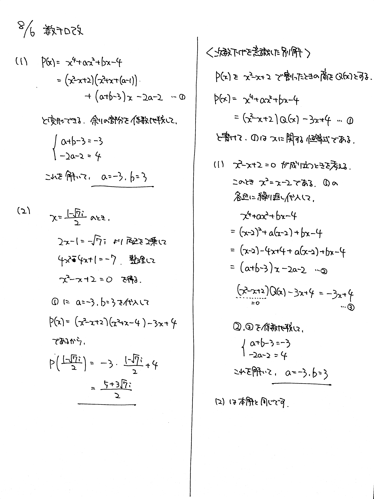

# 2021/08/06

満点:20点 / 目標:15点

整式 $P(x)=x^4+ax^2+bx-4$ は, $x^2-x+2$ で割ると余りが $-3x+4$ になる.

(1) 実数 $a$, $b$ の値を求めよ.

(2) $i$ を虚数単位とする. $P\left(\dfrac{1-\sqrt{7}i}{2}\right)$ の値を求めよ.

## ヒント・方針

方針

- (1) 頑張って割り算をしたあと, 余りを係数比較する.
- (2) $x=\dfrac{1-\sqrt{7}i}{2}$ をそのまま代入すると先が見えない.
    - 変形して2次方程式を作り, 効率の良い計算を考える.
    - 黄チャートIIB 例題56
- **次数下げ**による解法もあり

## 解答・解説

解答・解説

整式の除算に関する問題です. 毎度のことですが, 高校生は**剰余の定理**くらいしか道具がないので, 難しい問題はつくれないことになります.

(1) は, 頑張って除算をする問題でした. よくできていました. 
(2) は, 工夫を凝らして計算しようと試みたり, ゴリ押ししようとした答案がありました.  $4$ 次式にゴリ押しは通用しません.

### 問題の「主題」を考える

(1) で, 割り算の筆算を答案に書く必要はありません. また, 筆算を書いたとしても部分点にはつながりません.

この問題で求められているのは, $a$, $b$ を求めることです. 答案に書くべきは, 

- 割り算して余りを係数比較したら $a$ と $b$ が求まる
- 実際に計算すると $a=-3$, $b=3$ になる

ということのみです.

### 次数下げを意識した別解

$x^2-x+2=0$ から $x^2=x-2$ を連想し, 恒等式の性質と次数下げを利用して解くことができます. とても利用価値の高い解法です. ぜひ習得してください.

