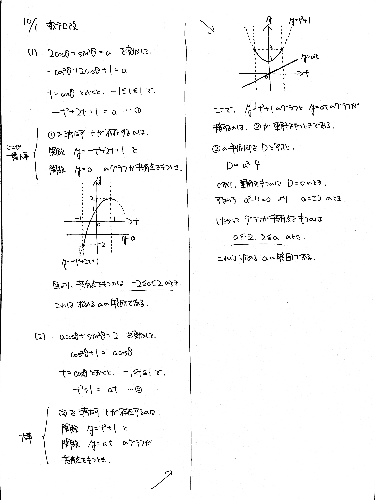

# 2021/10/01

> 見た目はそっくりだけど (1) は簡単 (2) はちょっと難しい

満点:20点 / 目標:12点

(1) $2 \cos \theta + \sin^2 \theta = a$ を満たす $\theta$ が存在するような $a$ の値の範囲を求めよ.

(2) $a \cos \theta + \sin^2 \theta = 2$ を満たす $\theta$ が存在するような $a$ の値の範囲を求めよ.

## ヒント・方針

方針

- (1) キーワード: **定数分離**
    - 黄チャート 例題126(1)
- (2) 工夫して定数分離する(おすすめ) or 解の存在範囲の問題に帰着させる

## 解答・解説

解答・解説

標準的な**定数分離**の問題です.

### 定数分離とは

方程式で, 文字定数を片側に集める変形のことをいいます.

関数のグラフと方程式の間には, 以下のような性質が成り立ちます.

> $y=f(x)$ のグラフと $y=a$ のグラフが共有点をもつ $\Leftrightarrow$ $x$ の方程式 $f(x)=a$ は実数解をもつ

そんないきなり言われても……と思ったかもしれませんが, みなさんはすでにこの性質を用いています.

> 【中学3年】  
> $y=x^2$ と $y=x+2$ の交点の座標を求めよ.

この問題は中学3年生のときにたくさん練習したと思います.

> $x$ の方程式 $x^2=x+2$ を解いて, $x=-1,\ 2$  
> $x=-1$ のとき $y=1$, $x=2$ のとき $y=4$  
> よって交点の座標は $(-1,\ 2),\ (2,\ 4)$

と解いていました. $x$ の方程式 $x^2=x+2$ を解くと, 交点の $x$ 座標が求まります.

> 【黄チャートIA 例題82】  
> $k$ は定数とする. 放物線 $y=x^2-2x+2k-4$ と $x$ 軸の共有点の個数を, $k$ の値によって場合分けして求めよ.

これを解くときに,

> $2$ 次方程式 $x^2-2x+2k-4=0$ の判別式を $D$ とする.

と書いていました. $x$ 軸とは, 直線 $y=0$ のことですから, 放物線 $y=x^2-2x+2k-4$ と直線 $y=0$ の交点の個数を求めればよいということです. だから, $x$ の方程式 $x^2-2x+2k-4=0$ を解きます.

そんなわけで, グラフの交点と方程式の解は関連性があることがわかると思います.

文字を含む方程式の解の個数を考えるとき, 「文字を含まないが複雑なグラフ」と「文字を含むが単純なグラフ」に分けて図を描けば, 簡単に解の個数がわかります.

定数分離のメリットは, **視覚的にわかる**ことです. グラフを目で見て確認できるので, ミスが減ります.

### 実際のグラフ

(1) は, すでに定数分離された形になっています. 左辺を $2$ 次関数にした後は, グラフを描いていつ交点をもつか考えましょう.

<iframe scrolling="no" title="定数分離1" src="https://www.geogebra.org/material/iframe/id/fa5xmazj/width/700/height/500/border/888888/sfsb/true/smb/false/stb/false/stbh/false/ai/false/asb/false/sri/false/rc/false/ld/false/sdz/false/ctl/false" width="700px" height="500px" style="border:0px;"> </iframe>

(2) は, 定数分離されていないので, 自力で分離します. すると, $y=t^2+1$ と $y=at$ のグラフを考えることになります. 曲線と直線がいつ接するかは見ただけではわからないので, 接するタイミングを別途確認します.

<iframe scrolling="no" title="定数分離2" src="https://www.geogebra.org/material/iframe/id/yfnfdxny/width/700/height/500/border/888888/sfsb/true/smb/false/stb/false/stbh/false/ai/false/asb/false/sri/false/rc/false/ld/false/sdz/false/ctl/false" width="700px" height="500px" style="border:0px;"> </iframe>

