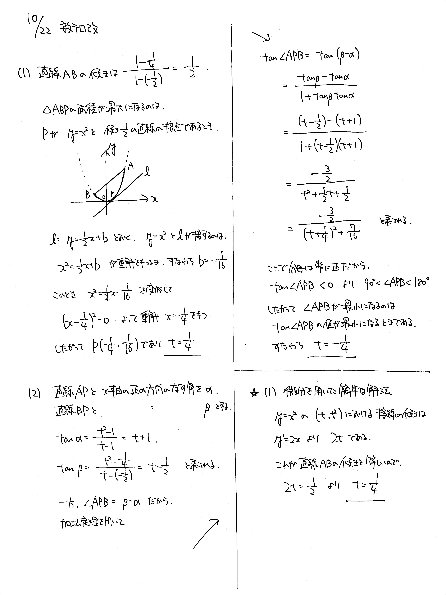

# 2021/10/22

満点:20点 / 目標:12点

$-\dfrac{1}{2} < t < 1$ とする. 放物線 $y=x^2$ 上に $3$ 点 $\mathrm{A}(1,\ 1)$, $\mathrm{B}\left(-\dfrac{1}{2},\ \dfrac{1}{4}\right)$, $\mathrm{P}(t,\ t^2)$ をとる.

(1) $\triangle \mathrm{APB}$ の面積が最大になるときの $t$ の値を求めよ.

(2) $\angle \mathrm{APB}$ の大きさが最小になるときの $t$ の値を求めよ.

## 誘導あり版

(2) の誘導あり版

(2-1) 直線 $\mathrm{AP}$, 直線 $\mathrm{BP}$ の傾きをそれぞれ $t$ を用いて表せ.

(2-2) $\angle \mathrm{APB}$ の大きさが最小になるときの $t$ の値を求めよ.

さらにヒントがほしい人のために

- 直線 $\mathrm{AP}$ と $x$ 軸の正の方向がなす角を $\alpha$, 直線 $\mathrm{BP}$ と $x$ 軸の正の方向がなす角を $\beta$ とおくと, $\angle \mathrm{APB}$ はどのように表されるか.

- ( $\mathrm{AP}$ の傾き) $= \tan \alpha$

## 解答・解説

解答・解説

座標平面上の三角形の問題です. 中3でたくさんやったので既視感があるかもしれません.

(1) は, $\triangle \mathrm{APB}$ の底辺を $\mathrm{AB}$ としたときの高さが最大になるタイミングを考えることになります. 直線 $\mathrm{AB}$ を下側にスライドしていくとすぐわかります. 

(2) は, 座標平面上の角度の最小値を求める問題でした. 直線の傾きは $\tan$ で表現できるため, $\tan \angle \mathrm{APB}$ の大小を考えよう, となってほしいところです.  
直線 $\mathrm{AP}$ と $x$ 軸の正の方向がなす角を $\alpha$, 直線 $\mathrm{BP}$ と $x$ 軸の正の方向がなす角を $\beta$ とおくと, $\angle \mathrm{APB}$ は $\beta - \alpha$ と表されます. 傾きが求まっているので, $\tan \alpha$ と $\tan \beta$ から加法定理を用いて $\tan (\beta-\alpha)$ を求めることができます.  
最後の変形は方向性が見えていないと難しいかもしれません.

例によって動くグラフを用意しました.

<iframe scrolling="no" title="放物線上の角" src="https://www.geogebra.org/material/iframe/id/jtgtaf4t/width/700/height/500/border/888888/sfsb/true/smb/false/stb/false/stbh/false/ai/false/asb/false/sri/false/rc/false/ld/false/sdz/false/ctl/false" width="700px" height="500px" style="border:0px;"> </iframe>

