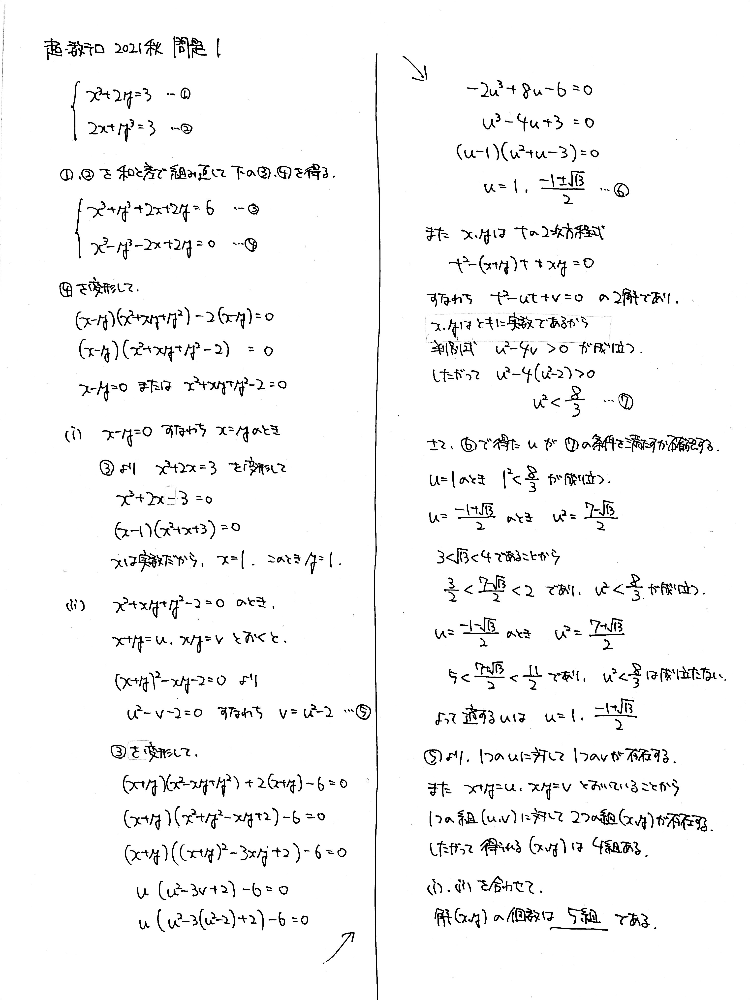
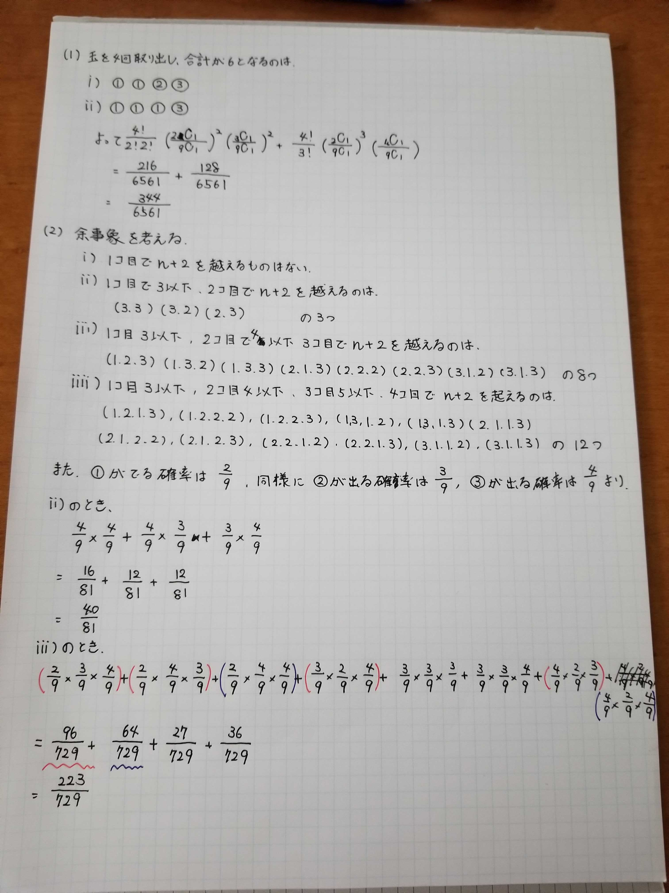
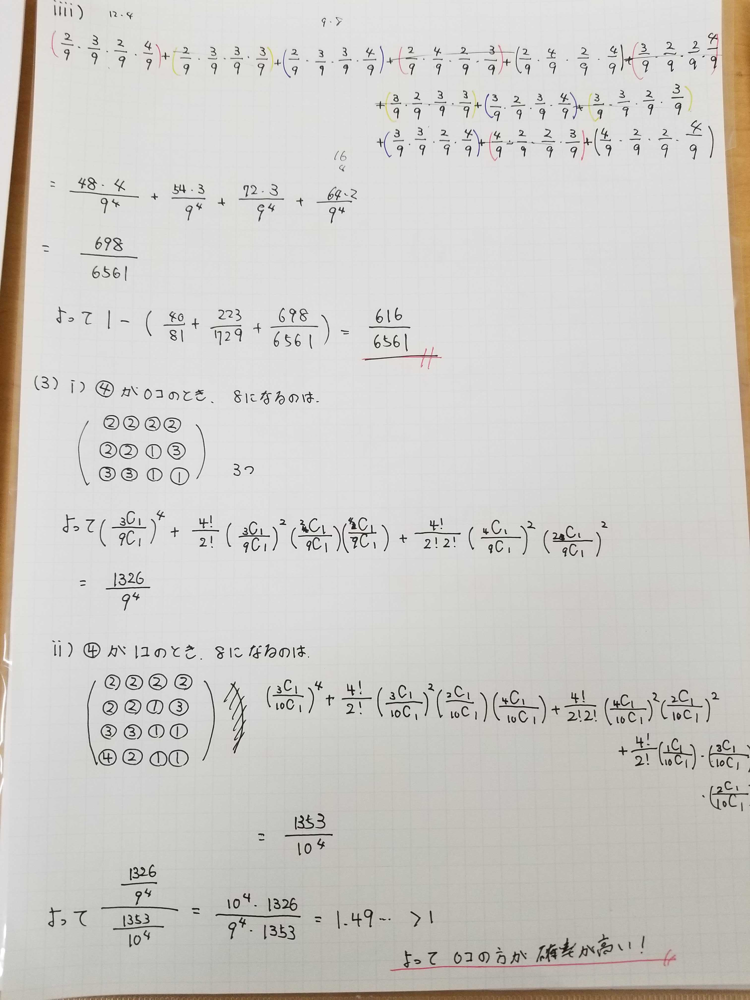
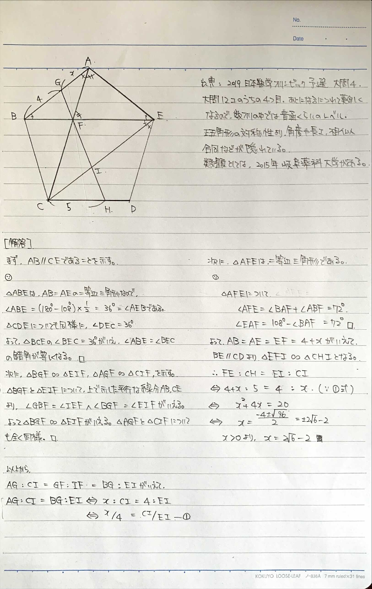
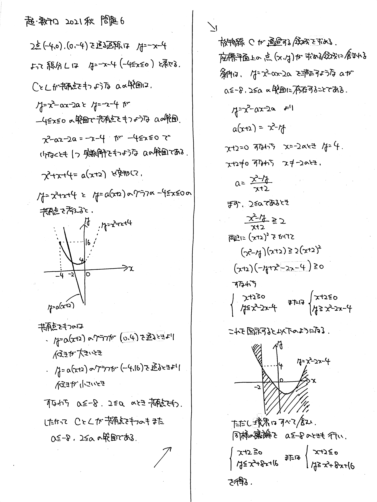
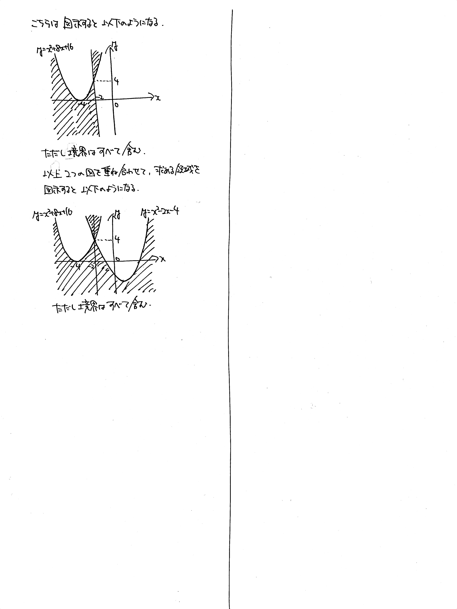

# 超・数テロ 2021秋

> 普段の数テロより少し難しい問題を集めました。  
> 豪華賞品付きです。挑戦をお待ちしております。

## ルール

- 好きな問題を選んで解く
- いつもの数テロと同じくなにを調べてもOK
- 数学のルールに則っていればどんな答案でもOK
- 完答できた問題数に応じて賞品を贈呈する
- 解答期間: 2021/10/01 (金) ～ 2021/10/31 (日)
- 出題範囲: 数学I / 数学A / 数学II (微分法・積分法を除く)

### 賞品

- 1問以上完答: 豪華な景品
- 3問以上完答: 超豪華な景品

## 問題 1

実数 $x$, $y$ に関する以下の連立方程式の解 $(x,\ y)$ の個数を求めよ.
$$\left\lbrace
\begin{array}[l]
xx^3+2y=3 \newline
2x+y^3=3
\end{array}
\right.$$ 

解答・解説

同値変形を意識して計算を頑張る問題です. **対称式の連立方程式は和と差で組み直す**のが強力です.

## 問題 2

$1000$ 以下の素数は $250$ 個以下であることを示せ.

解答・解説

2021年の一橋大で出題された問題です. 素数を全部書くだけの時間がないので, 集合の考え方を用いることになります.

### 解答方針

> 素数でない数が $750$ 個以上あることを示す.  
> $1000$ 以下の自然数の中に「$2$ の倍数 または $3$ の倍数 または $5$ の倍数」は全部で $734$ 個ある.
> あと $16$ 個は $7$ 以上の素数の積を列挙する.

## 問題 3

袋の中に $1$ と書かれた球が $2$ 個, $2$ と書かれた球が $3$ 個, $3$ と書かれた球が $4$ 個入っている. これから, 以下の【試行】を $4$ 回行う.

> 【試行】袋の中から $1$ つ球を取り出し, 書いてある数を記録して袋に戻す.

(1) 記録した数の合計が $6$ である確率を求めよ.

(2) 以下の**条件**を満たす確率を求めよ.

> **条件** &nbsp; $n=1,\ 2,\ 3,\ 4$ について, $1$ 回目から $n$ 回目までに記録した数の合計は $n+2$ 以下である.

(3) 袋の中に, $4$ と書かれた球を $1$ 個追加することを考える. 記録した数の合計が $8$ である確率がより大きくなるのは, 球を追加するときと追加しないときのどちらか判定せよ.

解答・解説

確率の問題ですが, 計算がかなり煩雑になるので定式化してから見当をつけるといいです.

## 問題 4

正 $5$ 角形 $\mathrm{ABCDE}$ があり, 線分 $\mathrm{BE}$ と線分 $\mathrm{AC}$ の交点を $\mathrm{F}$ とする. また点 $\mathrm{F}$ を通る直線が辺 $\mathrm{AB}$, $\mathrm{CD}$ とそれぞれ点 $\mathrm{G}$, $\mathrm{H}$ で交わり, $\mathrm{BG}=4$, $\mathrm{CH}=5$ が成り立つ. さらに, $\mathrm{GH}$ と $\mathrm{CE}$ の交点を $\mathrm{I}$ とする. このとき線分 $\mathrm{AG}$ の長さを求めよ.

解答・解説

図を描いて頑張って考えましょう.

## 問題 5

以下の条件を満たす自然数の組 $(x,\ y,\ z,\ w)$ は存在するか.
$$x+xy+xyz+xyzw=79, \ x<y<z<w$$

解答・解説

存在しなさそうだなーーと感じるのですがそれをどう示すかが問題です. きれいな形をしているので, 入れ子状に共通因数でくくっていくとよいです. おそらくこの問題セットの中で最も簡単です.

### 解答方針

> 与式を満たす自然数 $(x,\ y,\ z,\ w)$ が存在すると仮定する.  
> 与式は $$x(1+y+yz+yzw) = 79$$ と変形でき, $79$ は素数だから, $x=1$ である.
> このとき $$y(1+z+zw)=78$$ と変形でき, $78=2 \times 3 \times 13$ である. $y=2,\ 3,\ 13$ のいずれも, $x<y<z<w$ を満たすような組み合わせはないので, 前提が間違っている.
> よって自然数 $(x,\ y,\ z,\ w)$ は存在しない.

## 問題 6

$xy$ 平面上の $2$ 点 $(-4,\ 0)$, $(0,\ -4)$ を結ぶ線分(両端を含む)を $L$ とする. また, $a$ を実数の定数とする. 放物線 $C:\  y=x^2-ax-2a$ が $L$ と共有点をもつように $a$ を変化させるとき, $C$ が通過しうる領域を $xy$ 平面上に図示せよ. 

解答・解説

曲線の通過領域の問題です. 条件の読み替えが難しいと思います.

まず, 線分 $L$ は直線 $y=-x-4$ の $-4 \leqq x \leqq 0$ の部分ですから, $a$ の存在する範囲は

> $y=x^2-ax-2a$ と $y=-x-4$ が $-4 \leqq x \leqq 0$ の範囲で少なくとも $1$ つ実数解を持つ

ような範囲です. 解の存在範囲の問題は, 定数分離の考え方で処理するのが楽ですね. これで $a \leqq -8$, $2 \leqq a$ がわかります.

$C:\  y=x^2-ax-2a$ の $a$ の値によって放物線の式が変わります. 例えば

- $a=2$ のとき, $y=x^2-2x-4$
- $a=3$ のとき, $y=x^2-3x-6$

いま求めたいのは, $C$ が通過する領域です.  
さて, 点 $(1,\ -5)$ は求める領域に含まれるでしょうか. $C$ に $x=1$, $y=-5$ を代入すると, $a=2$ であることがわかります. これは先に求めた $a$ の範囲に含まれるので, 求める領域に含まれます.  
同様に, 点 $(1,\ -2)$ は求める領域に含まれるでしょうか. $C$ に $x=1$, $y=-2$ を代入すると, $a=1$ であることがわかります. これは先に求めた $a$ の範囲に含まれないので, 求める領域に含まれません.  
こんな感じで $a$ の範囲で絞り込みをしたいので, $a$ を $x$ と $y$ で表して, 不等式を解きます.

ということで, 不等式 $\dfrac{x^2-y}{x+2} \geqq 2$ を処理しますが, **ここで両辺に $x+2$ をかけてしまうと $x+2$ の正負によって場合分けが発生します. 場合分けを回避するために, 両辺に $(x+2)^2$ をかけています.** とても使い勝手の良いテクニックですので, ぜひ習得してください.

するとようやく領域が現れるので, それを図示して完成です.

