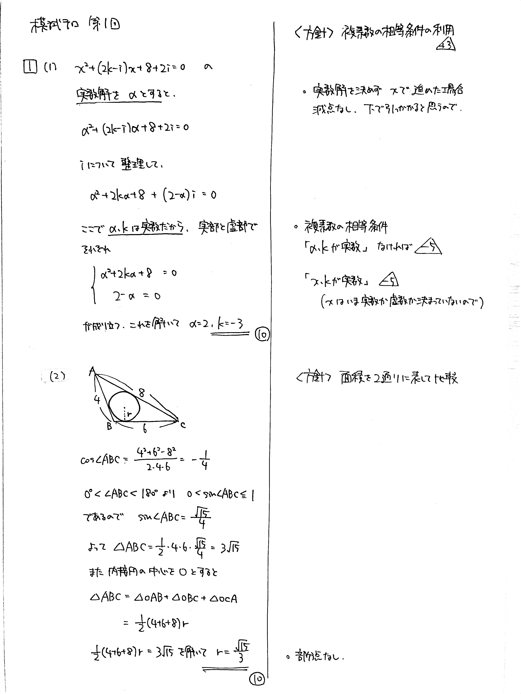

# 大問 1

## 問題・配点

(1) $i$ を虚数単位とする. $x$ の方程式 $x^2+(2k-i)x+8+2i=0$ が実数解をもつように, 実数 $k$ の値を定めよ. (10)

(2) $\triangle \mathrm{ABC}$ において, $\mathrm{AB}=4$, $\mathrm{BC}=6$, $\mathrm{CA}=8$ とする. $\triangle \mathrm{ABC}$ の内接円の半径 $r$ を求めよ. (10)

## 解説

(1) 虚数係数の $2$ 次方程式における実数解の問題です。実数解を $\alpha$ とおいて方程式に代入し、実数条件から実部と虚部に分けて連立方程式を作ります。

(2) 三角形の内接円の中心から各頂点に線を引くと、高さの等しい三角形が $3$ つできます。まず $\triangle \mathrm{ABC}$ の面積を求め、高さを逆算しましょう。

