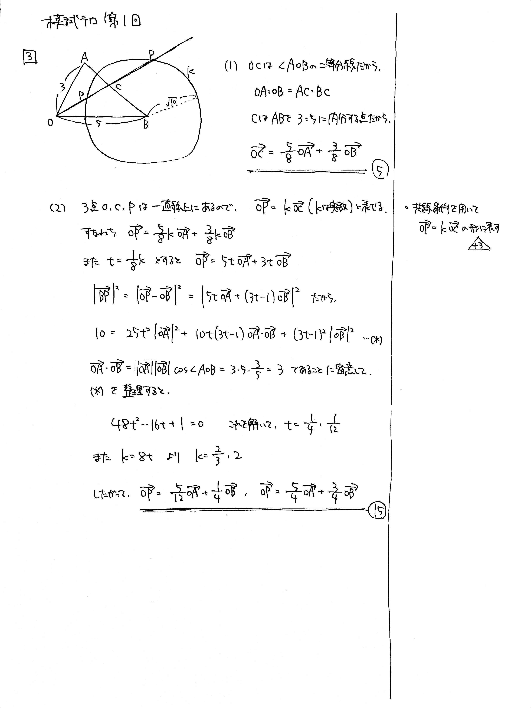

# 大問 3

## 問題・配点

$\triangle \mathrm{OAB}$ において, $\mathrm{OA}=3$, $\mathrm{OB}=5$, $\cos \angle \mathrm{AOB}= \dfrac{3}{5}$ とする. また, $\mathrm{B}$ を中心とする半径 $\sqrt{10}$ の円を $K$ とする.

(1) $\angle \mathrm{AOB}$ の二等分線と辺 $\mathrm{AB}$ の交点を $\mathrm{C}$ とする. $\overrightarrow{\mathrm{OC}}$ を $\overrightarrow{\mathrm{OA}}$, $\overrightarrow{\mathrm{OB}}$ を用いて表せ. (8)

(2) $\angle \mathrm{AOB}$ の二等分線と円 $K$ の交点を $\mathrm{P}$ とする. $\overrightarrow{\mathrm{OP}}$ を $\overrightarrow{\mathrm{OA}}$, $\overrightarrow{\mathrm{OB}}$ を用いて表せ. (12)

## 解説

円が絡んだベクトルの問題です。といってもやることは少ないので、誘導に乗って解いていきましょう。後半は計算量が多くて大変です。$\overrightarrow{\mathrm{OP}}=k\overrightarrow{\mathrm{OC}}$ と機械的に設定しても解けますが、$k$ をうまく設定すると計算量を減らすことができます。

