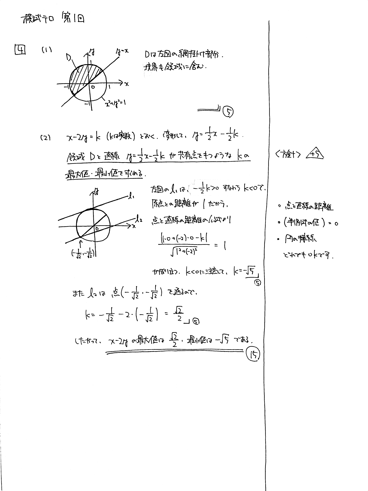

# 大問 4

## 問題・配点

$x$ と $y$ の連立不等式 $x^2+y^2 \leqq 1$, $y \geqq x$ が表す領域を $D$ とする.

(1) 領域 $D$ を $xy$ 平面上に図示せよ. (8)

(2) 領域 $D$ 内を点 $\mathrm{P}(x,\ y)$ が動くとき, $x-2y$ の最大値と最小値を求めよ. (12)

## 解説

典型的な線形計画法の問題です。$x-2y$ の値が存在するかどうかを確かめていくために、$x-2y=k$ とおいて図形的に考察します。円と直線の扱いは頻出です。

