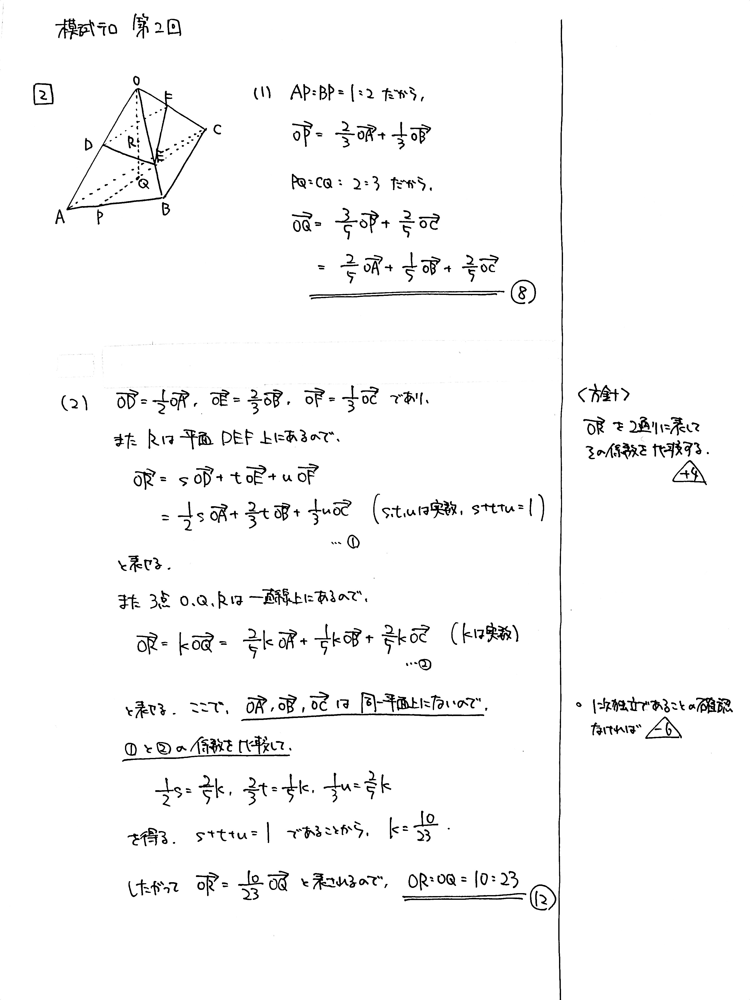

---
layout: default
parent: 第 2 回
grand_parent: 模試テロ
summary: 空間図形の計量
published: false
---

# 大問 2

## 問題・配点

四面体 $\mathrm{OABC}$ において, 辺 $\mathrm{AB}$ を $1:2$ に内分する点を $\mathrm{P}$, 線分 $\mathrm{PC}$ を $2:3$ に内分する点を $\mathrm{Q}$ とする. また, 辺 $\mathrm{OA}$ の中点を $\mathrm{D}$, 辺 $\mathrm{OB}$ を $2:1$ に内分する点を $\mathrm{E}$, 辺 $\mathrm{OC}$ を $1:2$ に内分する点を $\mathrm{F}$ とする.

(1) $\overrightarrow{\mathrm{OQ}}$ を $\overrightarrow{\mathrm{OA}}$, $\overrightarrow{\mathrm{OB}}$, $\overrightarrow{\mathrm{OC}}$ を用いて表せ.

(2) 平面 $\mathrm{DEF}$ と線分 $\mathrm{OQ}$ の交点を $\mathrm{R}$ とする. 線分の長さの比 $\mathrm{OR}:\mathrm{OQ}$ を求めよ.

## 解説

空間ベクトルの典型問題です。共線条件・共面条件を利用して、少しずつ式を立てていきましょう。

