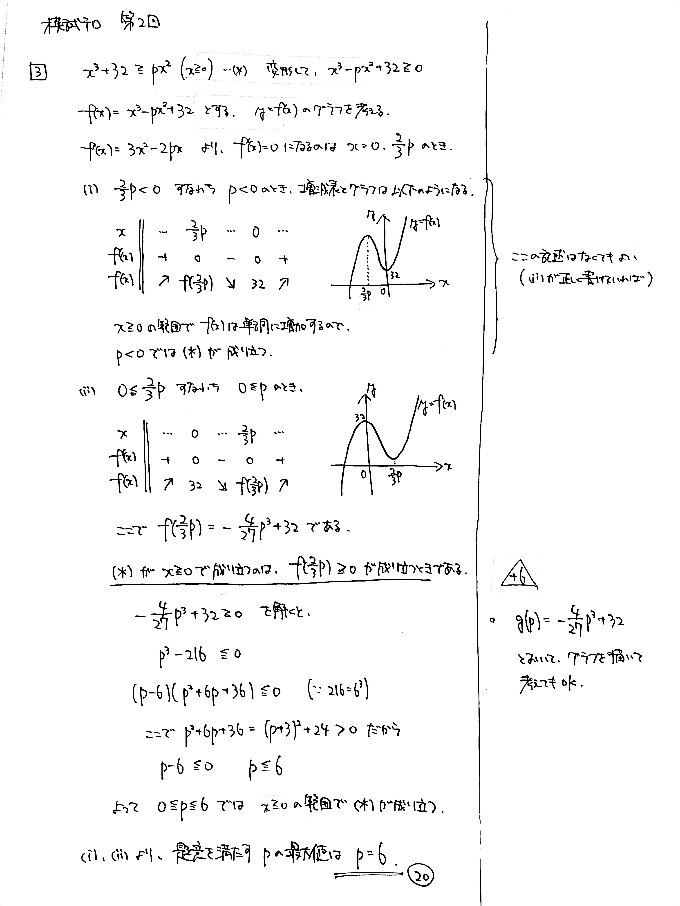

---
layout: default
parent: 第 2 回
grand_parent: 模試テロ
summary: 不等式を満たす条件
published: false
---

# 大問 3

## 問題・配点

$p$ を実数の定数とする. $x \geqq 0$ の範囲で, $x$ の不等式 $$ x^3+32 \geqq px^2 $$ が常に成り立つような $p$ の最大値を求めよ. (20)

## 解説

**常に成り立つ不等式**の問題です。グラフを描いて視覚的に考えて、最小値が正になるように $p$ の値を決めればよいのですが、そのグラフを描くのに場合分けが要ります。

